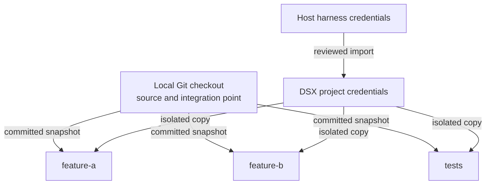

# DSX Product Requirements Document

- **Status:** Draft
- **Version:** 0.4
- **Date:** 2026-08-11
- **Audience:** DSX users and maintainers

This PRD defines the approved product contract for the DSX multi-workspace redesign. It specifies required behavior and acceptance criteria; it does not assert implementation or release evidence.

## 1. Product summary

DSX is a fast, local, command-line development environment for macOS on Apple silicon. From an existing local Git checkout, a developer can create multiple named, isolated Linux workspaces, run supported coding-agent harnesses, run project applications and local infrastructure, publish selected ports, test through an isolated browser, transfer committed revisions between the host and each workspace, and safely remove DSX-owned resources.

DSX uses Apple’s `container` runtime. It does not replace the project’s build system or infer arbitrary lifecycle commands.

DSX has exactly one workspace type: a named, isolated Apple microVM containing a private Git clone.



The product model has these constraints:

- There is no special `main` workspace.
- There are no live and clone workspace modes.
- The local checkout is not a DSX workspace.
- No host source directory is mounted into a workspace.
- No host home directory is mounted into a workspace.
- Every workspace is a named peer containing a private clone.
- Multiple workspaces may run concurrently.
- Workspace lifecycle and agent lifecycle are separate.
- DSX requires Git and transfers committed revisions through verified Git bundles.
- Workspaces do not share Git objects or writable authentication state.

## 2. User problem

A developer may already have source code, dependencies, local processes, credentials, and several unrelated projects on the Mac. Running coding agents directly on the host gives those agents access to more files, credentials, processes, and control sockets than the project requires. Existing development-container workflows also vary significantly between projects and monorepos.

The user needs a tool that:

- Starts quickly from a local Git checkout.
- Supports several independent workspaces for the same project.
- Keeps host files and credentials outside the granted workspace boundary.
- Supports TypeScript, Python, Java, PHP, and polyglot monorepos.
- Runs OMP, Codex, Claude Code, or OpenCode without separate workspace image setup.
- Can run application processes and infrastructure such as MySQL and Redis internally.
- Preserves explicitly approved agent authentication.
- Provides optional browser isolation and loopback-only host ports.
- Transfers results back to the local checkout without sharing Git metadata.
- Reliably removes every resource DSX created without deleting unrelated resources.

## 3. Product principles

1. **Named workspace peers:** every DSX workspace is an explicitly named private clone; there is no implicit or privileged workspace.
2. **Separate lifecycles:** creating, starting, stopping, updating, or restarting a workspace does not implicitly create or restore an agent session.
3. **Fast by reuse:** reuse pulled images, build layers, approved authentication, and explicitly persistent state.
4. **Explicit over clever:** inspect existing project declarations, but do not silently invent or execute lifecycle commands.
5. **Committed source transfer:** use verified Git bundles rather than host source mounts or shared Git objects.
6. **Project-scoped authority:** expose only the selected workspace, approved credentials, network paths, and ports.
7. **Reviewed authentication:** detect only supported portable artifacts and never import credentials silently.
8. **Owned cleanup:** delete only resources DSX can prove it owns and protect unfetched work from accidental deletion.
9. **No DSX daemon:** temporary DSX helpers exist only while required; Apple `container` system services remain a prerequisite.

## 4. Target users

### 4.1 Primary user

A macOS developer using Apple silicon who wants to run one or more coding-agent harnesses against isolated private clones of an existing local Git project.

### 4.2 Project maintainer

A developer who explicitly promotes a home-local configuration to `.dsx/config.jsonc` so contributors can reproduce the project’s workspace image, setup, processes, services, ports, resource limits, networking, and allowed agents.

## 5. Core user journeys

### 5.1 Project onboarding

From a local Git checkout:

```console
cd /Volumes/Dev/work/course-intelligence-agency
dsx inspect
dsx init
```

Onboarding configures reusable project defaults for:

- Workspace image.
- Allowed agents.
- Default agent.
- Internet policy.
- Published guest ports.
- CPU and memory.
- Setup definition.
- Supported host authentication imports.

`dsx inspect` reads the active home-local configuration or the explicitly shared `.dsx/config.jsonc`. It reports safe project facts from Git roots, Dockerfiles, dependency lockfiles, and `devenv.nix`, shows the effective plan and its sources, and executes nothing.

Dev Container declarations are not discovered, imported, parsed, or executed.

`dsx init` creates a project-ID-namespaced home-local configuration from safe, reviewable suggestions when an existing declaration does not fully describe the project. It does not translate or execute arbitrary Nix expressions.

The setup flow has three stages:

1. Choose **Ubuntu — Default settings** or **Ubuntu — Custom**. The default is 6 CPUs, 6 GiB of memory, internet allowed, no published ports, and no browser. Custom changes the coding agent, internet access, published guest ports, CPU, or memory. Alternate image configuration remains available through the configuration and CLI, not this onboarding screen.
2. Review one concise approval screen containing the effective Ubuntu environment, resources, network policy, browser state, agent, ports, executable hash, and every non-default command or authority grant. Routine internal digests, discovery facts, and provenance priorities are omitted. Overflow remains complete, bounded, and must be viewed before approval.
3. Verify the runtime, persist configuration and approval, prepare the Standard image when needed, and open the workspace dashboard.

The review retains exact setup and process commands, mounts, credential imports, host/private-network grants, published ports, volumes, image exceptions, and the executable-configuration hash whenever present.

New workspaces default to 6 CPUs and 6 GiB of memory. Guest ports entered during setup default to dynamic loopback host publication.

No project configuration, approval state, credential import, or runtime resource is created before final confirmation.

### 5.2 Reviewed authentication import

DSX detects supported portable host credentials and asks for explicit approval.

```text
Agent authentication

OMP
  Codex Team                 Available to import

Codex CLI
  Existing host login        Available to import

Claude Code
  Host login not portable    DSX login required

OpenCode
  Existing host login        Available to import

[Import supported authentication]
```

The import allowlist is exact:

- **OMP:** a consistent closed `agent.db` snapshot plus its optional WAL.
- **Codex CLI:** only the approved portable `auth.json`.
- **Claude Code:** no host import and no macOS Keychain copy; a DSX login is required.
- **OpenCode:** only the approved provider-auth artifact.

DSX must never:

- Import a complete harness directory.
- Import a complete host home directory.
- Import host credentials silently.
- Import an unsupported artifact because it is adjacent to an approved artifact.
- Translate OMP’s Codex provider identity into the separate Codex CLI credential format.
- Copy Claude host login or macOS Keychain state.

Imported artifacts become canonical project credentials separated by harness.

### 5.3 Creating named workspaces

```console
dsx workspace create feature-a
dsx workspace create feature-b --default-agent codex
```

The TUI creation form is:

```text
Create workspace

Name
  feature-a

Starting point
  feat/branch-1 @ abc123

Default agent
  OMP — inherited from project

Container
  dsx-tracking-chrome-feature-a-workspace-a81f2c

[Create and open]  [Create in background]
```

The form contains:

- A validated workspace name.
- The committed source branch and revision.
- An agent selector populated from `agents.allowed`.
- The project default agent preselected.

The form does not contain:

- Authentication selection.
- A task prompt.
- Browser selection.
- Workspace-mode selection.

Workspace creation must:

1. Inspect the local Git checkout.
2. Require a clean tracked working tree.
3. Warn that ignored and untracked files are excluded.
4. Record the checked-out source branch and commit.
5. Create and verify a restrictive Git bundle.
6. Create the workspace VM and private volumes.
7. Clone into guest-owned storage without shared Git objects.
8. Create and check out `dsx/<workspace-name>`.
9. Start only the DSX guest control process as the long-lived guest process.
10. Optionally open a shell.

Any approved setup work is executed through the DSX guest control process and must not implicitly start an agent, browser, project application, watcher, database, or other persistent project process.

### 5.4 Parallel workspaces and agents

```console
dsx workspace create api
dsx workspace create tests --default-agent claude
dsx agent api --agent codex -- "implement the API"
dsx agent tests --agent claude -- "add API tests"
dsx workspace list
```

Each workspace receives an independent:

- Apple container and microVM.
- Guest-owned Git clone and Git metadata.
- `dsx/<workspace-name>` branch.
- Dependency state.
- Persistent volumes and service data.
- Writable authentication copy per harness.
- Project network.
- Dynamic host-port allocation where requested.
- Lifecycle state.

DSX provides isolation and result transfer. It does not schedule, coordinate, semantically reconcile, or automatically merge parallel agent work.

### 5.5 Updating from the local checkout

```console
dsx workspace update feature-a
```

This command means **Update from local checkout**.

Before:

```text
Local:       C1 ── C2
Workspace:   C1 ── A1 ── A2
```

After:

```text
Local:       C1 ── C2
Workspace:        └── A1′ ── A2′
```

On conflict, the workspace remains available and is reported as:

```text
feature-a    Needs resolution
```

The user opens it and resolves or aborts the rebase:

```console
dsx workspace open feature-a
git rebase --continue
# or
git rebase --abort
```

DSX does not silently stash files, invent commits, or attempt semantic conflict resolution.

### 5.6 Integrating workspace results

```console
dsx git status feature-a
dsx git diff feature-a
dsx git fetch feature-a
dsx git apply feature-a
```

Fetch imports the workspace branch into:

```text
refs/remotes/dsx/feature-a
```

The user can merge it normally:

```console
dsx git fetch feature-a
git merge refs/remotes/dsx/feature-a
```

A recommended parallel workflow is:

1. Create `feature-a` and `feature-b`.
2. Let both agents work independently.
3. Commit new local changes.
4. Update both workspaces.
5. Fetch and merge `feature-a`.
6. Update `feature-b` again from the merged local checkout.
7. Fetch and merge `feature-b`.

Cleanup refuses to destroy unfetched commits or other unexported work unless loss is explicitly confirmed.

### 5.7 Bare-command dashboard

From a terminal in a project directory:

```console
dsx
```

DSX resolves the current project before selecting a screen:

- An unconfigured project opens the setup wizard.
- A configured project opens the multi-workspace dashboard.
- A non-interactive invocation prints help and exits without prompting or changing state.

The dashboard is:

```text
DSX PROJECT — tracking-chrome-extension

Local checkout
  feat/branch-1 @ abc123
  Clean

Workspaces

> feature-a    Running             OMP · Codex
  feature-b    Stopped             Codex
  tests        Needs resolution    OMP · Codex

[c] Create workspace
[Enter] Open
[a] Open agent
[u] Update from local checkout
[s] Start/stop
[r] Restart
[g] Review Git changes
[d] Remove
[q] Quit
```

Actions are state-aware. Restart and update are unavailable while another lifecycle mutation is active.

## 6. Command surface

### 6.1 Commands

| Command | User outcome |
|---|---|
| `dsx` | Open the setup wizard or multi-workspace dashboard when attached to a terminal; otherwise print help. |
| `dsx inspect` | Show the effective image, workspace defaults, setup, processes, services, mounts, credentials, network access, ports, configuration sources, and executable-configuration hash. Make no changes. |
| `dsx init` | Open the setup flow and generate a reviewable project-namespaced home-local configuration after confirmation. |
| `dsx workspace create NAME` | Create the named private-clone workspace from the committed local revision. |
| `dsx workspace create NAME --default-agent AGENT` | Create the workspace with an approved workspace-specific default agent. |
| `dsx workspace list` | List named workspaces, legacy cleanup-only resources, ownership, lifecycle state, source revision, agents, and published ports. |
| `dsx workspace open NAME` | Start the named workspace if necessary, wait for readiness, and open its interactive shell. |
| `dsx workspace start NAME` | Start only the named workspace and DSX guest control process without attaching. |
| `dsx workspace stop NAME` | Stop the named workspace while preserving its private clone and persistent state. |
| `dsx workspace restart NAME` | Restart only the named workspace without restoring agent or project processes. |
| `dsx workspace update NAME` | Transfer the latest committed local revision and rebase the workspace branch onto it. |
| `dsx workspace remove NAME` | Remove the named workspace and all proven DSX-owned resources belonging to it, subject to unfetched-work protection. |
| `dsx workspace remove --all` | Explicitly remove all removable DSX-owned workspace resources for the current project. |
| `dsx workspace remove --legacy-resources` | Explicitly remove proven current-project resources from the previous resource model; legacy resources cannot be started or adopted. |
| `dsx workspace remove --all-projects` | Explicitly remove proven DSX-owned workspace resources for every project after confirmation. |
| `dsx agent WORKSPACE` | Open an interactive session using the resolved agent for the existing workspace. |
| `dsx agent WORKSPACE --agent AGENT` | Open an interactive session using the specified approved agent without changing the workspace default. |
| `dsx agent WORKSPACE --agent AGENT -- "PROMPT"` | Run one task in the existing workspace and propagate output, cancellation, and exit status. |
| `dsx agent WORKSPACE --browser` | Open an agent session with a new disposable isolated browser. |
| `dsx auth status` | Show project authentication availability by harness without displaying secret values. |
| `dsx auth import --agent omp` | Explicitly import only OMP’s approved portable artifacts. |
| `dsx auth import --agent codex` | Explicitly import only Codex CLI’s approved portable `auth.json`. |
| `dsx auth import --agent opencode` | Explicitly import only OpenCode’s approved provider-auth artifact. |
| `dsx auth login --agent claude` | Run a DSX-scoped Claude login without importing host or Keychain state. |
| `dsx auth refresh --agent omp` | Explicitly refresh OMP’s canonical project credentials through the approved artifact path. |
| `dsx auth purge --agent omp` | Explicitly remove OMP’s canonical project credentials and inactive workspace copies after confirmation. |
| `dsx aws status [WORKSPACE]` | Show the project AWS capability and non-secret grant, availability, and mirror status for one or all workspaces. Make no changes. |
| `dsx aws enable WORKSPACE` | Grant the named workspace access to the current and subsequently rotated host `default` identity after validating that a complete temporary session is available. |
| `dsx aws disable WORKSPACE` | Immediately revoke AWS access from the named workspace and remove its exact private mirror without affecting siblings. |
| `dsx git status WORKSPACE [--repo MEMBER]` | Show source ref, result branch, dirty state, host fingerprint, rebase state, and fetch state. |
| `dsx git diff WORKSPACE [--repo MEMBER]` | Show safely rendered workspace changes. |
| `dsx git fetch WORKSPACE [--repo MEMBER]` | Import committed workspace history through a verified Git bundle into the workspace-specific host ref. |
| `dsx git apply WORKSPACE [--repo MEMBER]` | Apply workspace changes as a guarded squashed working-tree change. |
| `dsx doctor [--require-builder]` | Perform read-only validation of host architecture, OS, Apple CLI/API-server pair, service, builder, and compatibility allowlist. |
| `dsx version [--json]` / `dsx --version [--json]` | Print build, guest-helper digest, and pinned image metadata. |

Every workspace lifecycle command requires `NAME` unless an explicit cleanup set selector such as `--all`, `--legacy-resources`, or `--all-projects` is used. There is no unnamed workspace lifecycle.

Destructive operations require confirmation in an interactive terminal. `--force` may bypass only destructive cleanup confirmation and explicitly confirm loss of protected workspace results. It must never bypass executable-configuration approval or ownership checks.

### 6.2 Clean command cutover

The following concepts and commands do not exist in the redesigned command surface:

- Live workspace mode.
- Clone workspace mode.
- A special sandbox or workspace named `main`.
- Direct host source mounts.
- `dsx shell`.
- `dsx run`.
- `dsx run --name`.
- Top-level `dsx start`, `dsx stop`, `dsx clean`, `dsx list`, or `dsx ls` lifecycle aliases.
- Unnamed start, stop, open, update, restart, remove, or agent behavior.
- The old “create a clone and immediately run one prompt” workflow.

The replacements are:

- `dsx workspace ...` for workspace lifecycle.
- `dsx agent WORKSPACE ...` for agent lifecycle.
- `dsx auth ...` for authentication lifecycle.
- `dsx aws ...` for per-workspace AWS grant lifecycle and non-secret status, but not profile selection or manual credential synchronization.
- Named `dsx git ...` operations for result review and transfer.

DSX is unreleased, so there are no deprecated compatibility aliases.

## 7. Functional requirements

### R1. Host and runtime

- DSX must require macOS 26 or newer on Apple silicon. No macOS 15 degraded mode is included in the MVP.
- DSX must initially support Apple `container` versions `>=1.2.2 <1.3.0` and reject untested versions until the compatibility suite passes.
- DSX must verify that the Apple `container` CLI and required system services are usable.
- DSX must invoke the installed runtime rather than exposing its control socket or service API inside a workspace.
- DSX must fail with an actionable error when a required runtime capability is unavailable.
- DSX must not require a permanent DSX daemon.

### R2. Project identity and workspace isolation

- DSX must derive a stable project ID from the canonical local checkout root.
- Every new workspace must have a validated user-visible name and a unique run identity.
- Every workspace must be a named, isolated Apple microVM containing a private Git clone.
- All workspaces in a project must be peers; no workspace is privileged as `main`.
- Multiple named workspaces must be able to run concurrently for one project.
- A second project must be able to run concurrently without resource, state, network, port, or cleanup collision.
- Every resource must carry DSX ownership, project ID, workspace name, run ID, resource type, and creation-time metadata where the runtime supports labels.
- Ownership labels and lifecycle manifests are authoritative for cleanup.
- No workspace may receive the host source directory or host home directory as a mount.
- A workspace must not receive unrelated repositories, container control sockets, SSH agent, GPG agent, or macOS Keychain state by default.
- DSX must never read, copy, mount, import, or execute host shell dotfiles.
- Shell configuration supplied by the managed standard image must remain image-owned.
- CPU, memory, and per-project workspace concurrency limits must be configurable.

### R3. Git source creation

- DSX must require Git.
- Workspace creation must require a clean tracked local working tree.
- DSX must warn that ignored and untracked files are excluded from source transfer.
- DSX must record the checked-out local source branch and commit.
- Source transfer must use a generated, restrictive, verified Git bundle.
- DSX must create the private clone in guest-owned storage.
- Clone creation must prohibit shared object hardlinks and other shared Git-object storage.
- Each workspace must have independent Git metadata.
- The initial workspace branch must be `dsx/<workspace-name>`.
- Composite projects must declare each participating Git repository and reproduce each selected repository at its configured relative path.
- Existing macOS dependency artifacts must remain untouched.
- Linux dependencies and caches must use workspace- or project-scoped guest volumes.

### R4. Workspace lifecycle

#### R4.1 Create

`dsx workspace create NAME` must create only the named workspace. It must not require authentication, a prompt, or browser selection.

The CLI and TUI may offer an explicit create-and-open action, but workspace creation must not launch an agent or browser.

#### R4.2 List

`dsx workspace list` must report, at minimum:

- Workspace name.
- Ownership and project identity.
- Running, stopped, failed, mutating, or `Needs resolution` state.
- Recorded source branch and revision.
- Workspace default and allowed agents.
- Published port mappings and final URLs when active.
- Unfetched or otherwise unexported work.
- Legacy cleanup-only resources.

#### R4.3 Open

`dsx workspace open NAME` must:

- Start the named workspace if it is stopped.
- Wait for the DSX guest control process to become ready.
- Open an interactive shell.
- Leave every sibling workspace unchanged.
- Avoid restoring any prior agent or project process.

With the managed standard image, the interactive shell must be login interactive Zsh using DSX-owned shell defaults.

#### R4.4 Start

`dsx workspace start NAME` must start the named workspace without attaching. Only the DSX guest control process may be started automatically as a persistent process.

#### R4.5 Stop

`dsx workspace stop NAME` must:

- Stop only the selected workspace.
- Terminate agent sessions, project applications, watchers, manually started databases, background commands, and other guest processes.
- Remove active port forwarding and temporary host proxies as appropriate.
- Preserve the private clone, commits, uncommitted files, dependencies, persistent volumes, authentication working copies, configuration, and ownership metadata.

#### R4.6 Restart

`dsx workspace restart NAME` must preserve:

- Git clone, commits, and uncommitted files.
- Rebase state, including unresolved conflicts.
- Dependencies and persistent volumes.
- Authentication working copies.
- Workspace configuration and ownership.

Restart must terminate and must not restore:

- Agent sessions.
- `pnpm dev`.
- Watchers.
- Manually started databases.
- Background commands.
- Project application processes.
- Browser sessions.

Only the DSX guest control process starts automatically afterward. Restarting one workspace must not affect siblings.

#### R4.7 Update

`dsx workspace update NAME` must mean **Update from local checkout** and must:

1. Require all relevant local tracked changes to be committed.
2. Verify that the local checkout remains on the workspace’s recorded source branch.
3. Transfer the latest local revision through a restrictive, verified Git bundle.
4. Create a workspace backup ref before rewriting the workspace branch.
5. Rebase `dsx/<workspace-name>` onto the transferred local revision.
6. Report conflicts without semantic resolution.

If uncommitted workspace changes prevent a safe rebase, DSX must stop before rewriting the branch and instruct the user to commit, discard, or otherwise handle those files. DSX must not silently stash them.

On a rebase conflict, DSX must:

- Preserve the Git rebase state.
- Report the workspace as `Needs resolution`.
- Permit the user to open the workspace.
- Leave `git rebase --continue` and `git rebase --abort` under user control.
- Preserve the backup ref until safe cleanup.

Update and restart must be unavailable while another lifecycle mutation is active.

#### R4.8 Remove

`dsx workspace remove NAME` must remove all proven DSX-owned resources associated with that workspace, subject to unfetched-work protection and confirmation requirements.

Removal must be idempotent and must not affect sibling workspaces or unrelated projects.

### R5. Images, dependencies, toolchain, and shell

- DSX must provide a versioned standard Linux ARM64 image based on Ubuntu 26.04 LTS ARM64 and containing common development tools and the supported agent harnesses.
- Release builds must pull the standard image by published digest.
- Development builds may build the exact embedded, approved recipe locally.
- A locally built standard image must be keyed by the complete embedded build-input digest and reused only under that key.
- Project-specific system dependencies must be added through a project image or explicit build definition.
- Image builds must use OCI layers and content-addressed caching.
- Setup commands may run only when declared by `.dsx/config.jsonc` or imported from an approved supported field.
- Changed configuration or image input must invalidate the relevant cached setup state.
- The managed standard image must provide:
  - Node.js active LTS and npm.
  - A compatible stable pnpm.
  - Python 3 with pip and venv, plus the `python` command.
  - Go.
  - A supported LTS JDK with `java` and `javac`.
  - AWS CLI v2 2.36.22 with `aws` and `aws_completer`.
  - uv 0.12.3 with `uv` and `uvx`.
  - .NET 10 LTS SDK 10.0.400, .NET and ASP.NET Core runtimes 10.0.11, and `dotnet` and `dnx`.
  - Standalone Kotlin compiler 2.4.10 with `kotlin` and `kotlinc`, using the managed JDK.
- Installing AWS CLI grants no AWS capability. Per-workspace AWS grants remain authoritative, and Python `awscli` v1 must not be installed.
- uv and `dnx` may resolve project dependencies only when explicitly invoked. Kotlin does not imply Gradle, Maven, Kotlin/Native, or runtime dependency resolution.
- The managed standard image must support configured Node, Python, Java, PHP, .NET, Kotlin, and polyglot project workflows; project-specific tools not included in the standard image remain explicit project-image or setup responsibilities.
- Its development identity must be exactly `dsx`, UID 1000, GID 1000, home `/home/dsx`, and login shell `/bin/zsh`.
- An interactive `dsx workspace open NAME` session using the managed standard image must open login interactive Zsh with one DSX-owned authored shell-defaults file.
- Direct user shells and supported IDE attachment may use passwordless `sudo` inside the workspace VM. DSX provides no root password or direct-root-login workflow.
- The managed standard image must install immutable, pinned Antidote plugin content.
- The managed standard image must pre-generate Starship initialization at image-build time.
- Interactive startup must require neither network access nor plugin fetching or regeneration.
- The managed standard image must publish its development-tool `PATH` at image level so interactive shells, direct commands, setup, agents, and managed processes resolve the same baseline tools without depending on shell rc files.
- These guarantees apply only to the DSX-managed standard image.
- A custom image remains an explicit project responsibility. DSX must not inject the managed shell stack or assume a custom image supplies the standard toolchain, account metadata, or sudo policy.

#### R5.1 External IDE attachment

- The dashboard action `[v] Attach with VS Code (experimental)` must be available only for a definitely running, ownership-verified workspace with no active lifecycle mutation.
- The action must open the documented VS Code setting and print the exact documented Command Palette picker steps plus the inspected DSX container name.
- DSX must not start a stopped workspace, create or manage a VS Code remote server, parse `.devcontainer/**`, publish a private `apple-container+...` remote authority, or change `dsx workspace open NAME` from a shell operation.

### R6. Guest processes and services

- A workspace must support multiple concurrent guest processes.
- The selected agent, application processes, MySQL, Redis, Caddy, workers, and other configured services may run inside one integrated workspace container.
- Container-local processes must be able to communicate through loopback.
- Each process may declare environment variables, dependencies, health checks, and a log identity.
- DSX-managed process output must be multiplexed to container stdout and stderr with a process-name prefix.
- DSX must retain bounded process output for dashboard review.
- DSX must wait for required health checks before launching a dependent agent or browser task.
- Workspace start and restart must not automatically relaunch project processes.
- Approved configured processes may start only when explicitly requested by an action or required by executable configuration approved for that action.
- DSX does not automatically restart failed project processes in the MVP.
- A failed required process must make the relevant task or workspace failed.
- A configured project process manager may implement its own restart policy.
- Sibling service containers are not required for the MVP.
- Configured argv processes must be passed as structured arguments and run directly.
- Direct process execution must not be wrapped in an interactive shell or depend on shell rc files.
- An explicitly declared shell command remains executable configuration and is subject to configuration approval.

### R7. Agent lifecycle

- The MVP must support OMP, Codex, Claude Code, and OpenCode.
- Multiple harness CLIs may be installed in one workspace image.
- Workspace and agent lifecycle must remain separate.
- An agent invocation must target an existing named workspace.
- The user must select an agent from the approved project list, directly or through default resolution.
- Agent resolution must be:

```text
Explicit --agent
      ↓
Workspace default
      ↓
Project default
```

- With no prompt, `dsx agent WORKSPACE` must open an interactive agent session.
- With a prompt, the agent must run that task inside the existing persistent workspace.
- Repeated sessions must reuse the same workspace.
- An invocation-level `--agent` override must not change the workspace default.
- DSX must support interactive invocation, prompt invocation, output streaming, cancellation, exit-code propagation, and terminal resize.
- Multiple named workspaces may run different harnesses concurrently.
- DSX must not automatically create a workspace when an agent is invoked.
- Agent termination must not remove the persistent workspace.
- Workspace stop or restart must terminate active agent sessions and must not restore them.

### R8. Authentication and reusable configuration

- Authentication must use canonical project credential stores, isolated workspace copies, or per-session environment injection.
- Authentication must never use a mount of the complete host home directory.
- Canonical project credentials must be separated by harness.
- Imported credentials must always require explicit user approval.
- Only the following host-import artifacts are allowed:
  - OMP: consistent closed `agent.db` snapshot plus optional WAL.
  - Codex CLI: approved portable `auth.json`.
  - OpenCode: approved provider-auth artifact.
- Claude host authentication, macOS Keychain state, and complete Claude host directories must never be imported.
- Claude authentication must use an explicit DSX login.
- Complete harness directories must never be imported.
- OMP’s Codex provider identity must remain in OMP’s credentials and must not be converted to Codex CLI credentials.
- When an agent first starts in a workspace, DSX must:
  1. Resolve canonical project credentials for that harness.
  2. Create an independent writable workspace copy.
  3. Inject only that harness’s credentials.
  4. Run the agent against the isolated copy.
  5. Serialize any promotion back to the canonical project store.
- Each concurrently running workspace must receive its own writable authentication and session copy.
- DSX must not mount one writable credential store into multiple workspaces concurrently.
- Reusable skills and reviewed harness configuration may be shared read-only.
- Authentication working copies may persist across workspace restart and recreation when approved.
- Ordinary workspace cleanup must preserve canonical project credentials.
- Credential removal must require `dsx auth purge --agent AGENT`.
- Active credential copies must block purge unless the user first terminates the relevant sessions or explicitly follows the safe shutdown path.
- DSX must never display secret values.

If required authentication is unavailable, DSX must present:

```text
OMP authentication is not configured.

[i] Import supported host credentials
[l] Sign in
[Esc] Cancel
```

### R9. AWS host-default capability

#### R9.1 Project capability and approval

- AWS integration must be opt-in. The project configuration must accept only `aws.mode: "none"` or `aws.mode: "host-default"`; `none` is the default and must resolve to a zero, disabled capability with no source or mount authority.
- The removed `leapp` mode and any configurable AWS `profile` field must fail with precise unsupported-configuration diagnostics rather than act as aliases.
- `host-default` must authorize a provider-neutral capability to follow the standard AWS files in one reviewed canonical physical host directory. DSX integrates only with the provider’s materialized standard-file output and must not invoke or depend on a provider executable, private database, configuration, socket, browser state, or authentication flow.
- Leapp is the first proven producer of this output because it performs the Google Workspace SAML flow and rotates temporary AWS STS credentials. Leapp or a compatible provider must keep one complete temporary session active as `default` for enablement and rotation; DSX must never start, stop, select, or authenticate that host session.
- Project approval authorizes only the capability to grant AWS to selected workspaces. It must not grant AWS to an existing workspace or change the default-off state for a new workspace.
- Project capability review and approval must remain possible when the host default is unavailable, but the UI must guide the user to start a valid temporary host `default` before any workspace can be enabled.
- The secret-free executable plan and executable-configuration hash must cover the mode, approved canonical source directory and source identity, reserved guest destination `/run/dsx/aws`, read-only state, eligible profile `default`, default workspace grant `disabled`, and authority model `dynamic-host-default`.
- Host availability, credential bytes, and workspace grant state must not enter the reusable project executable plan or hash. Credential values must never enter configuration, plans, hashes, manifests, status, logs, errors, TUI output, or browser VMs.
- Before project approval, DSX must present the complete warning that:
  - AWS can be enabled for selected workspaces only, and new workspaces start disabled.
  - Leapp or a compatible provider must keep a temporary `default` session active for enablement and credential rotation.
  - Enabling a workspace grants whichever AWS account and role the host provider currently assigns to `default`.
  - Switching the active host default changes AWS authority in every AWS-enabled running workspace without another DSX approval or workspace restart.
  - Named host profiles are unavailable.

#### R9.2 Workspace grant lifecycle

- Every workspace must start with AWS disabled, including workspaces created after `host-default` receives project approval.
- The per-workspace AWS grant must be durable, ownership-scoped, non-secret manifest state outside the reusable project executable hash. It must survive stop and restart until explicitly disabled or the workspace is removed.
- `dsx aws enable WORKSPACE` must enable only the named workspace. The TUI must expose an equivalent **Enable AWS** action and show the selected workspace’s current AWS grant and mirror status.
- Enablement must first validate a bounded, stable host snapshot containing a complete temporary `default` session. If no valid temporary default is available, enablement must fail without changing the grant, helper, mirror, mount, or workspace runtime.
- After successful validation, DSX must durably record the grant before starting an owned helper or mutating runtime state, then create an independently owned private mirror for that workspace.
- `dsx aws disable WORKSPACE` and the TUI’s equivalent **Disable AWS** action must immediately revoke only the named workspace. DSX must durably record revocation before stopping its helper and deleting its exact private mirror and control artifacts; new AWS commands in that workspace must then fail while enabled siblings remain unchanged.
- `dsx aws status [WORKSPACE]` and the TUI must report project capability, workspace grant, host-default availability, and mirror health without returning or displaying secret values. Source status must be limited to `available`, `unavailable`, or a stable non-secret failure code.
- TUI actions must express lifecycle intent through the same AWS operations as the CLI; the TUI must not manipulate host files, credential bytes, helpers, or grants directly.

#### R9.3 Accepted default and standard AWS behavior

- `host-default` must read only regular `config` and `credentials` files through the approved descriptor-bound directory identity and emit only `[default]` from each file. Named sections must be ignored and absent from every workspace mirror.
- The credentials section must contain the complete temporary STS set `aws_access_key_id`, `aws_secret_access_key`, and `aws_session_token`. Missing session tokens, long-lived key-only credentials, `credential_process`, `credential_source`, `source_profile`, `web_identity_token_file`, SSO references or caches, role chains, and external file or process providers must fail closed.
- Duplicate sections or keys, malformed or oversized files, symlinks, non-regular files, wrong ownership, changed approved directory identity, and authority-bearing config references must fail safely. Bounded profile-local non-secret settings such as `region` and `output` may be retained.
- DSX must not set `AWS_PROFILE`. Standard AWS CLI and SDK default-profile resolution must work inside an enabled workspace, including `aws sts get-caller-identity` without profile flags.
- Named profiles must be unavailable. A named `--profile NAME` lookup must fail because the named section is absent, and DSX must provide neither a profile-selection command nor a manual `dsx aws sync` command.

#### R9.4 Rotation, revocation, isolation, and cleanup

- Each enabled running workspace must have an independently owned helper that continuously obtains bounded stable source snapshots, filters `default`, and atomically publishes complete paired generations to that workspace’s private read-only mirror mounted at `/run/dsx/aws`.
- Propagation is measured from the provider’s completed publication of a stable host file pair. A replacement must normally become visible in every healthy AWS-enabled running workspace in less than 1 second, and physical acceptance requires every such workspace to converge within 2 seconds. No workspace may observe a mixed config and credentials generation.
- A transient unstable or unreadable source may keep the prior complete generation temporarily while reporting a non-secret degraded state. A stable snapshot without a valid complete temporary `default` is authoritative revocation and must atomically publish an empty generation and remove prior credential bytes.
- A stable valid replacement of `default`, whether routine rotation or a different account or role, must fan out only to AWS-enabled running workspaces without a DSX command, reapproval, or restart. DSX must not attempt to pin or distinguish the identity.
- An enabled stopped workspace must run no mirror helper. Start and restart must obtain and publish a fresh valid `default` generation before exposing a shell, agent, or AWS environment; they must never expose a persisted stale generation.
- A disabled workspace must have no AWS files, AWS environment, helper, mirror, or host-source access. Browser VMs must receive no AWS files, environment, mount, grant, or helper under any circumstance.
- Guest writes to the AWS mirror must fail. DSX must never modify the approved host files.
- Disable and rollback must remove only the selected workspace’s exact helper, control artifacts, mount state, and private mirror generations while preserving its durable disabled grant state. Workspace removal and project cleanup must additionally delete only the durable grant records whose ownership is proven for the selected scope. All paths must preserve enabled siblings, unrelated resources, and host file contents, hashes, ownership, and modes; ambiguous evidence must be reported and preserved.

### R10. Networking

- Public internet access must support dependency installation, agent APIs, Git, and AWS APIs when enabled by project policy.
- Host or private-network access must be an explicit trust grant shown by `dsx inspect` and the setup review.
- Each workspace must have an isolated project-scoped network boundary.
- A browser session may connect only to the selected workspace network.
- Sibling workspace networks must not be implicitly bridged.
- DSX must not mount Tailscale identity or state into a workspace.
- When direct guest routing cannot reach an approved host-only network, DSX may start a temporary host proxy limited to the selected workspace network.
- Host proxies must stop with the workspace and be removed by cleanup.
- No workspace may receive the Apple runtime control socket or API.

### R11. Ports

- Published host ports must bind to `127.0.0.1` by default.
- For unspecified host ports, DSX must request dynamic allocation where the runtime supports it.
- For fixed host ports, the runtime bind result is authoritative.
- A preflight conflict check may improve diagnostics but is not a safety guarantee.
- The user must explicitly request non-loopback binding.
- DSX must display final host URLs and port mappings per workspace.
- The setup wizard must accept optional guest ports and map them to dynamic loopback host ports by default.
- The dashboard must show configured guest ports and final URLs for active publications.
- A configured project must allow its guest-port list to be changed from the dashboard.
- If the selected workspace exists, changing its published-port configuration must require explicit confirmation.
- Port reconfiguration may replace only the selected workspace runtime container while preserving its private clone, project network, DSX-owned volumes, credentials, and ownership state.
- Runtime-container replacement must terminate project and agent processes and must not restore them automatically.
- Port forwarding must be removed during stop or cleanup as appropriate.
- Independent workspaces must not share fixed host ports unless the runtime can bind them safely and the configuration explicitly permits it.

### R12. Per-session browser support

Browser support must be opt-in per agent invocation:

```console
dsx agent feature-a --browser
```

The TUI agent form is:

```text
Open agent

Agent
  OMP

[ ] Enable isolated browser

[Open agent]
```

When enabled, DSX must:

1. Create a disposable browser VM.
2. Connect it only to the selected workspace network.
3. Wait for Playwright MCP readiness.
4. Inject the Playwright MCP endpoint into only that agent session.
5. Give the browser no source, credentials, AWS state, or host-home mounts.
6. Publish no browser control port to the host.
7. Delete the browser when the agent session ends or is cancelled.

The browser must not be:

- Started during workspace creation.
- Shared between workspaces.
- Reused between agent sessions.
- Restored by workspace restart.
- Persisted after cancellation or terminal closure.

The browser must expose a DSX-managed Playwright MCP endpoint only over the private workspace network. DSX must inject ephemeral harness configuration without modifying global or canonical harness configuration.

OAuth and interactive agent-login URLs may open in the macOS browser through a temporary callback bridge. That bridge must be scoped to the active login, must not expose runtime control, and must be removed after completion or cancellation.

### R13. Configuration and trust approval

- Setup-created configuration must live at `~/.dsx/projects/<project-name>-<project-id>/config.jsonc`.
- The stable project ID must prevent same-name project collisions.
- A repository `.dsx/config.jsonc` is an explicit shared alternative.
- Exactly one home-local or repository-shared configuration may be active for a project.
- DSX must fail on ambiguity rather than merge configurations.
- Configuration precedence must be:
  1. CLI flags.
  2. The single active DSX configuration.
  3. Standard defaults.
- `dsx inspect` must show each effective value and its source.
- `dsx inspect` must show the executable-configuration hash.
- Dev Container declarations must not be discovered, imported, parsed, or executed.
- DSX must require approval whenever executable project configuration changes from the last approved hash.
- In an interactive terminal, DSX may present the changed plan and request approval.
- Non-interactive execution must supply the exact expected hash through `--approve-config`.
- `--force` must never bypass executable-configuration approval.
- Unsupported configuration must fail visibly rather than being ignored.
- Setup commands, project process definitions, hooks, skills, plugins, MCP servers, shell commands, images, mounts, credentials, private-network grants, and non-loopback ports must appear in the reviewed effective plan when applicable.

### R14. Git update and result integration

- `dsx git status WORKSPACE` must report:
  - Recorded source branch and commit.
  - Workspace result branch.
  - Dirty state.
  - Rebase and conflict state.
  - Host project fingerprint.
  - Last fetched revision.
  - Unfetched or otherwise unexported work.
- `dsx git diff WORKSPACE` must safely render committed and uncommitted changes.
- `dsx git fetch WORKSPACE` must import committed workspace history through a generated, restrictive, verified Git bundle.
- The host destination must be `refs/remotes/dsx/<workspace-name>`.
- Fetch must not automatically merge the result.
- `dsx git apply WORKSPACE` must support a guarded squashed working-tree application, including applicable uncommitted workspace changes.
- Result transfer must preserve new, deleted, renamed, and binary files.
- Composite workspaces must support explicit `--repo MEMBER` targeting.
- DSX must never silently merge parallel results.
- DSX must never attempt semantic conflict resolution.
- Generated source-transfer and result-transfer files must use restrictive permissions and be removed after use.
- Repository paths and bundle contents must be validated against the recorded project and workspace identity.

### R15. Cleanup ownership and safety

- Workspace removal must delete every proven DSX-owned resource for the selected workspace, including:
  - Workspace containers and VMs.
  - Browser VMs.
  - Helper processes.
  - Workspace networks.
  - Published ports.
  - Temporary host proxies.
  - Private clones.
  - Workspace caches.
  - Dependency volumes.
  - Service data, including databases.
  - Logs.
  - Temporary files.
  - Lifecycle manifests.
- Explicit all-workspace cleanup must remove all proven workspace resources in the selected scope.
- Cleanup must preserve canonical project authentication unless `dsx auth purge` is explicitly invoked.
- Cleanup must refuse to destroy unfetched commits or other unexported workspace work unless the user explicitly confirms loss.
- Cleanup must handle:
  - Normal completion.
  - Agent failure.
  - Ctrl-C.
  - Terminal closure.
  - Partial startup.
  - Partial removal.
  - Stale resources after a crash.
- Cleanup must be idempotent.
- Cleanup must never delete:
  - An unrelated Apple container resource.
  - An Apple runtime-owned builder.
  - A host process DSX did not create.
  - A host data directory DSX did not create.
  - Another project’s resources.
  - Ambiguously owned resources.
- Ambiguous resources must be reported rather than deleted.
- Ownership checks must fail closed.
- `--force` may confirm destructive loss but must not bypass ownership proof.

### R16. Resource naming and legacy resources

New runtime resources must use deterministic bounded names:

```text
dsx-<project:16>-<workspace:24>-<role:9>-<hash:6>
```

Examples:

```text
dsx-tracking-chrome-feature-a-workspace-a81f2c
dsx-tracking-chrome-feature-b-workspace-a81f2c
dsx-tracking-chrome-feature-a-browser-a81f2c
```

Rules:

- The project component must be derived from the project folder, sanitized, and limited to 16 characters.
- The workspace component must contain only lowercase letters, digits, and hyphens and must be limited to 24 characters.
- The role component must be limited to 9 characters.
- The hash must contain six characters derived deterministically from the canonical project path.
- A complete newly generated container name must be no more than 62 bytes.
- Names must be readable and deterministic while ownership labels remain authoritative.
- Project and workspace identities must prevent collisions even when sanitized display components match.

Existing DSX-owned resources from the prior resource model:

- Retain their existing names.
- Must be recognized through proven ownership metadata and lifecycle manifests.
- Must be shown as `Legacy — cleanup only`.
- Must not be started, opened, restarted, updated, adopted, renamed, or used for new agent sessions.
- May be removed only through explicit cleanup.
- Remain subject to unfetched-work protection.
- Must not cause unrelated resources to be classified as DSX-owned.

### R17. Performance

- A warm configured workspace must avoid image rebuilds and dependency reinstallation when relevant inputs have not changed.
- Warm `dsx inspect` should complete within 500 ms at p95 and must not start a VM.
- A cached `dsx workspace open NAME` should reach a shell prompt within 3 seconds at p95, excluding project setup and service readiness.
- DSX planning before runtime invocation should complete within 250 ms at p95.
- Ordinary `dsx workspace remove NAME` should complete within 5 seconds at p95 when the runtime is responsive.
- DSX host and guest helpers should use no more than 100 MiB combined, excluding the Apple runtime and project processes.
- DSX must not require a permanent daemon.
- Browser and host-proxy resources must start only when explicitly requested.
- Startup timing must distinguish:
  - Apple builder initialization.
  - Image pull or build.
  - Workspace boot.
  - Setup.
  - Service readiness.
  - Agent launch.
  - Browser readiness.

### R18. Terminal user interface and accessibility

- Bare `dsx` must select setup or dashboard state from the current project’s configuration and DSX-owned resources.
- `dsx init` must open the same setup flow directly.
- The TUI must be a presentation adapter over the same application services used by explicit CLI commands.
- The TUI must not implement separate lifecycle state transitions.
- The setup flow must show detected facts, selected capabilities, executable commands, mounts, credentials, network grants, ports, and the resulting configuration hash before confirmation.
- The setup flow must allow:
  - Guest-port entry.
  - CPU selection.
  - Memory selection.
  - Allowed-agent selection.
  - Default-agent selection.
  - Internet-policy selection.
  - AWS capability selection with active-host-default guidance.
  - Returning from review without losing selections or mutating state.
- New workspaces must default to dynamic loopback publication, 6 CPUs, and 6 GiB unless configured otherwise.
- Authentication import must always be a separate explicit approval.
- Workspace creation forms must not ask for authentication, a prompt, a browser, or a workspace mode.
- No project configuration or runtime resource may be created before final setup confirmation.
- The dashboard must support:
  - Listing named workspaces.
  - Creating a workspace.
  - Opening a workspace.
  - Starting and stopping the selected workspace.
  - Restarting the selected workspace.
  - Updating from the local checkout.
  - Opening an agent.
  - Reviewing Git status and diffs.
  - Fetching results.
  - Removing the selected workspace.
  - Showing and reconfiguring published ports.
  - Showing AWS grant and mirror status and enabling or disabling AWS for the selected workspace.
  - Identifying legacy cleanup-only resources.
- Actions must be state-aware.
- Update and restart must be disabled while another lifecycle mutation is active.
- The TUI must show bounded, animated milestones rather than unbounded raw command logs during confirmed work.
- The TUI must leave its alternate screen before handing control to an interactive shell or agent and restore it after that process exits.
- Ctrl-C before confirmation must leave no changes.
- Interruption during creation must use the normal rollback and cleanup path.
- When stdin or stdout is not an interactive terminal, bare `dsx` must print help and exit without prompting.
- The TUI must respect:
  - `NO_COLOR`.
  - Terminal resizing.
  - Narrow layouts.
  - Accessible form mode.
  - Plain-output fallback where required.
- Repository names, paths, process labels, configuration text, and runtime output must be treated as untrusted terminal content and escaped before rendering.
- Secret values must never be displayed, and secret input must be masked.

## 8. Security considerations

### 8.1 Trust boundaries

1. **Host control plane:** DSX owns runtime operations, Git transfer, credential stores, and temporary host integration.
2. **Workspace:** the agent may control the private clone and every resource mounted into or reachable from that workspace.
3. **Browser:** untrusted web content is isolated from project source and credentials.
4. **External systems:** agent providers, package registries, Git hosts, AWS, and explicitly approved private networks.

### 8.2 Required controls

- Run the workspace as the fixed non-root identity `dsx` (`1000:1000`) by default.
- Direct shells and supported IDE attachment may use image-provided passwordless sudo. Managed guest processes retain no-new-privileges and cannot elevate.
- Guest elevation grants authority over the workspace VM and mounted workspace resources only. It must not grant host runtime, host-home, or host-source authority.
- DSX provides no root password or direct-root-login workflow.
- Do not expose host runtime control to a workspace.
- Do not mount host source or host home directories.
- Pass process arguments as structured arrays.
- Do not construct host shell command strings from project input.
- Treat setup commands, hooks, agent skills, plugins, MCP servers, harness configuration, and shell commands as executable code.
- Keep secrets out of images, logs, generated configuration, and command-line arguments where possible.
- Separate credentials, reusable configuration, sessions, caches, service data, and project source into distinct volumes or injections.
- Import only the exact approved portable authentication artifacts.
- Never import Claude host authentication or macOS Keychain state.
- Never import complete harness directories.
- Use independent writable authentication copies for concurrent workspaces.
- Serialize promotion back to canonical project credential stores.
- Use loopback-only host publication by default.
- Require explicit private-network and non-loopback grants.
- Make every host trust grant visible before launch.
- Give browser VMs no source, agent credentials, AWS credentials, or host-home mounts.
- Publish no browser control port to the host.
- Make cleanup ownership fail closed.
- Report ambiguous resources rather than deleting them.
- Create Git transfer files with restrictive permissions and remove them after use.
- Verify source and result bundles before use.
- Strip or escape ANSI and control sequences before TUI rendering.
- Never display secret values.
- Mask secret input.
- Ensure `--force` cannot bypass configuration approval or ownership proof.

### 8.3 Residual risks

- An agent can modify or delete any content in its private workspace clone.
- An agent can read and exfiltrate any secret deliberately placed in its workspace, including repository `.env` files and the temporary `default` credentials mirrored into an explicitly AWS-enabled workspace.
- Persisted provider OAuth tokens remain sensitive plaintext within host-resident DSX or VM storage.
- A malicious dependency or approved setup command has the same workspace authority as the agent.
- Internet access permits source exfiltration unless network policy restricts destinations.
- MicroVM isolation protects the host boundary but does not protect resources deliberately mounted, copied, injected, or proxied into the workspace.
- Multiple agent sessions targeting the same workspace may conflict with each other’s files and processes.
- Named workspaces isolate files and processes but do not resolve semantic merge conflicts between independent results.
- A user who explicitly confirms removal of unfetched work may permanently lose it.

## 9. Assumptions

- The user has Apple silicon and macOS 26 or newer.
- Apple `container` is installed separately and can pull OCI images.
- The local project is represented by one or more declared Git repositories.
- Projects and required images can run on Linux ARM64.
- Rosetta and amd64-only dependencies are outside the MVP.
- Project maintainers can declare non-obvious setup and service commands.
- An integrated container is sufficient for each workspace’s MVP application and infrastructure processes.
- Loopback publication satisfies normal local development access.
- Agent-provider authentication mechanisms permit isolated Linux credential copies or per-session injection.
- OMP can be imported through a consistent closed `agent.db` snapshot and optional WAL.
- Codex CLI supports its approved portable `auth.json`.
- OpenCode supports its approved provider-auth artifact.
- Claude host authentication is not portable and requires DSX login.
- A host provider can continuously materialize one complete temporary AWS STS session as `default` in standard AWS `config` and `credentials` files; Leapp is the first provider proven against this contract.
- Host browser automation does not require browser-profile reuse for the isolated testing path.
- The user’s terminal supports the minimum capabilities required by the TUI, or DSX can use accessible or plain output.

## 10. What DSX does not do

The MVP does not:

- Provide live-mounted or host-mounted workspaces.
- Treat the local checkout as a DSX workspace.
- Provide a special `main` workspace.
- Support live and clone workspace modes.
- Provide `dsx shell`.
- Provide `dsx run`.
- Create a workspace implicitly when an agent is invoked.
- Combine workspace creation with a one-shot agent prompt.
- Provide unnamed workspace lifecycle commands.
- Provide deprecated top-level lifecycle aliases.
- Replace Nix, pnpm, uv, Maven, Gradle, Composer, or a project process manager.
- Fully interpret arbitrary `devenv.nix`, shell scripts, Docker Compose, or the complete Dev Container specification.
- Discover, import, parse, or execute Dev Container declarations.
- Automatically execute inferred install, migration, seed, or startup commands.
- Provide Docker Engine APIs, Docker Compose, Testcontainers, nested containers, Kubernetes, Rosetta, or amd64 emulation.
- Transparently inherit every macOS VPN route or arbitrary non-HTTP network protocol.
- Prevent an agent from exfiltrating credentials or source explicitly granted to it.
- Isolate one process from another inside the same integrated workspace.
- Schedule tasks, coordinate agent prompts, resolve semantic conflicts, or merge parallel results automatically.
- Provide a graphical desktop or web interface, IDE, cloud execution service, or remote multi-host scheduler.
- Migrate users away from Leapp, control a host AWS provider, replace standard AWS default-profile behavior, expose named AWS profiles, or require manual credential synchronization.
- Import Claude host login or macOS Keychain state.
- Import complete harness directories.
- Translate OMP’s Codex identity into Codex CLI credentials.
- Migrate or adopt legacy DSX resources into the new workspace model.
- Delete host dependencies, host databases, host processes, Apple runtime-owned builders, or non-DSX resources.

## 11. MVP acceptance criteria

1. Bare `dsx` in an unconfigured project opens the setup wizard.
2. Cancelling setup before confirmation creates no configuration, approval, credential, or runtime resource.
3. Bare `dsx` in a configured project opens the multi-workspace dashboard.
4. Bare `dsx` without an interactive terminal prints help and exits without prompting or changing state.
5. `dsx inspect` lists the effective image, setup, processes, services, mounts, credential grants, network grants, ports, value sources, and executable-configuration hash without starting a VM.
6. Executable configuration changed from the approved hash cannot run non-interactively without the exact `--approve-config` value.
7. `--force` cannot bypass executable-configuration approval.
8. Three named workspaces can run concurrently with independent files, Git metadata, processes, persistent state, writable authentication copies, networks, and dynamic host ports.
9. A second project can run concurrently without resource-name, state, network, port, or cleanup collisions.
10. No workspace receives a host source mount or host-home mount.
11. Workspace creation requires a clean tracked local working tree and warns that ignored and untracked files are excluded.
12. Workspace creation records the local source branch and commit, transfers a verified restrictive Git bundle, and creates `dsx/<workspace-name>` without shared Git objects.
13. Workspace creation requires neither authentication selection, task prompt, browser selection, nor workspace-mode selection.
14. Workspace creation starts no agent, browser, application, watcher, manually started database, or other persistent project process.
15. `dsx workspace open NAME` opens login interactive Zsh in the managed standard image without reading or mounting host dotfiles.
16. The managed standard image’s pinned Antidote and pre-generated Starship environment works offline without plugin fetching or regeneration.
17. Direct commands, setup, agents, and managed processes resolve the managed baseline Node, Python, Go, and Java tools without loading Zsh rc files.
18. Configured Node, Python, Java, PHP, application, MySQL, Redis, Caddy, worker, and other declared processes can run and communicate internally as configured.
19. Workspace restart preserves the private clone, commits, uncommitted files, dependencies, service volumes, authentication copies, configuration, ownership, and rebase state.
20. Workspace restart relaunches no agent, `pnpm dev`, watcher, manually started database, background command, or project application process.
21. Restarting, stopping, updating, or removing one workspace does not affect siblings.
22. `dsx workspace update NAME` requires committed local changes, verifies the recorded source branch, transfers the latest revision through a verified bundle, creates a backup ref, and rebases the workspace branch.
23. A rebase conflict leaves the workspace in `Needs resolution` with a valid Git rebase state for `git rebase --continue` or `git rebase --abort`.
24. Update never silently stashes files, invents commits, or attempts semantic conflict resolution.
25. OMP host import accepts exactly a consistent closed `agent.db` snapshot plus optional WAL and no complete OMP directory.
26. Codex host import accepts exactly the approved portable `auth.json`.
27. Claude host authentication and macOS Keychain state are never imported; Claude uses explicit DSX login.
28. OpenCode host import accepts exactly the approved provider-auth artifact.
29. No supported host credential is imported silently.
30. Canonical project credentials are separated by harness, and each workspace receives an independent writable copy for only the invoked harness.
31. OMP’s Codex provider identity is not translated into Codex CLI credentials.
32. Authentication survives workspace restart and recreation when approved, while ordinary workspace cleanup preserves canonical project credentials.
33. Credential purge is explicit and does not display secret values.
34. Each supported harness can be launched interactively in an existing named workspace.
35. Each supported harness can run a supplied prompt in an existing named workspace with output streaming, cancellation, exit-code propagation, and terminal resize.
36. An invocation-level agent override does not change the workspace default.
37. Agent invocation never creates an implicit workspace.
38. A browser VM exists only for an explicitly browser-enabled agent session.
39. Each browser-enabled session receives a new disposable browser VM connected only to the selected workspace network.
40. The browser receives no source, agent credentials, AWS credentials, host-home mounts, or host-published browser control port.
41. The browser is removed when its agent session exits or is cancelled and is not restored by workspace restart.
42. Published application ports listen only on `127.0.0.1` by default.
43. Dynamic host-port allocation is used when no host port is specified and the runtime supports it.
44. Final URLs and port mappings are reported per workspace.
45. Reconfiguring ports affects only the selected workspace and preserves its private clone and DSX-owned persistent state.
46. Host or private-network access is unavailable without an explicit, reviewed trust grant.
47. Temporary host proxies are scoped to the selected workspace and removed on stop or cleanup.
48. `dsx git status` and `dsx git diff` safely report committed, uncommitted, conflict, and fetch state.
49. `dsx git fetch` imports committed workspace history into `refs/remotes/dsx/<workspace-name>` through a verified Git bundle without merging it.
50. Workspace results can be fetched and merged independently.
51. `dsx git apply` can apply guarded new, deleted, renamed, binary, and applicable uncommitted workspace changes.
52. Cleanup refuses to destroy unfetched commits or other unexported work without explicit confirmation.
53. Removing one workspace removes all proven DSX-owned resources for that workspace while preserving sibling workspaces, unrelated projects, Apple runtime-owned builders, and canonical authentication.
54. Explicit all-workspace cleanup removes all proven DSX-owned workspace resources in scope while preserving unrelated resources.
55. Cleanup handles normal completion, failure, Ctrl-C, terminal closure, partial startup, partial cleanup, and stale crash resources.
56. Cleanup is idempotent and reports ambiguous ownership instead of deleting the resource.
57. Newly generated runtime names are readable, deterministic, unique within their ownership scope, and no more than 62 bytes.
58. Existing resources retain their existing names, are reported as legacy cleanup-only resources, and cannot be started, opened, updated, restarted, adopted, or used for new agents.
59. The dashboard exposes create, open, agent, update, start or stop, restart, Git review, remove, port, and AWS status, enable, and disable actions for the selected workspace.
60. Restart and update are unavailable in the TUI while another lifecycle mutation is active.
61. The TUI restores terminal state around interactive shells and agents, respects `NO_COLOR` and resizing, supports narrow layouts and accessible form mode, and safely escapes untrusted terminal content.
62. Browser and host-proxy resources start only when explicitly requested.
63. No permanent DSX daemon is required.
64. Runtime planning and cleanup meet the performance targets in R17 when the runtime is responsive.
65. AWS project configuration accepts only `none` and `host-default`; removed `leapp` mode and any `profile` field are rejected precisely, and no secret value is representable in configuration, executable plans, hashes, manifests, or output.
66. Project approval reviews the canonical source identity, `/run/dsx/aws` destination, read-only state, `default` eligibility, default-off workspace policy, and dynamic authority model, while host availability and workspace grant state do not change the reusable project hash.
67. Approval states that only selected workspaces may be enabled, new workspaces are disabled, a compatible provider must keep a temporary default active, a host-default switch changes every enabled running workspace without reapproval or restart, and named profiles are unavailable.
68. Every new workspace starts AWS-disabled, and each explicit workspace grant is durable, ownership-scoped, outside the project executable hash, and preserved across stop and restart.
69. AWS enablement without a complete valid temporary host `default` fails without changing grant or runtime state; successful enablement records the grant before starting a helper or publishing a private mirror.
70. Each enabled workspace receives only its independently owned, read-only, default-only mirror; standard AWS default resolution works without `AWS_PROFILE`, while named profile lookup fails.
71. Complete stable host-default replacements reach only healthy AWS-enabled running workspaces atomically, normally in less than 1 second and in every physical acceptance run within 2 seconds, with no mixed file generation.
72. An enabled stopped workspace has no helper and obtains a fresh valid generation before start or restart exposes a shell, agent, or AWS environment.
73. Stable removal or invalidation of host `default` revokes enabled mirrors and removes prior credential bytes instead of preserving stale access; transient unstable reads remain bounded and non-secret.
74. Disablement records revocation before immediately stopping the selected workspace’s helper and deleting its exact mirror and control artifacts; new AWS calls fail there and enabled siblings remain usable.
75. Disabled workspaces and browser VMs have no AWS files, environment, helper, mirror, grant propagation, or host-source access.
76. Mirrors contain only the `default` config and credentials sections with a complete temporary STS session; named sections are absent; long-lived or external-provider shapes fail closed; malformed, duplicate, oversized, symlinked, replaced, or unstable inputs fail safely without logging source bytes; and guest writes fail.
77. Rotation and freshness require no manual `dsx aws sync`, DSX provider-control command, DSX restart, workspace restart, or renewed approval.
78. CLI and TUI enable, disable, and status operations share one lifecycle; status is non-secret, and the TUI remains an intent-only client of that lifecycle.
79. Physical Apple/Leapp acceptance uses two temporary sessions assigned to `default` and two workspaces: both workspaces start AWS-disabled; enabling only the first leaves the second without AWS; enabling the second gives both the first identity; replacing host `default` changes both atomically within 2 seconds without restart; disabling the first revokes it immediately while the second remains usable; the remaining mirror has no named profile; stopping the host default removes the second workspace’s prior credentials; guest writes fail; and a browser-enabled agent receives no AWS state.
80. The physical acceptance cleanup stops and removes the tested resources, restores the initial DSX-owned runtime inventory, removes only exact proven owned AWS runtime artifacts and grants in scope, leaves host AWS file contents, hashes, ownership, and modes unchanged, preserves siblings and unrelated resources, and reports rather than deletes ambiguous evidence. Ordinary disable and rollback retain the durable disabled grant state.

## 12. Success measures

- Warm workspace startup is dominated by Apple VM boot and service readiness rather than DSX planning overhead.
- Three or more named workspaces can be used concurrently without file, process, authentication, network, port, or cleanup collisions.
- No workspace receives the host source tree or host home directory.
- No unrelated host or Apple runtime resource is deleted during the acceptance suite.
- All removable workspace resources for a project can be removed through one explicit `dsx workspace remove --all` invocation.
- A configured project requires no host toolchain installation beyond DSX, Git, and Apple `container`.
- A returning user can switch approved agent harnesses without rebuilding the project environment.
- Workspace update and Git result transfer support an independent parallel-development workflow without automatic semantic merging.