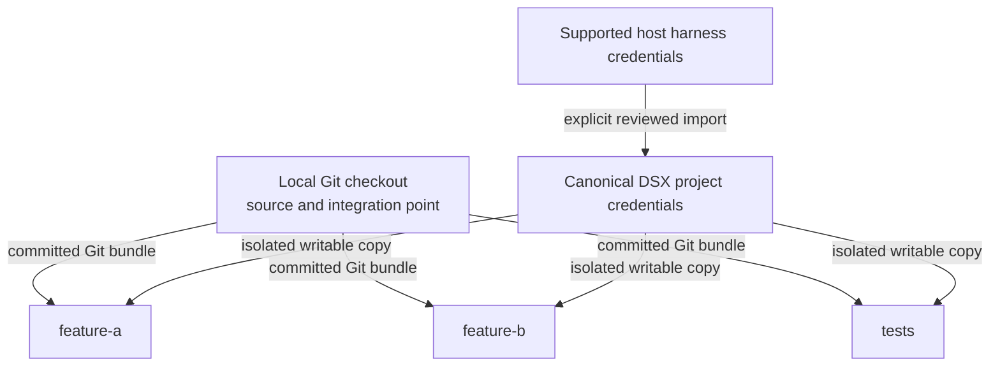
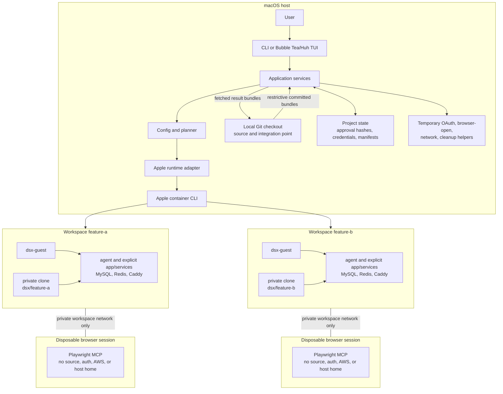

# ADR 0001: DSX implementation architecture

- **Status:** Accepted
- **Date:** 2026-08-11
- **Decision type:** Reversible early; increasingly costly after public configuration and release compatibility commitments
- **Owner:** DSX maintainers
- **Confidence:** 80%
- **Related:** [DSX Product Requirements](../PRD.md)

## Context

DSX must provide a fast, minimal, Apple-native command-line workflow for creating and operating isolated Linux development workspaces and coding-agent harnesses from an existing macOS Git checkout.

The implementation must coordinate:

- Apple’s `container` runtime.
- OCI image build and reuse.
- Interactive terminals and signal propagation.
- Multiple concurrently running named workspaces for one project.
- Independent Git source transfer, workspace branches, updates, and result retrieval.
- Multiple guest processes, including agents, applications, MySQL, Redis, and Caddy.
- Project configuration and approval of executable declarations.
- Explicit import and isolated use of supported authentication artifacts.
- Persistent project and workspace state without concurrent writable sharing.
- Optional per-agent-session browser isolation.
- Temporary host-network integration.
- Selective host port publication.
- Deterministic ownership and cleanup after normal completion, interruption, or failure.
- Recognition and cleanup of legacy DSX-owned resources without adopting them into the new workspace model.

Apple’s `container` CLI is written in Swift and uses Apple’s Containerization Swift package. That does not require clients of the installed CLI to use Swift. Apple describes the project as actively evolving and limits stability guarantees across some releases, making direct package coupling a material maintenance risk. See [Apple container](https://github.com/apple/container/blob/1.2.2/README.md).

This ADR defines a clean product cutover. DSX has one workspace type: a named Apple microVM containing a private Git clone. There are no workspace modes, distinguished primary workspace, direct host source mounts, unnamed lifecycle operations, or compatibility lifecycle aliases.

## Decision drivers

1. Fast startup and low idle overhead.
2. A single installable host executable.
3. Reliable process, terminal, signal, and network handling.
4. Ability to build a small Linux ARM64 guest helper from the same repository.
5. A narrow, version-checkable boundary with Apple’s runtime.
6. Minimal permanent DSX host state and no mandatory DSX daemon.
7. Concurrent workspace isolation without adding a scheduler or orchestration service.
8. Private Git metadata and files for every workspace.
9. Explicit, portable, per-harness credential handling.
10. Separation of workspace lifecycle, agent lifecycle, and browser-session lifecycle.
11. Maintainability by a small team.
12. A path to additional runtimes without changing product semantics.
13. A discoverable first-run experience without weakening the explicit, scriptable CLI.
14. Deterministic, readable, bounded runtime names and conservative cleanup.
15. Preservation of the standard image, toolchain, guest-process, service, networking, configuration-approval, performance, accessibility, and security contracts.

## Decision

### 1. Implement DSX in Go

Build two executables from one Go module:

- `dsx`: the macOS ARM64 host CLI and temporary host-helper entry points.
- `dsx-guest`: a static Linux ARM64 guest lifecycle helper distributed with `dsx` and mounted read-only into every workspace.

Go is selected because it provides self-contained binaries, fast startup, mature process and networking primitives, straightforward cross-compilation, and one language for both macOS control-plane and Linux guest components. The guest build must use `CGO_ENABLED=0` so it does not depend on the selected project image’s libc.

Swift will not be used for the main CLI. A narrowly scoped Swift helper may be introduced later only if a required macOS API cannot be used securely through a stable command or system interface.

### 2. Treat the Apple `container` CLI as the runtime boundary

DSX will invoke `container` commands as structured subprocess argument arrays. It will not:

- Import the Containerization Swift package.
- Copy or fork Apple’s CLI implementation.
- Expose Apple runtime control inside a workspace.
- Scrape human-formatted output when machine-readable output is available.

The runtime adapter must:

- Require macOS 26 or newer.
- Initially accept Apple `container` versions `>=1.2.2 <1.3.0`.
- Reject untested runtime versions until the self-hosted compatibility suite passes for them.
- Verify required Apple system services and capabilities without describing those services as DSX daemons.
- Use machine-readable inspection results where available.
- Treat command exit status, bind results, and runtime inspection as authoritative.
- Keep Apple-specific arguments inside one package.

Package boundary:

```text
internal/runtime/runtime.go
internal/runtime/apple/adapter.go
```

The internal runtime interface represents DSX operations rather than mirroring Docker or Apple command syntax:

```text
BuildImage
CreateWorkspace
StartWorkspace
Exec
Inspect
Stop
Delete
CreateVolume
DeleteVolume
CreateNetwork
DeleteNetwork
```

This preserves the option to add a Podman or Docker compatibility backend later without making one an MVP dependency.

### 3. Use a daemonless DSX host control plane

The `dsx` process plans and performs operations directly. DSX will not install a permanent background daemon for the MVP. Apple’s launchd-managed `container` services remain prerequisites and are checked by `dsx doctor`.

Temporary helper modes may be spawned by the same binary for:

- OAuth callback forwarding.
- Opening a macOS browser.
- Explicit host-network proxying.
- Active lifecycle and session cleanup coordination.

Each helper must be tied to a project, workspace, and lifecycle or agent-session lease. It must exit when that lease ends or the owning workspace stops.

Persistent host state is limited to:

- Project configuration.
- Configuration approval records.
- Canonical project credential stores.
- Resource manifests.
- Explicitly persistent authentication and cache data.

### 4. Use one named private-clone workspace type

A DSX workspace is a named, isolated Apple container/microVM containing guest-owned storage and a private Git clone.



The product model is:

- The local checkout is the source and integration point, not a DSX workspace.
- There is no distinguished or special workspace.
- All workspaces are named peers.
- Every workspace uses a guest-owned private clone.
- Multiple workspaces may run concurrently.
- Each workspace has independent files, Git metadata, dependencies, authentication working copies, sessions, service state, processes, ports, and resource limits.
- Workspace lifecycle and agent lifecycle are separate.
- DSX requires Git and transfers committed revisions through restrictive Git bundles.
- No host source directory is mounted into a workspace.
- No host home directory is mounted into a workspace.
- Host Git worktrees are not an isolation boundary because they share the host repository’s object database and metadata.
- DSX provides isolation and lifecycle management; it does not schedule tasks, coordinate prompts, or semantically merge results.

For a composite project, the same private-clone operation is repeated for each explicitly declared member repository while preserving approved relative paths. Member repositories do not share Git object databases, and cross-repository operations are not claimed to be atomic.

### 5. Use one integrated workspace VM for applications and services

Each workspace contains:

- The selected agent harness when invoked.
- Other installed approved harness CLIs.
- Its guest-owned private Git clone or explicitly declared private member clones.
- Application processes.
- Workspace-specific infrastructure such as MySQL and Redis.
- `dsx-guest`.
- An explicitly selected project process manager, when configured.

Processes inside one workspace communicate over guest loopback. This avoids one Apple VM per ordinary local service, reducing startup time, memory, network configuration, and cleanup complexity. Processes within a workspace intentionally share a trust boundary and are not isolated from one another.

Each concurrently running workspace receives independent:

- Source and Git metadata.
- Writable dependency and cache state.
- Service data.
- Authentication and session state.
- Private network.
- Published host ports.
- CPU and memory limits.

Concurrent workspaces must not share fixed host ports unless the user has explicitly configured a non-conflicting fixed allocation. Dynamic loopback publication is the default when concurrent publication is required.

Starting, creating, or restarting a workspace starts only the DSX guest control process. It does not automatically launch:

- An agent.
- `pnpm dev`.
- Watchers.
- Databases started manually by the user.
- Background commands.
- Project application processes.

Configured setup commands may run as finite, reviewed creation or update steps. Configured long-running processes and process managers run only when explicitly invoked; they are never implicitly restored by workspace lifecycle operations.

### 6. Use a mounted guest lifecycle helper with an exec control channel

`dsx-guest` is bind-mounted read-only at:

```text
/usr/local/libexec/dsx/dsx-guest
```

It is mounted into every standard or custom project image and provides the stable primary guest control process. Runtime injection is authoritative even if the selected image contains another copy.

`dsx-guest` must:

- Start configured commands without a guest shell unless the command explicitly requests one.
- Track process identity and health.
- Multiplex child stdout and stderr to container output with process-name prefixes.
- Propagate termination signals.
- Reap child processes.
- Report readiness and exit status.
- Mark a required managed process invocation failed when that process exits.
- Perform no automatic process restart in the MVP.
- Remain independent of any agent harness.

`dsx-guest` owns a guest-local Unix socket:

```text
/run/dsx/control.sock
```

The host invokes:

```text
container exec … dsx-guest ctl <operation> --json
```

That short-lived guest command communicates with the socket. Status, health polling, and cancellation therefore require no published control port, vsock dependency, or host control socket inside the guest. Runtime inspection detects whole-VM failure.

When a project already uses a process manager such as `process-compose`, DSX may launch it without its TUI as an explicitly requested managed child. Its output must retain process identity or be labeled as one process-manager stream.

Agents are normally launched through `container exec` after any explicitly requested required services become healthy.

### 7. Define project onboarding and configuration

Project onboarding configures reusable defaults for:

- Workspace image.
- Allowed agents.
- Default agent.
- Internet policy.
- Published ports.
- CPU and memory.
- Workspace concurrency.
- Setup definition.
- Processes and services.
- Health checks and dependencies.
- Persistent volumes and dependency caches.
- Workspace root and explicitly declared member repositories.
- Browser capability and policy.
- Network trust grants.
- Supported host authentication imports.

Setup writes the project contract to:

```text
~/.dsx/projects/<project-name>-<project-id>/config.jsonc
```

The readable project name is paired with an ID derived from the canonical project root to prevent collisions.

A repository-local contract may instead be stored at:

```text
.dsx/config.jsonc
```

DSX accepts exactly one configuration location. It fails closed when both locations exist and does not merge them.

Configuration precedence is:

```text
CLI flags
  > one active DSX configuration
  > DSX defaults
```

DSX may suggest configuration from dependency lockfiles, Dockerfiles, or `devenv.nix`, but it must not silently execute inferred commands. Dev Container declarations remain outside discovery and import.

Interactive users must approve the executable configuration hash. Unattended callers must provide the exact hash through:

```text
--approve-config
```

`--force` never bypasses configuration trust.

The approval review must show:

- Effective configuration and provenance.
- Image source.
- Executable setup and process commands.
- Mounts and volumes.
- Credential sources and destinations without secret values.
- Internet and host-network grants.
- Published guest ports and host bindings.
- CPU and memory.
- Configuration hash.

The approval completed during onboarding authorizes the immediately following create action when the executable plan is unchanged. Port changes and other executable changes require review and approval under the same rules.

### 8. Restrict host authentication imports to approved portable artifacts

Authentication import is always explicit. DSX must never import credentials silently or copy a complete harness directory.

The only supported host harness imports are:

| Harness | Allowed host import | Requirements |
|---|---|---|
| OMP | A consistent closed `agent.db` snapshot and its optional WAL | DSX must obtain and validate a consistent snapshot. No other OMP directory content is imported. |
| Codex CLI | The approved portable `auth.json` | No other Codex files or directories are imported. |
| Claude Code | None | Host login and macOS Keychain state are never copied. Authentication requires a DSX login. |
| OpenCode | The approved provider-auth artifact | No other OpenCode files or directories are imported. |

The onboarding review is:

```text
Agent authentication

OMP
  Codex Team                 Available to import

Codex CLI
  Existing host login        Available to import

Claude Code
  Host login not portable    DSX login required

OpenCode
  Existing host login        Available to import

[Import supported authentication]
```

Additional rules:

- Imported credentials become canonical project credentials separated by harness.
- OMP’s Codex provider identity remains inside OMP’s credentials.
- OMP credentials must not be translated into the separate Codex CLI credential format.
- A writable credential volume is never concurrently mounted into multiple workspaces.
- Credentials are never baked into an OCI image.
- Credential values are never logged or rendered in the TUI.
- Reviewed reusable non-secret skills and configuration may be mounted read-only.
- Cloud or network integrations such as an explicitly approved Leapp or host-network grant are separate from harness-auth import and do not expand the allowed harness artifact list.
- Leapp integration remains explicit and read-only at the filesystem boundary; any mounted profile is readable by processes in the workspace and must be reviewed accordingly.

Canonical credential operations are:

```console
dsx auth status
dsx auth import --agent omp
dsx auth import --agent codex
dsx auth login --agent claude
dsx auth refresh --agent omp
dsx auth purge --agent omp
```

`dsx auth purge` requires explicit selection and confirmation. Removing a workspace never silently purges canonical project credentials.

### 9. Create named workspaces from committed Git revisions

Workspace names must contain only lowercase letters, digits, and hyphens and must be no longer than 24 characters.

CLI examples:

```console
dsx workspace create feature-a
dsx workspace create feature-b --default-agent codex
```

The TUI creation form is:

```text
Create workspace

Name
  feature-a

Starting point
  feat/branch-1 @ abc123

Default agent
  OMP — inherited from project

Container
  dsx-tracking-chrome-feature-a-workspace-a81f2c

[Create and open]  [Create in background]
```

The form contains:

- A validated workspace name.
- The committed source branch and revision.
- An agent selector populated from `agents.allowed`.
- The project default agent preselected.

The form does not contain:

- Authentication selection.
- A task prompt.
- Browser selection.
- A workspace-mode selection.

Creation must:

1. Inspect the local Git checkout.
2. Require a clean tracked working tree.
3. Warn that ignored and untracked files are excluded.
4. Record the checked-out branch and commit.
5. Create and verify a restrictive temporary Git bundle.
6. Create the workspace VM, private network, and private volumes.
7. Clone into guest-owned storage without shared Git objects or object hardlinks.
8. Create and check out `dsx/<workspace-name>`.
9. Start only the DSX guest control process.
10. Optionally open an interactive shell.

Temporary source bundles must use restrictive permissions and be deleted after a verified transfer or rollback.

A composite project repeats the verified bundle and private-clone operation for each approved member repository. Relative paths are preserved, but no host repository metadata is shared.

The explicit CLI create command is scriptable and does not require authentication, a prompt, or browser selection. The TUI separately offers create-and-open and create-in-background actions.

### 10. Provide explicit workspace lifecycle commands

The workspace lifecycle command surface is:

```console
dsx workspace create NAME
dsx workspace list
dsx workspace open NAME
dsx workspace start NAME
dsx workspace stop NAME
dsx workspace restart NAME
dsx workspace update NAME
dsx workspace remove NAME
```

Semantics:

- `create` creates a new named workspace from the current committed local revision.
- `list` reports all current-project workspaces and their states.
- `open` opens an interactive shell in the named workspace and may run the same explicit start transaction first if it is stopped.
- `start` starts the VM and only the DSX guest control process.
- `stop` terminates workspace processes and the VM while preserving configured persistent state.
- `restart` performs a stop/start transaction for one named workspace.
- `update` transfers and rebases onto a newer committed local revision.
- `remove` deletes one named workspace only after protecting unfetched or otherwise unintegrated work.

Lifecycle operations always require a workspace name except `list`. There is no unnamed lifecycle.

The cutover provides no deprecated or compatibility aliases. The previous multiple-mode, distinguished-workspace, direct source-mount, shell-shortcut, and one-shot create-and-prompt command surfaces are not part of this contract. Agent execution is available only through the workspace-targeted agent command surface.

#### Restart

```console
dsx workspace restart feature-a
```

Restart preserves:

- The private Git clone.
- Commits and uncommitted files.
- Dependencies and persistent volumes.
- Authentication working copies.
- Workspace configuration.
- Workspace ownership metadata.

Restart terminates and does not restore:

- Agent sessions.
- `pnpm dev`.
- Watchers.
- Manually started databases.
- Background commands.
- Project application processes.

Only the DSX guest control process starts afterward. Restarting one workspace must not stop, restart, mutate, or reconfigure a sibling workspace.

#### Removal

Removal must detect:

- Commits that have not been fetched.
- Uncommitted tracked changes.
- Untracked workspace files.
- Incomplete result integration.
- An in-progress or conflicted rebase.

It must refuse destructive removal unless loss is explicitly confirmed. `--force` may confirm result loss where supported, but it never bypasses configuration trust or ambiguous ownership checks.

### 11. Update a workspace by rebasing onto the local checkout

```console
dsx workspace update feature-a
```

This command means **Update from local checkout**.

The operation must:

1. Require the local source state to be committed.
2. Verify that the local checkout remains on the workspace’s recorded source branch.
3. Transfer the latest revision through a restrictive, verified Git bundle.
4. Create a workspace backup ref.
5. Rebase `dsx/feature-a` onto the new local revision.
6. Report conflicts without attempting semantic resolution.

```text
Before:

Local:       C1 ── C2
Workspace:   C1 ── A1 ── A2

After:

Local:       C1 ── C2
Workspace:        └── A1′ ── A2′
```

If the workspace contains changes that prevent Git from beginning the rebase, DSX must report the precondition and leave the files unchanged. It must not silently stash files, discard files, or create commits.

On conflict, the persistent workspace state is:

```text
feature-a    Needs resolution
```

The user opens the workspace and resolves or aborts the rebase:

```console
git rebase --continue
# or
git rebase --abort
```

DSX does not attempt semantic conflict resolution. A conflicted workspace remains openable, but another update is unavailable until the rebase is continued or aborted.

Update and restart are unavailable while another lifecycle mutation for that workspace is active. A lifecycle mutation in one workspace does not block unrelated operations in sibling workspaces unless a project-wide runtime or configuration transaction requires serialization.

### 12. Keep agent lifecycle separate from workspace lifecycle

Agent commands always target an existing named workspace:

```console
dsx agent feature-a
dsx agent feature-a --agent codex
dsx agent feature-a --agent omp -- "implement the API"
```

Agent selection resolves in this order:

```text
Explicit --agent
      ↓
Workspace default
      ↓
Project default
```

Rules:

- The resolved agent must be present in `agents.allowed`.
- Without a prompt, DSX opens an interactive agent session.
- With a prompt after `--`, DSX runs that task inside the existing workspace.
- Repeated sessions reuse the same persistent workspace.
- An invocation-level `--agent` override does not change the workspace default.
- Starting an agent does not create another workspace.
- Ending an agent session does not remove or stop its workspace.
- Restarting or stopping a workspace terminates active agents and does not restore them.
- Agent sessions are tracked separately from workspace lifecycle leases.

### 13. Give each workspace and harness an isolated authentication copy

Authentication is not a workspace-creation decision.

When an agent first starts in a workspace, DSX must:

1. Resolve the canonical project credentials for that harness.
2. Create an independent writable workspace copy.
3. Inject only that harness’s approved credentials.
4. Run the agent against the isolated copy.
5. Serialize any approved credential promotion back to the canonical project store.

Concurrent workspaces must never share one writable credential or session volume.

If authentication is unavailable, DSX presents:

```text
OMP authentication is not configured.

[i] Import supported host credentials
[l] Sign in
[Esc] Cancel
```

Cancellation must leave the workspace intact and must not import or create credentials.

Authentication, reviewed reusable configuration, session history, dependency caches, and service state use separate volumes or mounts. Canonical project authentication persists independently of workspace removal and is deleted only through an explicit authentication purge.

### 14. Provide explicit Git result integration

The Git command surface is:

```console
dsx git status feature-a
dsx git diff feature-a
dsx git fetch feature-a
dsx git apply feature-a
```

For composite projects, the existing explicit member selector remains available:

```console
dsx git status feature-a --repo MEMBER
dsx git diff feature-a --repo MEMBER
dsx git fetch feature-a --repo MEMBER
dsx git apply feature-a --repo MEMBER
```

Composite operations require an explicit member where the target would otherwise be ambiguous. DSX does not claim cross-repository atomicity.

`dsx git fetch` exports a restrictive Git bundle from the workspace and imports its committed workspace branch into:

```text
refs/remotes/dsx/feature-a
```

The local checkout can merge it normally:

```console
dsx git fetch feature-a
git merge refs/remotes/dsx/feature-a
```

DSX must not invent a workspace commit to conceal uncommitted files. Uncommitted or untracked workspace changes remain visible through status and diff and continue to block destructive cleanup until integrated or explicitly discarded.

`dsx git apply` remains a convenience for applying the reviewed workspace result as a squash to the local working tree only when the local tracked-state fingerprint still matches the expected workspace base. Otherwise it refuses without modifying the local checkout. Transfer must preserve applicable binary files, renames, additions, and deletions.

The recommended parallel workflow is:

1. Create `feature-a` and `feature-b`.
2. Let both agents work independently.
3. Commit new local changes.
4. Update both workspaces.
5. Fetch and merge `feature-a`.
6. Update `feature-b` again from the merged local checkout.
7. Fetch and merge `feature-b`.

Removal refuses to destroy unfetched or unintegrated work unless loss is explicitly confirmed.

### 15. Make browser isolation opt-in per agent session

Browser support is enabled only for an individual agent invocation:

```console
dsx agent feature-a --browser
```

The TUI agent form is:

```text
Open agent

Agent
  OMP

[ ] Enable isolated browser

[Open agent]
```

When enabled, DSX must:

1. Create a disposable browser Apple container/microVM.
2. Connect it only to the selected workspace’s private network.
3. Wait for Playwright MCP readiness.
4. Inject ephemeral Playwright MCP configuration only into that agent session.
5. Give the browser no source, provider credentials, AWS credentials, host-home mount, or host runtime control.
6. Publish no browser control port to the host.
7. Delete the browser when the agent session ends, fails, or is cancelled.

The browser is not:

- Started during workspace creation.
- Shared between workspaces.
- Reused between agent sessions.
- Restored by workspace restart.
- Connected to sibling workspace networks.

The Playwright MCP endpoint exists only on the selected workspace’s private network. OAuth may use a temporary host callback bridge tied to the active session; automated browsing must not reuse the user’s daily browser profile.

### 16. Use deterministic, readable, bounded resource names

New container names use:

```text
dsx-<project:16>-<workspace:24>-<role:9>-<hash:6>
```

Examples:

```text
dsx-tracking-chrome-feature-a-workspace-a81f2c
dsx-tracking-chrome-feature-b-workspace-a81f2c
dsx-tracking-chrome-feature-a-browser-a81f2c
```

Rules:

- The project-folder component is sanitized and limited to 16 characters.
- The workspace component contains lowercase letters, digits, and hyphens and is limited to 24 characters.
- The role is limited to 9 characters.
- The hash is six characters derived from the canonical project path.
- A complete generated container name is at most 62 bytes.
- The format is deterministic for the same canonical project, workspace, and role.
- Ownership labels and runtime inspection remain authoritative even when a readable name is present.
- Existing resources retain their existing names.
- Legacy names are never rewritten merely to match the new format.

The 62-byte generation limit satisfies the acceptance requirement that runtime names remain at most 63 bytes.

### 17. Track ownership with runtime metadata and atomic manifests

Every new DSX-owned resource must carry supported ownership metadata identifying:

- DSX namespace.
- Canonical project ID.
- Workspace name.
- Lifecycle or agent-session ID where applicable.
- Resource type or role.

A local atomic manifest records:

- Intended resource graph.
- Workspace state.
- Git fetch and integration state.
- Rebase-conflict state.
- Cleanup state.
- Active lifecycle and session leases.

Runtime inspection and supported ownership labels are authoritative when a manifest is stale. DSX does not require SQLite for the MVP; atomic JSON manifests and file locking are sufficient.

Cleanup rules:

- `dsx workspace stop NAME` preserves configured persistent state.
- `dsx workspace remove NAME` removes one current workspace after protecting unfetched or unintegrated work.
- Apple runtime-owned builder resources are never classified as project resources or deleted by DSX.
- Ambiguous ownership is reported and left intact.
- Unrelated resources are never deleted.
- Repeated removal and rollback operations are safe and idempotent.
- Partial creation is rolled back using the same ownership and manifest rules.
- Canonical project authentication is not deleted by workspace removal.

Legacy DSX-owned resources must be safely recognized but are cleanup-only:

- They are not adopted as current workspaces.
- They cannot be opened, started, restarted, updated, or targeted by an agent through current lifecycle commands.
- Their existing runtime names remain unchanged.
- Cleanup requires corroborating ownership metadata and explicit selection or confirmation.
- Ambiguous legacy resources remain intact and are reported.
- No compatibility lifecycle alias is provided for them.

### 18. Preserve the managed standard image and shell contract

The OCI image model is:

```text
Pinned Ubuntu base
  → common DSX development layer
  → project toolchain/system dependency layer
  → selected project image
```

The common DSX development layer defines the managed-standard-image contract.

#### Shell

- Install Zsh.
- Use `/bin/zsh -il` only for a bare interactive shell opened in a workspace.
- Set image-level `ZDOTDIR=/usr/local/share/dsx/shell`.
- Use a root-owned `.zshrc` loader so an empty persistent `/home/dsx` does not trigger the first-run Zsh wizard.
- Use `/usr/local/share/dsx/shell/dsx.zsh` as the sole authored executable defaults file.
- Use these other authored inputs:

```text
/usr/local/share/dsx/shell/zsh_plugins.txt
/usr/local/share/dsx/shell/starship.toml
```

Fetch Antidote and all plugin sources during image build from immutable checksum- or commit-pinned inputs.

Plugin order is invariant:

1. `zsh-users/zsh-completions` adds its `fpath` before `compinit`.
2. `Aloxaf/fzf-tab` loads after `compinit`.
3. `zsh-users/zsh-history-substring-search` loads.
4. `zsh-users/zsh-autosuggestions` loads.
5. `zsh-users/zsh-syntax-highlighting` loads last.

Oh My Zsh, nvm plugins, and pyenv plugins are not part of the managed stack.

Generate these files during image build:

```text
/usr/local/share/dsx/shell/plugins-pre.zsh
/usr/local/share/dsx/shell/plugins-post.zsh
/usr/local/share/dsx/shell/zcompdump
/usr/local/share/dsx/shell/fzf-init.zsh
/usr/local/share/dsx/shell/direnv-init.zsh
/usr/local/share/dsx/shell/starship-init.zsh
```

`dsx.zsh` initializes them in deterministic order:

1. Source the pre-loader.
2. Run `compinit -C` against the immutable completion dump.
3. Source the static FZF initializer when stdin and stdout are terminals.
4. Source the post-loader.
5. Source the static direnv initializer.
6. Set `STARSHIP_CONFIG` to `/usr/local/share/dsx/shell/starship.toml`.
7. Source the static Starship initializer.

Pinned Antidote remains installed in `/opt/antidote` and autoloadable from managed Zsh, but shell startup does not invoke it.

Shell startup performs no:

- Network access.
- Plugin resolution.
- Repository checkout.
- Initialization regeneration.

#### Toolchain

The managed standard image installs:

- Node.js active LTS with npm.
- A compatible stable pnpm.
- Python 3 with pip and venv plus a `python` command.
- Go 1.26.5.
- A supported LTS JDK with `java` and `javac`.

Tool artifacts and installers must be immutable and checksum-pinned.

The toolchain `PATH` is published through the image environment, not only through Zsh startup. Structured commands are passed as exact argv to the runtime exec path. `dsx-guest` starts configured argv processes without a shell. Neither path depends on shell startup files; only an explicitly configured shell command invokes a shell.

DSX must never read, copy, mount, import, or execute host dotfiles. The complete managed shell experience is image-owned and does not weaken host-home isolation.

This contract applies only when the approved plan selects the DSX-managed standard image. Custom images remain the project’s explicit responsibility. DSX does not inject the managed shell or toolchain layer or alter a custom image’s shell expectations. Runtime injection of the read-only `dsx-guest` remains authoritative.

#### Image integrity and caching

Shell assets, locks, generated initialization, and toolchain inputs are part of the standard image build context and content digest. They preserve:

- Image-layer cache keys.
- Approval review.
- Managed-image attestation.
- Release-digest semantics.

Supported agent harnesses are included in the standard agent-ready image for fast switching. A release binary resolves that image through its published immutable digest.

When release metadata is absent, a development binary must:

1. Use the embedded DSX-owned Containerfile and harness lock.
2. Include their complete build-context digest in the approved execution plan.
3. Materialize them in a private directory outside the project.
4. Build a content-addressed image named:

```text
dsx.local/standard:<input-digest-prefix>
```

5. Reuse that tag on subsequent operations with matching inputs.

Harness attestation accepts this path only when the plan selects the managed standard image and its input digest matches the embedded authority. Project and custom builds remain outside that trust path.

`dsx-guest` is still mounted at runtime so host and guest versions stay aligned. Project setup state is reusable only while its declared inputs and configuration hash remain unchanged.

### 19. Preserve network and port isolation

Each workspace receives its own private network. Container-local applications and services communicate over loopback.

User-facing ports are selectively published to macOS:

- Bind to `127.0.0.1` unless the user approves an explicit broader trust grant.
- Treat the runtime bind result as authoritative.
- Prefer dynamically allocated loopback host ports for concurrently running workspaces.
- Require explicit, non-conflicting configuration for fixed host ports.
- Report final published URLs.
- Never publish the guest control socket or a browser control port.

Internet access follows the project’s approved internet policy. Explicit host-network or Tailscale proxying requires a reviewed trust grant and a temporary proxy tied to an active project, workspace, and lease.

Port publication is create-time runtime authority. Changing publication for an existing workspace requires review and explicit confirmation before replacing its runtime container. The workspace network and DSX-owned persistent volumes are retained where safe.

### 20. Use a state-aware, accessible terminal UI for bare `dsx`

When stdin and stdout are interactive terminals, bare `dsx` launches a TUI in the same executable:

- If no project configuration and no DSX resources exist, it opens the setup wizard.
- For a configured project, it shows Apple Container availability, local checkout state, and named workspace state.
- Apple Container may be reported as installed, stopped, running, or unavailable.
- A workspace may be reported as absent, stopped, running, needs resolution, or unverifiable.

The workspace dashboard is:

```text
DSX PROJECT — tracking-chrome-extension

Local checkout
  feat/branch-1 @ abc123
  Clean

Workspaces

> feature-a    Running             OMP · Codex
  feature-b    Stopped             Codex
  tests        Needs resolution    OMP · Codex

[c] Create workspace
[Enter] Open
[a] Open agent
[u] Update from local checkout
[s] Start/stop
[r] Restart
[g] Review Git changes
[d] Remove
[q] Quit
```

Actions are state-aware:

- Inapplicable actions are not rendered as available.
- Restart and update are unavailable while another lifecycle mutation for that workspace is active.
- Update is unavailable while a rebase requires resolution.
- Agent actions require an existing startable workspace and an approved agent.
- Removal reflects unfetched or unintegrated-work protection.
- Advanced port and project configuration remain under contextual secondary actions.

Starting the Apple container system is an explicit user action.

`dsx init` opens the setup flow directly.

Without an interactive terminal, bare `dsx` prints help and exits without prompting or changing state.

The TUI uses:

- [Bubble Tea](https://github.com/charmbracelet/bubbletea) as the state/update/view framework.
- [Huh](https://github.com/charmbracelet/huh) for setup and lifecycle forms.
- Bubbles and Lip Gloss only where needed.
- Huh’s accessible mode as the initial screen-reader path.

The TUI is a presentation adapter, not a second control plane:

```text
Explicit CLI commands ─┐
                       ├→ application services → planner → runtime/Git adapters
TUI actions ───────────┘
```

The setup flow performs detection and planning without mutation. Final confirmation first performs a read-only Apple container-system status check. A missing CLI or any service state other than `running` fails before configuration or approval persistence.

Confirmed setup remains inside the TUI, renders bounded secret-free setup milestones, and transitions to the project dashboard.

The TUI:

- Never renders raw runtime logs as lifecycle milestones.
- Never displays secret values.
- Masks secret input.
- Sanitizes untrusted repository names, paths, configuration text, process labels, and runtime output.
- Strips or escapes ANSI and control sequences.
- Respects `NO_COLOR`.
- Supports narrow terminals and resize events.
- Restores terminal state on normal exit, cancellation, recoverable errors, and child-process handoff.
- Exits its alternate screen before handing the terminal to an interactive guest or agent process.
- May restore the dashboard after the child exits.
- Treats Ctrl-C before confirmation as side-effect free.
- Uses the same rollback path for interruption during creation as explicit CLI operations.

Resource selectors update only the in-memory configuration submitted to planning. Returning from review reconstructs forms from those in-memory choices and performs no write or runtime mutation.

### 21. Treat performance and builder state as explicit runtime concerns

Apple’s shared BuildKit builder is runtime-owned global infrastructure. `dsx doctor` verifies it when a build is required. DSX cleanup never deletes it. Timing reports builder startup separately.

Initial p95 acceptance budgets on a warm host are:

- `dsx inspect` completes within 500 ms.
- DSX planning completes within 250 ms.
- Opening a cached empty workspace interactive shell reaches its prompt within 3 seconds, excluding setup and services.
- Ordinary workspace removal and cleanup complete within 5 seconds.
- DSX host and guest helpers use no more than 100 MiB combined.

These are budgets to validate, not claims about unmeasured Apple VM, image, agent, database, or project-process resource usage.

## Command contract

### Project and diagnostics

```console
dsx
dsx init
dsx doctor
dsx inspect
```

### Workspace lifecycle

```console
dsx workspace create NAME
dsx workspace list
dsx workspace open NAME
dsx workspace start NAME
dsx workspace stop NAME
dsx workspace restart NAME
dsx workspace update NAME
dsx workspace remove NAME
```

### Agent lifecycle

```console
dsx agent WORKSPACE
dsx agent WORKSPACE --agent AGENT
dsx agent WORKSPACE --agent AGENT -- "PROMPT"
dsx agent WORKSPACE --browser
```

### Authentication

```console
dsx auth status
dsx auth import --agent omp
dsx auth import --agent codex
dsx auth login --agent claude
dsx auth refresh --agent omp
dsx auth purge --agent omp
```

### Git integration

```console
dsx git status WORKSPACE
dsx git diff WORKSPACE
dsx git fetch WORKSPACE
dsx git apply WORKSPACE
```

For an explicitly declared composite member:

```console
dsx git status WORKSPACE --repo MEMBER
dsx git diff WORKSPACE --repo MEMBER
dsx git fetch WORKSPACE --repo MEMBER
dsx git apply WORKSPACE --repo MEMBER
```

No deprecated aliases, unnamed lifecycle operations, or implicit create-and-run behavior are provided.

## Architecture



## Options considered

### Implementation language

| Option | Benefits | Costs | Decision |
|---|---|---|---|
| Go | Fast, self-contained host binary; mature CLI, process, and networking support; straightforward Linux ARM64 guest build | Less direct access to Apple-only frameworks; configuration types are less expressive than TypeScript | **Selected** |
| Swift | Native Apple APIs; same ecosystem as `container`; self-contained macOS binary | Linux guest build and shared code are harder; direct Containerization coupling is unstable; Apple-only control plane | Not selected for the main CLI |
| TypeScript with Bun | Fast product iteration; strong JSON/configuration and agent ecosystem; standalone Darwin/Linux executables | Larger embedded runtime; less conservative for PID 1, PTY, proxy, and signal-critical code | Viable fallback |
| Rust | Strong performance and safety; self-contained binaries | Higher implementation complexity and slower iteration for this product | Not selected |

Bun’s standalone executable capability remains an alternative if Go materially slows product iteration: [Bun single-file executable documentation](https://bun.sh/docs/bundler/executables).

### Runtime integration

| Option | Benefits | Costs | Decision |
|---|---|---|---|
| Invoke Apple `container` CLI | Small surface; uses installed signed runtime; enforceable tested-version range; language-independent | Subprocess overhead; requires self-hosted compatibility tests | **Selected** |
| Import Containerization Swift package | Typed low-level integration; native access | Tight coupling to evolving Apple APIs; Swift control plane; duplicated CLI policy | Not selected |
| Use Docker or Podman by default | Broader ecosystem and Compose compatibility | Does not meet the Apple-native default; adds daemon or VM dependencies | Deferred compatibility backend |

Subprocess overhead is expected to be insignificant compared with VM boot, image build, dependency installation, and service readiness, but performance remains subject to measurement against the stated budgets.

### Workspace strategy

| Option | Benefits | Costs | Decision |
|---|---|---|---|
| Named guest-owned private clone from a verified Git bundle | Independent files and Git metadata; excludes ignored files; supports concurrent workspaces, updates, and explicit result retrieval | One VM and clone per workspace; clean committed host input; explicit fetch and merge workflow | **Selected as the only workspace type** |
| Direct host source mount | Immediate host visibility | Exposes the host checkout, ignored files, and host-side mutation risk | Rejected |
| Host Git worktree | Efficient parallel branches | Shares host Git objects and metadata; `.git` pointer complicates isolation | Rejected as the security boundary |
| Multiple workspace modes | Accommodates different interaction styles | Creates divergent lifecycle, security, and command semantics | Rejected |

### Service topology

| Option | Benefits | Costs | Decision |
|---|---|---|---|
| Integrated workspace services | Fast; loopback compatibility; one VM; simpler cleanup | Services and agents share a trust boundary and resources | **Selected for MVP** |
| One sibling Apple VM per service | Stronger service isolation and independent lifecycle | Higher startup, memory, and networking cost | Deferred opt-in |
| Reuse host services | Avoids duplicate installation and data | Weakens isolation; complicates host loopback bridging and ownership | Not the default |

### Host lifecycle

| Option | Benefits | Costs | Decision |
|---|---|---|---|
| Daemonless DSX CLI with temporary helpers | Minimal installation and idle cost; explicit ownership | No background scheduler; crash recovery relies on manifests and labels | **Selected** |
| Permanent DSX host daemon | Central scheduling, monitoring, and orchestration | Larger security and lifecycle surface; idle overhead | Deferred |

### Terminal interface

| Option | Benefits | Costs | Decision |
|---|---|---|---|
| Bubble Tea v2 and Huh v2 in `dsx` | Native Go stack; forms, dashboard composition, accessibility path; shared binary | Adds terminal dependencies and interaction testing | **Selected** |
| Hand-written ANSI UI | Few dependencies | High input, rendering, and accessibility risk | Rejected |
| Separate GUI or web UI | Rich visuals | Adds service, packaging, security, and lifecycle surface | Out of MVP |
| Help text only | Smallest implementation | Poor first-run discovery for a configuration-heavy security tool | Rejected |

## Tradeoffs and consequences

### Positive consequences

- Every workspace has private files and Git metadata.
- Multiple workspaces can run concurrently without sharing writable authentication, sessions, dependency state, databases, or fixed ports.
- Workspace, agent, and browser lifecycles are independently understandable.
- The local checkout remains the explicit source and result-integration point.
- The host source and host home are not mounted into workspaces.
- Apple runtime changes remain contained within one version-gated adapter.
- Host and Linux guest lifecycle components share one language and repository.
- Applications and databases retain ordinary loopback communication inside each workspace.
- All result operations remain discoverable under `dsx git`.
- Cleanup has a deterministic owned resource graph and protects unfetched work.
- No permanent DSX daemon, Git daemon, or host container-control socket is added.
- Bare `dsx` provides guided setup and lifecycle discovery without changing the explicit command contract.
- Deterministic names remain readable while bounded below runtime name limits.
- Authentication import is limited to reviewed portable artifacts and isolated per workspace and harness.

### Negative consequences

- Go maintainers must implement JSONC validation and rich configuration diagnostics without TypeScript’s native type ecosystem.
- Invoking a CLI requires a self-hosted Apple silicon compatibility suite.
- Integrated services are not isolated from malicious agents or dependencies inside one workspace.
- A standard polyglot image may be large.
- Concurrent workspaces duplicate VMs, dependency state, and configured databases.
- Git bundle transfer requires committed tracked input, explicit updates, explicit result fetching, and per-repository handling for composite projects.
- Uncommitted workspace changes cannot be represented by a normal fetched branch until the user commits them.
- DSX does not resolve semantic rebase or merge conflicts.
- Workspace restart intentionally does not restore development processes or agent sessions.
- Docker Compose and Testcontainers projects remain unsupported until a compatibility backend exists.
- The TUI adds terminal-state, resizing, accessibility, and interaction tests to the first vertical slice.
- Per-session browser isolation requires an additional VM for each browser-enabled agent session.

## Security considerations

### Host boundary

- Never mount or forward Apple, Docker, or Podman runtime control into a workspace.
- Never mount host source into a workspace.
- Never mount the complete host home directory.
- Do not expose an SSH agent, GPG agent, macOS Keychain, Tailscale state, or browser profile by default.
- Invoke host processes with structured arguments and controlled environments.
- Bind published ports to `127.0.0.1` unless the user approves an explicit trust grant.
- Treat runtime bind results as authoritative.
- Use restrictive temporary files for source and result Git bundles.
- Remove temporary bundles after verified transfer or rollback.
- Limit temporary host proxies to an active project, workspace, and lease.
- Remove temporary helpers and proxies during normal exit, cancellation, failure, and cleanup.

### Project configuration

- Treat setup commands, process definitions, plugins, skills, hooks, and MCP servers as executable code.
- Show effective configuration and provenance before execution.
- Require approval whenever the executable configuration hash changes.
- Require unattended callers to provide the exact hash through `--approve-config`.
- Do not allow `--force` to bypass configuration trust.
- Never run imported host lifecycle commands silently.
- Fail closed on unsupported security-relevant fields.
- Treat internet policy, host-network grants, mounts, and published ports as approval-relevant inputs.

### Guest boundary

- Run as a non-root user by default.
- Guest elevation grants control over the workspace VM and every mounted resource but must not grant host runtime control.
- Apply CPU, memory, and workspace-concurrency limits.
- Use separate writable volumes for each workspace’s dependencies, service data, authentication, and sessions.
- Do not share Git metadata or object storage between workspaces.
- The integrated topology intentionally does not isolate MySQL, Redis, applications, and agents inside one workspace.
- Workspace isolation does not prevent source exfiltration when internet access is approved.
- Workspace isolation does not prevent semantic merge conflicts.

### Credentials

- Allow only the four explicitly defined harness-auth behaviors:
  - OMP consistent closed `agent.db` snapshot plus optional WAL.
  - Codex approved portable `auth.json`.
  - No Claude host import or macOS Keychain copying.
  - OpenCode approved provider-auth artifact.
- Require explicit import approval every time host credentials are imported.
- Never import complete harness directories.
- Prefer first login inside a dedicated Linux authentication volume when no approved portable import exists.
- Seed a workspace-specific writable authentication copy rather than sharing a writable project profile.
- Serialize promotion back to canonical project credentials.
- Mount reusable non-secret configuration and skills read-only where supported.
- Never bake credentials into OCI images.
- Never log credential values.
- Treat OAuth tokens stored in host-resident DSX or VM volume data as sensitive plaintext at rest.
- Keep OMP provider credentials in OMP format and do not translate them into Codex CLI credentials.

### Browser

- Keep automated browsing in a separate disposable VM.
- Give it no source, provider authentication, AWS credentials, host home, or host runtime control.
- Share only the owning workspace’s private application network.
- Publish no browser-control port to the host.
- Expose Playwright through a DSX-managed MCP endpoint.
- Inject only ephemeral session-specific harness configuration.
- Delete the browser after session completion, cancellation, or failure.
- Use a temporary OAuth callback bridge rather than the daily browser profile.

### Terminal UI

- Treat repository names, paths, configuration text, process labels, and runtime output as untrusted display input.
- Strip or escape ANSI and control sequences.
- Never display secret values.
- Mask secret input.
- Do not create configuration or runtime resources before final confirmation.
- Keep review navigation side-effect free.
- Restore terminal state on normal exit, cancellation, child-process handoff, and recoverable errors.
- Respect `NO_COLOR`, narrow terminals, resize events, and accessible mode.
- Print help and exit in non-interactive contexts rather than opening prompts.

### Cleanup

- Delete only resources with corroborating DSX ownership metadata.
- Never delete Apple runtime-owned builder state.
- Refuse deletion of unfetched or unintegrated work without explicit confirmation.
- Leave ambiguous resources intact and report them.
- Never delete unrelated resources.
- Make cleanup idempotent.
- Test cleanup after normal exit, failure, interruption, and partial creation.
- Require explicit selection and confirmation for canonical authentication deletion.
- Treat legacy resources as cleanup-only and never silently adopt them.

## Assumptions

- The target host has Apple silicon and macOS 26 or newer.
- Apple `container` versions `>=1.2.2 <1.3.0` provide the required ARM64 image, mount, network, volume, exec, inspection, and loopback-publication behavior.
- Rosetta and amd64-only project dependencies are outside the MVP.
- Go can provide the required PTY behavior or use a small maintained PTY dependency without a DSX daemon.
- Supported projects can execute on Linux ARM64 and clone from Git bundles.
- The local project is a Git checkout and source updates can be represented by committed revisions.
- Most local application and infrastructure processes can coexist in one workspace VM.
- Project maintainers provide explicit configuration for non-obvious lifecycle behavior and composite repository membership.
- Browser isolation is worth one additional VM per browser-enabled agent session because it handles untrusted content.
- Approved per-harness authentication artifacts can be copied into independent writable workspace volumes without mounting complete host configuration trees.
- Atomic manifests plus runtime labels are sufficient before background scheduling or multi-host operation exists.
- Interactive users have a terminal compatible with Bubble Tea or can use the accessible/plain CLI path.

## Implementation outline

This outline describes required implementation work and does not assert that the behavior already exists.

### Sequence 1: contract, runtime, and named-workspace foundation

- Update the PRD, this ADR, configuration schema, and manuals.
- Replace all former workspace-mode domain types with one named private-clone workspace model.
- Remove distinguished-workspace assumptions, host source mounts, unnamed lifecycle behavior, compatibility aliases, and one-shot create-and-prompt flow.
- Implement `dsx doctor`, `dsx inspect`, and runtime version and service checks.
- Implement `dsx workspace create`, `list`, `open`, `start`, `stop`, `restart`, and `remove`.
- Implement deterministic names no longer than 62 bytes.
- Implement atomic manifests, ownership labels, rollback, and conservative cleanup.
- Add recognition of existing DSX-owned resources as cleanup-only.
- Add bare-`dsx` setup selection, Huh forms, and the Bubble Tea workspace dashboard.
- Test non-TTY help fallback, side-effect-free cancellation, ANSI sanitization, `NO_COLOR`, narrow layouts, resizing, accessible mode, and terminal restoration.
- Exercise a pinned standard image against `course-intelligence-agency`.
- Test interactive terminal attachment, signal forwarding, persistent private volumes, and complete owned-resource cleanup.
- Test file watching and HMR inside guest-owned storage for Vite, webpack, and Next.

### Sequence 2: guest processes, configuration, and services

- Bind-mount `dsx-guest`.
- Implement `/run/dsx/control.sock`.
- Exercise `container exec` JSON control operations.
- Implement home-local and repository-local JSONC configuration parsing.
- Implement fail-closed location selection, provenance, review, interactive approval, and `--approve-config`.
- Implement setup definitions, process health checks, prefixed logs, explicit integrated services, and failure semantics.
- Ensure workspace start and restart launch only the DSX guest control process.
- Exercise the composite `devenv` workspace with MySQL, Redis, Caddy, and selected application processes.
- Test independent workspace service data and non-conflicting host ports.

### Sequence 3: source update, agents, authentication, and Git integration

- Implement verified restrictive source bundles and private guest cloning.
- Implement source-branch recording and `dsx/<workspace-name>` branches.
- Implement `dsx workspace update`, backup refs, rebase, and persistent `Needs resolution` state.
- Implement OMP, Codex, Claude Code, and OpenCode adapters.
- Implement allowed-agent and default-agent resolution.
- Implement the exact approved host credential imports.
- Implement canonical per-project, per-harness credentials.
- Implement independent writable workspace credential and session copies.
- Implement serialized credential promotion.
- Implement `dsx agent WORKSPACE` interactive and prompted invocations.
- Implement `dsx git status`, `diff`, `fetch`, and `apply`.
- Test that concurrently running same-project workspaces share no Git metadata, writable authentication, session state, service state, or fixed host ports.
- Test result protection during workspace removal.
- Test update conflicts, `git rebase --continue`, and `git rebase --abort`.

### Sequence 4: browser and host integration

- Implement opt-in per-agent-session browser VMs.
- Implement private-network-only Playwright MCP readiness and injection.
- Implement deletion on normal completion, cancellation, failure, and workspace stop.
- Implement macOS URL opening and temporary OAuth callback forwarding.
- Implement explicit Leapp and host-network or Tailscale proxy grants.
- Verify that browser VMs receive no source, provider credentials, AWS credentials, host home, or host runtime access.
- Verify that no browser control port is published to the host.

### Sequence 5: complete Apple-runtime workflow validation

- Run VM, PTY, image, mount, network, port, browser, cleanup, and version-compatibility tests on self-hosted Apple silicon.
- Exercise three concurrently running named workspaces.
- Exercise independent update, fetch, and merge workflows.
- Measure startup, planning, inspection, cleanup, and helper-memory budgets.
- Test lifecycle failure and cleanup before introducing each additional resource type.
- Keep unit and adapter command-generation tests in ordinary CI.
- Keep real Apple runtime compatibility tests on self-hosted Apple silicon.

## Acceptance criteria

The redesign is accepted for release only when all of the following are validated:

### Product workflow

- Three named workspaces run concurrently with independent files and processes.
- No workspace receives a host source mount.
- No workspace receives a host-home mount.
- The local checkout is not represented as a DSX workspace.
- Workspace creation requires neither authentication, prompt, nor browser selection.
- Workspace lifecycle and agent lifecycle operate independently.
- There is no unnamed lifecycle behavior or deprecated lifecycle alias.
- Restarting one workspace cannot affect a sibling workspace.

### Source and Git

- Workspace creation requires a clean tracked local checkout and reports excluded ignored and untracked files.
- Every workspace clones from a verified restrictive Git bundle into guest-owned storage.
- Workspaces share no Git metadata or object storage.
- Workspace update rebases onto the latest committed local revision.
- Update verifies the recorded source branch.
- Rebase conflicts persist as `Needs resolution`.
- DSX does not silently stash files, discard files, invent commits, or attempt semantic conflict resolution.
- Workspace results can be fetched independently into `refs/remotes/dsx/<workspace-name>`.
- Independently fetched workspace branches can be merged through normal Git operations.
- Cleanup protects unfetched and unintegrated work.

### Authentication

- Supported host credentials are imported only after explicit approval.
- OMP imports only a consistent closed `agent.db` snapshot and optional WAL.
- Codex imports only its approved portable `auth.json`.
- Claude imports no host credential or macOS Keychain state and requires a DSX login.
- OpenCode imports only its approved provider-auth artifact.
- Complete harness directories are never imported.
- Canonical project credentials remain separated by harness.
- Every workspace receives an independent writable credential copy for the selected harness.
- Concurrent workspaces never share one writable authentication or session volume.
- OMP’s Codex provider identity is not translated into Codex CLI credentials.

### Lifecycle and processes

- Workspace start and restart launch only the DSX guest control process.
- Restart preserves the clone, commits, uncommitted files, dependencies, persistent volumes, authentication copies, configuration, and ownership.
- Restart relaunches no agent, application, watcher, database, process manager, or background command.
- Guest process control requires no published control port.
- Required managed process failure is reported without automatic restart.
- Signals are propagated and child processes are reaped.

### Browser

- A browser VM exists only for an explicitly browser-enabled agent session.
- Browser VMs are not started during workspace creation.
- Browser VMs are not shared or reused between sessions.
- Browser VMs are not restored by workspace restart.
- A browser connects only to its owning workspace’s private network.
- A browser receives no source, provider credentials, AWS credentials, host home, or host runtime control.
- No browser control port is published to the host.
- Browser resources are deleted after session completion, cancellation, or failure.

### Networking and resources

- Published ports bind to `127.0.0.1` unless an explicit broader trust grant is approved.
- Concurrent workspaces receive independent networks and non-conflicting host ports.
- Runtime bind results are treated as authoritative.
- Generated runtime names are readable, deterministic, unique within their ownership scope, and no longer than 62 bytes.
- Ownership labels and runtime inspection remain authoritative.
- Existing owned resources retain their existing names.
- Legacy resources are recognized only for safe cleanup.
- Cleanup never deletes unrelated, ambiguous, or Apple runtime-owned builder resources.
- Cleanup and rollback are idempotent.

### Configuration, TUI, and security

- Executable configuration is reviewed and hash-approved before mutation.
- `--approve-config` requires the exact hash.
- `--force` does not bypass configuration trust.
- Bare `dsx` prints help without mutation when not attached to an interactive terminal.
- TUI cancellation before confirmation is side-effect free.
- The TUI sanitizes untrusted display input, masks secrets, respects `NO_COLOR`, supports resizing and narrow terminals, and provides an accessible mode.
- Terminal state is restored around cancellation, errors, and interactive child handoff.
- No host dotfiles, runtime control sockets, Keychain state, or complete host home are mounted or imported.

### Performance

On a warm host, subject to measured p95 validation:

- `dsx inspect` completes within 500 ms.
- DSX planning completes within 250 ms.
- A cached empty workspace interactive shell reaches its prompt within 3 seconds, excluding setup and services.
- Ordinary workspace removal and cleanup complete within 5 seconds.
- DSX host and guest helpers use no more than 100 MiB combined.

## What would change this decision

Reconsider Go or the Apple CLI boundary if:

- Apple publishes a stable, supported high-level API that materially improves security or functionality over the CLI.
- Required runtime behavior cannot be observed or controlled reliably through machine-readable CLI operations.
- A required Network Extension, Keychain, or Virtualization feature requires a privileged Swift component.
- Go PTY behavior proves unreliable for supported harnesses.
- Bun or TypeScript reduces implementation complexity enough to outweigh the larger runtime and systems-code risk.
- Real project measurements show that one integrated VM per workspace cannot meet startup, memory, or service-isolation requirements.
- Git bundle transfer, update rebasing, or independent per-workspace authentication cannot support required workflows safely.
- Terminal behavior or accessibility requirements cannot be met reliably with Bubble Tea and Huh without compromising the explicit CLI.
- A material share of target projects requires Docker Engine APIs.

## Revisit

Revisit this ADR after:

1. The named-workspace, guest-process, and configuration slices pass lifecycle and cleanup tests for both reference projects.
2. Three concurrent workspaces pass isolation, update, authentication, and result-transfer tests.
3. Per-session browser cleanup passes normal completion, cancellation, failure, and workspace-stop tests.
4. Measured startup time, memory, cleanup reliability, Apple CLI compatibility, PTY correctness, file watching, integrated-service behavior, and Git transfer safety are available for review.