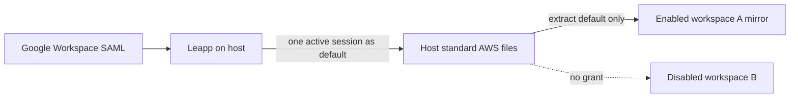

# DSX Default AWS Profile Plan

## Status

Implementation in progress. This document defines target behavior and acceptance criteria, not a claim that every slice is already implemented. `docs/PRD.md` and `docs/adr/0001-dsx-implementation-architecture.md` remain authoritative.

Decision type: reversible product scope reduction with a security-sensitive dynamic authority grant.

## 1. Recommendation

Support only the standard AWS `default` profile in the first increment.

Assumptions:

- The user has at most one active host AWS session at a time.
- The host credential provider materializes that session as `[default]` in the standard AWS `config` and `credentials` files.
- Leapp is the first proven provider because it performs the company's Google Workspace SAML flow and rotates AWS STS credentials.
- DSX integrates with the standard-file output, not Leapp's executable, CLI, database, or private configuration.
- Named-profile selection is deferred.

Project setup authorizes the **capability** to follow host `default`; it does not grant AWS credentials to every workspace. Each workspace starts with AWS access disabled. The user explicitly enables the capability for selected workspaces, which then receive independently owned continuously refreshed mirrors.

If the user switches the active Leapp session on the host, Leapp replaces `default`; DSX publishes the new complete generation only to AWS-enabled running workspaces.



This is deliberately not identity pinning. Enabling AWS grants that workspace access to **whichever temporary AWS identity the host provider currently materializes as `default`**. A host session switch can change an enabled running workspace from one account or role to another without a DSX configuration change or restart.

Both decisions must be explicit: project setup allows the capability; workspace enablement applies it. If that authority is unacceptable, leave the project in `aws.mode: "none"` or leave the workspace grant disabled. Named profiles and identity pinning are future work.

## 2. User contract

Configuration:

```jsonc
{
  "aws": {
    "mode": "host-default",
    "directory": "/Users/example/.aws"
  }
}
```

Rules:

- `none` remains the default and grants no host AWS credentials.
- `host-default` is opt-in.
- `host-default` imports only `[default]` from the credentials file and `[default]` from the config file.
- No profile name is configurable in this increment.
- Named sections are ignored even if present in the host files.
- `AWS_PROFILE` is not set; standard AWS default-profile resolution applies.
- `--profile NAME` for a named profile fails because that profile is absent from the mirror.
- The `host-default` mode, approved canonical host directory and source identity, reserved guest destination `/run/dsx/aws`, read-only mode, eligible profile `default`, new-workspace default `disabled`, and authority model `dynamic-host-default` are reviewed and covered by the executable hash.
- Credential values never enter configuration, plans, hashes, manifests, status, logs, errors, TUI output, or browser VMs.

Workspace rules:

- AWS access is disabled for every new workspace by default.
- Project `host-default` mode permits, but does not imply, a workspace grant.
- `dsx aws enable WORKSPACE` explicitly enables the grant for one workspace.
- `dsx aws disable WORKSPACE` immediately revokes that workspace, stops its mirror helper, removes its private mirror, and leaves siblings unchanged.
- `dsx aws status WORKSPACE` reports that workspace's grant and only non-secret host-default availability or a stable failure code.
- The TUI exposes equivalent **Enable AWS** and **Disable AWS** actions on the selected workspace and displays its non-secret AWS state; it records intent and uses the same lifecycle path.
- The grant persists across workspace stop/restart. Stop ends the live helper/publication; start and restart perform a fresh sync before exposing a shell or agent.
- Removing a workspace removes its exact grant, helper, and private mirror after ownership proof.
- Enabling requires a complete temporary host `default` profile to be available. DSX never starts Leapp or a Leapp session.
- Workspace grant state is durable, ownership-scoped, non-secret manifest data.

## 3. Simulated user flow

### 3.1 Setup

Project setup selects whether this project may offer host AWS access:

```text
AWS capability

> No host AWS access
  Allow selected workspaces to follow the host default

Host requirement
  Leapp Desktop (or a compatible provider) must be running with one active
  temporary AWS session assigned to \"default\" for enablement and refresh.

Current host default
  Available — temporary session credentials detected

New workspaces start with AWS access disabled.
```

DSX derives availability from a safe standard-file inspection; it does not probe or invoke the Leapp process. If `default` is unavailable, the screen reports **Unavailable — start the host default session**. Project capability may be reviewed, but no workspace can be enabled until a valid temporary `default` exists.

Project approval authorizes the optional capability:

```text
AWS capability

Source
  /Users/sri/.aws

Source identity
  Canonical physical directory identity verified

Guest destination
  /run/dsx/aws (read-only)

Eligible profile
  default only

Authority model
  dynamic-host-default

Scope
  Selected workspaces only

Default for new workspaces
  Disabled

Host requirement
  Keep Leapp Desktop (or a compatible provider) and one complete temporary
  default session active for enablement and rotation.

Warning
  Enabling AWS on a workspace lets it and its agents use whichever AWS account
  and role the host provider currently assigns to \"default\".

  Switching the active host session changes AWS authority in every AWS-enabled
  running workspace without another DSX approval or workspace restart.

  Named host profiles are not available.
```

The user cannot approve until the complete warning has been viewed under the existing approval-review rules.


### 3.2 Start the first role

On the host, the user starts the Developer session through Leapp UI or CLI:

```console
host$ leapp session start --sessionId DEVELOPER_SESSION_ID
```

Leapp performs Google Workspace SAML authentication, calls AWS STS `AssumeRoleWithSAML`, and writes temporary credentials under `default`.

DSX observes a stable pair of standard files, validates that `default` contains temporary session credentials, creates a private generation, and atomically publishes it.

Inside the workspace:

```console
workspace$ aws sts get-caller-identity
```

No `AWS_PROFILE` is required.

### 3.3 Enable AWS for one workspace

After creating a workspace, AWS remains off:

```text
feature-a
  AWS access  Disabled

[Enable AWS]
```

Selecting **Enable AWS** shows:

```text
Enable AWS for feature-a?

Host default
  Available — temporary session credentials detected

Effect
  feature-a and its agents will continuously follow the host default identity.
  Other workspaces are unchanged.

[Enable]  [Cancel]
```

CLI equivalents:

```console
dsx aws status feature-a
dsx aws enable feature-a
dsx aws status feature-a
```

DSX records the workspace grant before starting its owned helper and publishing the mirror. If the host default is unavailable or unsafe, enablement fails without changing the workspace grant or runtime.

### 3.4 Switch the host role

The user activates NonProd, also assigned to `default`:

```console
host$ leapp session start --sessionId NONPROD_SESSION_ID
```

Leapp's documented session behavior permits only one active session for a named-profile slot. Starting NonProd stops the previous session using `default`, obtains new federated credentials, and replaces that section.

DSX observes the stable replacement and atomically publishes it. The existing workspace now uses NonProd:

```console
workspace$ aws sts get-caller-identity
```

No DSX command or restart occurs. This change is intended behavior under the dynamic-default grant.

### 3.5 Stop the host session

```console
host$ leapp session stop --sessionId NONPROD_SESSION_ID
```

When a stable host snapshot no longer contains a complete temporary `default` profile, DSX atomically publishes an empty AWS generation. It must not preserve the previous credentials.

Subsequent AWS calls fail until the user starts another host session.

### 3.6 Multiple workspaces

Only AWS-enabled workspaces receive mirrors. Disabled workspaces have no AWS files, AWS environment, mirror helper, or host-source access.

A host switch changes the effective identity in every AWS-enabled running workspace while leaving disabled siblings unchanged:

```text
Changing the host default affects every AWS-enabled running workspace
in this project. Workspaces with AWS disabled receive no credentials.
```

Disabling one workspace is immediate and independent:

```console
dsx aws disable feature-a
```

DSX records revocation before stopping the helper and removing the exact private mirror. New AWS commands in that workspace then fail; other enabled workspaces continue following host `default`.

A browser VM receives no AWS files or environment under any circumstance.

### 3.7 Synchronization model

Synchronization is continuous only while an AWS-enabled workspace is running. Each enabled workspace-owned helper periodically obtains a bounded stable snapshot, filters `default`, and atomically updates that workspace's private mirror. Disabled workspaces do not read the source or run a mirror helper. Polling or filesystem-event delivery is an implementation choice; either must preserve bounded deadlines and the propagation contract below.

Propagation time is measured from the moment Leapp finishes publishing a stable host file pair, not from the beginning of Google login. The first-increment target is:

- normally visible in every healthy AWS-enabled running workspace within 1 second;
- physical acceptance requires every healthy AWS-enabled workspace to converge within 2 seconds;
- no workspace may observe a mixed config/credentials generation.

The implementation must bound detection, validation, and atomic publication tightly enough to satisfy the 2-second physical acceptance contract under real Apple mount propagation and real provider writes. The chosen synchronization interval is not part of the user interface.

Continuous synchronization is required because Leapp rotates temporary credentials. A manual-only `dsx aws sync` would also require the user to run it after routine rotations or accept expired credentials, which makes normal AWS use fragile.

Do not add `dsx aws sync` in this increment:

- it would imply that credentials remain stable until explicitly synchronized, which is false for federated STS sessions;
- syncing “all workspaces” would need partial-success and stopped-workspace semantics without improving the existing per-workspace helper;
- it would not solve the security distinction between same-role rotation and a different role replacing `default`;
- a manual refresh command would duplicate the continuously managed helper without improving credential freshness or identity safety.

AWS-enabled running workspaces converge independently to the same stable host `default` generation. An enabled stopped workspace has no live mirror helper and performs a fresh sync before runtime start, before any shell or agent can use AWS. If one enabled running workspace cannot refresh, only that workspace reports a degraded AWS mirror; other workspaces continue independently.

`dsx aws status WORKSPACE` is deliberately observational: it reports the durable grant and bounded non-secret availability or failure state. It is not a credential refresh, retry, or profile-selection command.

## 4. Security contract

### 4.1 Accepted source shape

The source is a reviewed canonical physical directory containing standard `config` and `credentials` regular files. DSX extracts only:

- credentials `[default]`;
- config `[default]`.

The credentials section must contain a complete temporary STS set:

- `aws_access_key_id`;
- `aws_secret_access_key`;
- `aws_session_token`.

Reject:

- missing session token;
- long-lived key-only credentials;
- `credential_process`;
- `credential_source`;
- `source_profile`;
- `web_identity_token_file`;
- SSO session references or caches;
- role chains and external file/process providers;
- duplicate sections or keys;
- malformed or oversized files;
- symlinks, non-regular files, wrong ownership, or changed approved directory identity.

The config section may retain bounded profile-local non-secret settings such as `region` and `output`. Unknown authority-bearing references fail closed.

### 4.2 Rotation and switching

For every stable paired source snapshot:

1. Read both bounded files through the approved descriptor-bound directory.
2. Parse the complete files structurally.
3. Extract and validate only `default`.
4. Write private files with directory mode `0700` and file mode `0400`.
5. Atomically switch `current` only after both files are complete.

Failure semantics:

- A transient unstable or unreadable source keeps the prior complete generation temporarily and reports a non-secret degraded state. STS credentials still expire naturally.
- A stable snapshot without valid `default` is authoritative revocation; publish an empty generation and remove prior credential bytes.
- Named-profile changes are irrelevant and do not alter the mirror.
- A stable valid replacement of `default` is accepted as the user's intended host switch. DSX does not attempt to distinguish rotation from an account/role change.

### 4.3 Invariants

1. Only `default` is serialized into a workspace mirror.
2. The guest never receives host `~/.aws`, `.Leapp`, home, Keychain, browser state, or a host executable/socket.
3. DSX never invokes `leapp session start`, `stop`, `change-profile`, or `generate`.
4. DSX never receives Google credentials, cookies, SAML assertions, or MFA responses.
5. The guest mount is read-only and uses the reserved runtime mount authority.
6. Browser VMs receive no AWS state.
7. Mirror state and helper control artifacts remain under private DSX-owned paths.
8. Cleanup deletes only exact proven resources and preserves ambiguous evidence.
9. Source bytes, counts, retries, polling, errors, and cleanup are bounded.
10. Status exposes only `available`, `unavailable`, or a stable non-secret failure code.

## 5. Why this increment is smaller

It removes:

- profile discovery and selection UI;
- profile-name configuration and validation;
- named-section dependency closure;
- `AWS_PROFILE` default configuration;
- per-profile availability status;
- simultaneous role support;
- profile-order hashing and rendering;
- named-profile migration UX.

It retains the hard security work that cannot be deferred:

- structural AWS INI parsing;
- temporary-credential validation;
- stable paired snapshots;
- rotation and revocation semantics;
- private atomic mirrors;
- read-only runtime wiring;
- dynamic-authority approval text;
- exact helper lifecycle and cleanup;
- per-workspace grant state, enable/disable actions, and immediate revocation.

This is simpler, but not low risk: the dynamic `default` alias intentionally allows authority to change in running workspaces.

## 6. Implementation sequence

### Slice 1 — authoritative contract

Update:

- `docs/PRD.md` R9;
- `docs/adr/0001-dsx-implementation-architecture.md`;
- `schema/dsx-config-v1.schema.json`;
- `internal/config` types and validation;
- executable plan/hash and approval rendering;
- `docs/manual/getting-started.md` and `docs/manual/user-guide.md`.

Acceptance:

- schema supports only `none` and `host-default`;
- old `mode: "leapp"` and `profile` are rejected with precise diagnostics;
- approval clearly describes dynamic identity switching and fan-out to AWS-enabled workspaces only;
- no secret value is representable in configuration or plans.

### Slice 2 — default-only filtering

Generalize the current Leapp source/mirror boundary only as far as needed for standard materialized temporary credentials. Add a bounded parser and deterministic default-only encoder.

Acceptance:

- only credentials/config `default` sections are emitted;
- all named sections are absent from generated files;
- long-lived and external-provider shapes fail closed;
- malformed, duplicate, oversized, symlinked, replaced, or unstable inputs fail safely;
- fuzz tests never log input bytes.

### Slice 3 — lifecycle integration

Wire the default-only mirror through durable per-workspace grant state, explicit enable/disable/status, start/restart/stop/remove, and the existing ownership-safe helper lifecycle.

Acceptance:

- every new workspace starts with AWS disabled;
- disabled workspaces have no mirror, helper, AWS environment, or host-source access;
- enablement requires an available valid host default and persists grant state before helper/runtime mutation;
- status reports the durable grant and bounded non-secret availability/failure without reading or exposing credential values;
- each enabled workspace gets an independently owned private mirror;
- a stable host default replacement reaches only enabled running workspaces atomically;
- disablement records revocation before stopping the helper and deleting that workspace's exact mirror;
- stable default removal revokes enabled mirrors rather than preserving stale bytes;
- guest writes fail;
- browser sessions receive no AWS state;
- stop terminates helper/publication while preserving the grant, start/restart fresh-sync before exposure, and remove cleans the exact grant/helper/mirror;
- rollback and cleanup remove exact proven artifacts only.

### Slice 4 — verification

Focused deterministic checks:

- config/schema/hash and complete-review tests;
- parser/filter shape and rejection tests;
- rotation, replacement, revocation, permissions, ownership, and cleanup tests;
- runtime mount/environment tests;
- terminal-safe inspect/setup and JSON status tests;
- relevant race tests.

Real Apple/Leapp acceptance:

1. Build exact host and guest binaries.
2. Use an isolated project and inventory the Apple runtime.
3. Configure two Google-federated Leapp sessions, both assigned to `default`.
4. Start Developer and approve `host-default` through the real setup/TUI path.
5. Create and attach two workspaces; prove AWS is disabled and unavailable in both.
6. Enable AWS only for the first workspace; prove Developer works there and remains unavailable in the second.
7. Enable AWS for the second; prove Developer works there.
8. Start NonProd; prove both enabled running workspaces atomically change to the expected NonProd identity without restart.
9. Disable AWS in the first workspace; prove immediate revocation there while the second remains usable.
10. Prove no named host profile exists in the remaining mirror.
11. Stop NonProd; prove the remaining enabled workspace loses AWS access and no prior credentials remain.
12. Prove guest writes fail and a browser-enabled agent receives no AWS state.
13. Stop/remove; prove exact cleanup, unchanged host file hashes/modes, no unrelated resource mutation, and restoration of initial runtime state.

Then run repository-required formatting, focused tests, `go vet ./...`, `go test ./...`, targeted race suites, and `make build`. Destructive Apple suites remain opt-in under the physical-runner protocol.

## 7. Future named-profile support

Future configuration may add an explicit allowlist:

```jsonc
{
  "aws": {
    "mode": "host-profiles",
    "directory": "/Users/example/.aws",
    "profiles": ["developer", "nonprod"],
    "defaultProfile": "developer"
  }
}
```

That future contract should provide:

- simultaneous approved profiles;
- standard `AWS_PROFILE` and `--profile` switching inside a workspace;
- stable identity names rather than mutable `default`;
- optional account/role identity pinning;
- exact per-profile availability and revocation;
- fresh approval when the allowlist changes.

Do not implement compatibility aliases now. The future schema should make the authority expansion explicit and require a new executable approval hash.

## 8. Decision risks and revisit loop

Primary risk:

> A host switch can silently increase or otherwise change AWS authority in every running project workspace.

Mitigations in this increment:

- explicit opt-in;
- complete approval warning;
- only temporary credentials;
- only the `default` section;
- immediate stable-source revocation;
- no browser propagation;
- no DSX provider control.

What would change this recommendation:

- Company policy requires account/role pinning for development agents.
- Users routinely need simultaneous roles.
- Different workspaces must retain different AWS identities.
- Host switches must not affect running agents.
- Leapp stops materializing complete temporary STS credentials.

Revisit after the first physical Developer-to-NonProd switch acceptance and before enabling this mode by default anywhere.

## 9. References

- [Leapp: configure an AWS IAM Role Federated session](https://docs.leapp.cloud/latest/configuring-session/configure-aws-iam-role-federated/)
- [Leapp CLI prerequisites](https://docs.leapp.cloud/latest/cli/)
- [Leapp CLI session commands](https://docs.leapp.cloud/latest/cli/scopes/session/)
- [Leapp AWS session start/stop/rotate behavior](https://docs.leapp.cloud/0.8.1/contributing/project-structure/)
- [Leapp AWS temporary credential generation](https://docs.leapp.cloud/latest/security/credentials-generation/aws/)
- [AWS shared configuration and credentials files](https://docs.aws.amazon.com/cli/latest/userguide/cli-configure-files.html)
