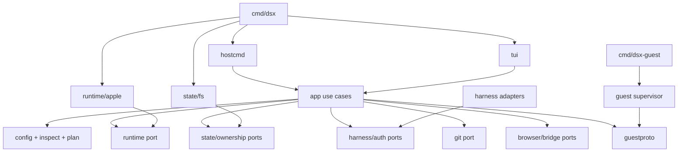
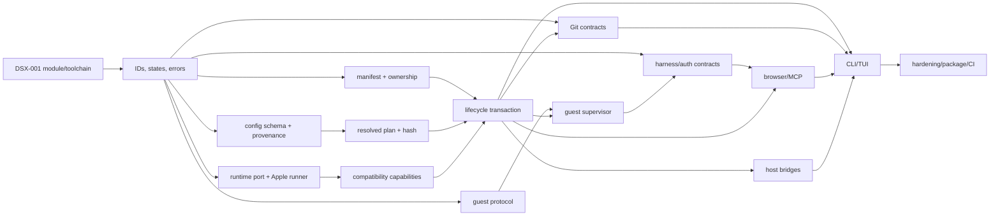

# DSX MVP implementation plan

- **Status:** implementation-ready plan; no production implementation included
- **Date:** 2026-08-09
- **Authority:** [PRD v0.3](./PRD.md) and [ADR 0001](./adr/0001-dsx-implementation-architecture.md)
- **Historical evidence only:** [PRD/ADR pressure test](./review-2026-08-09-prd-adr-pressure-test.md)

## 1. Evidence baseline

### 1.1 Repository state

The repository contains the PRD, ADR 0001, and historical review only. It has no Go source, `go.mod`, `go.sum`, image recipe, schema, test fixture, CI workflow, or implementation source. `.git/config` has no remote, so the canonical Go module path is not yet knowable.

### 1.2 Observed workstation toolchains

| Check | Observed result | Plan consequence |
|---|---|---|
| Host | macOS 27.0, arm64 | Satisfies the PRD's macOS 26+ and Apple-silicon gates, but macOS 27 still needs the same compatibility suite as macOS 26. |
| Go | `go: command not found` | Local implementation cannot begin until the pinned Go toolchain is installed. Pin Go 1.26.5 for builds; keep the module language floor at 1.25.8 because Huh v2.0.3 requires it. |
| Apple runtime | `container` CLI 1.2.2 | Exactly the minimum accepted ADR version. |
| Apple service | API server 1.2.2, status `running` | Doctor's healthy path can be exercised after code exists. |
| Required surface | `build`, `create`, `start`, `exec`, `inspect`, `stop`, `delete`, `copy`, `network`, `volume`, `builder`, `system` present | Matches the broad ADR boundary. Exact JSON schemas and behavior remain compatibility-test contracts. |
| Machine-readable discovery | container/network/volume list support `--format json`; `inspect` emits JSON | Suitable for discovery and ownership reconciliation. |
| Existing unrelated resources | Apple `buildkit`, default Apple network, and a non-DSX volume exist | Destructive tests must prove these remain untouched. No runtime mutation was performed during planning. |

Apple 1.2.2 documents fixed loopback publication, labels on containers/networks/volumes, and named volumes. It does **not** document native dynamic host-port allocation. `127.0.0.1:0:<guest-port>` is an experiment, not an assumption. `container copy` requires a running container.

## 2. Scope, non-goals, and locked decisions

### 2.1 MVP scope

Deliver one signed macOS ARM64 `dsx` executable plus one cgo-free Linux ARM64 `dsx-guest` payload. The MVP covers:

1. project inspection, strict JSONC configuration, provenance, effective-plan rendering, and executable-hash approval;
2. context-aware bare-command TUI plus scriptable commands;
3. one live-mounted workspace or multiple named private-clone sandboxes, never both modes concurrently for one project;
4. Apple runtime build/create/start/exec/inspect/stop/delete, labeled networks/volumes, ports, and failure rollback;
5. integrated guest process supervision, readiness, services, logs, cancellation, and state;
6. pinned OMP, Codex, Claude Code, and OpenCode adapters with isolated persistent authentication profiles;
7. Git-bundle source and result transfer, including `status`, `diff`, `fetch`, and guarded squash `apply`;
8. a separate disposable Playwright MCP browser VM;
9. opt-in Leapp/AWS and destination-specific Tailscale/private-network bridges;
10. ownership-safe, idempotent cleanup, packaging, and self-hosted Apple-silicon compatibility CI.

### 2.2 Non-goals

The PRD exclusions remain unchanged: no Docker Engine/Compose/Testcontainers, nested containers, Kubernetes, Rosetta/amd64, arbitrary Nix or shell interpretation, sibling service topology, process-level isolation inside a workspace, general VPN, generic proxy, task scheduler, prompt coordinator, merge engine, host dependency adoption, permanent DSX daemon, GUI/web app, remote execution, or deletion of non-DSX/Apple-builder resources.

The implementation must not add `dsx logs`, `dsx ps`, or a general-purpose `dsx exec` in the MVP. Apple `container logs`/`exec` remain available; DSX owns only the promised command surface.

### 2.3 Locked architecture

| Decision | Lock |
|---|---|
| Language/artifacts | One Go module; `dsx` for Darwin/arm64 and static `dsx-guest` for Linux/arm64 with `CGO_ENABLED=0`. |
| Runtime boundary | Structured subprocess invocation of the installed Apple `container` CLI; no Swift package import and no guest runtime socket. |
| Runtime gate | macOS `>=26`, arm64, CLI and API-server versions in `>=1.2.2 <1.3.0`, and the exact patch pair must be in a compatibility allowlist. |
| Topology | One integrated workspace VM per sandbox; one separate browser VM only when requested. |
| Control plane | Direct CLI with temporary leased helpers only; no permanent DSX daemon. |
| Guest control | Read-only mounted helper at `/usr/local/libexec/dsx/dsx-guest`; Unix socket `/run/dsx/control.sock`; host reaches it only through `container exec … dsx-guest ctl … --json`. |
| Configuration | `.dsx/config.jsonc`; CLI > project > explicitly imported supported fields > defaults; unsupported security-relevant input fails closed. |
| TUI | Bubble Tea v2 and Huh v2 as presentation adapters over the same application services as explicit CLI commands. |
| Source modes | `shell` uses one live mount; `run --name` uses guest-owned clones from restrictive Git bundles; modes do not coexist. |
| State | Atomic JSON manifests and stable file locks; no SQLite host registry in the MVP. |
| Cleanup | Complete ownership evidence, exact-ID deletion, reverse dependency order, unfetched-result guard, ordinary auth preservation. |

### 2.4 Plan-level implementation choices

- Standard-library `flag.FlagSet` per command, with `ContinueOnError` and injected I/O. Avoid Cobra/Kong until generated completion becomes a requirement.
- Go toolchain 1.26.5; `go 1.25.8` compatibility floor; Bubble Tea 2.0.8, Huh 2.0.3, `creack/pty` 1.1.24 where a PTY is proven necessary.
- `tidwall/jsonc` 0.3.3 for length-preserving JSONC normalization, an explicit duplicate-key pass, embedded Draft 2020-12 JSON Schema validated by `santhosh-tekuri/jsonschema/v6` 6.0.3, then strict typed decoding and semantic validation.
- `google/renameio/v2` 2.0.0 for same-filesystem atomic replacement plus explicit parent-directory sync; `x/sys/unix.Flock` on stable sibling lock files.
- Standard `testing`, hand-written fakes, `testdata` fixtures, and no mock generator/test framework initially.
- Exact harness baselines for the first standard image: OMP 17.2.12, Codex `rust-v0.147.0`, Claude Code 2.1.226, OpenCode 1.18.15, each pinned by upstream artifact digest. Upgrades are independent compatibility events.
- Playwright MCP v0.0.79, pinned image digest, headless Chromium, `--isolated`.

## 3. Security and ownership invariants

These are code-review blockers, not preferences.

1. **Host boundary:** no workspace receives the host home, container control socket, SSH/GPG agent, Keychain, Tailscale state/socket, or browser profile. All host subprocesses use executable plus argument arrays; no project input is concatenated into a host shell command.
2. **Guest authority:** workspace user is non-root by default; capabilities start dropped/minimal. Guest elevation affects only its VM and mounted grants. `dsx-guest` control operations select prevalidated process IDs and never accept arbitrary argv/env/cwd.
3. **Configuration trust:** no runtime mutation or executable project command occurs until the effective executable-plan hash is approved. `--force` cannot bypass this. Noninteractive execution must provide the exact hash via `--approve-config`.
4. **Secrets:** execution plans, manifests, argv displays, TUI, logs, diagnostics, and Git artifacts contain secret references, never secret values. Credential files are mode 0600 under 0700 roots. Generated MCP files are treated as secrets when they contain headers/tokens.
5. **Source modes:** one project lock enforces either a live workspace or clone sandboxes. A live mount visibly grants full read/write authority over the selected host repositories. Clone mode never persistently mounts host source and excludes ignored/untracked files.
6. **Auth isolation:** a persistent profile seed is never writable-mounted into a sandbox. Each sandbox gets a physically independent writable copy; concurrent copies do not share inode, volume, SQLite WAL, session, or cache state.
7. **Browser isolation:** browser has zero mounts, exactly one owning private network, no host-published MCP port, and no source/auth/AWS/Tailscale/profile material. Playwright origin allowlists are defense in depth, not a security boundary.
8. **Network:** host publications bind `127.0.0.1` by default. Non-loopback bind, AWS mount, browser, or private-host relay is an explicit, hash-covered trust grant shown by `inspect`.
9. **Ownership proof for runtime resources:** deletion requires a complete DSX label tuple plus canonical DSX name and no contradictory manifest. Normal deletion also requires a matching manifest record. Orphan recovery may rely on complete labels plus a canonical name derived from those labels when a manifest is stale/missing; incomplete or conflicting evidence is ambiguous and retained.
10. **Ownership proof for host helpers:** before signaling a PID, match manifest lease, executable identity, process start time, project/sandbox/run, and a control-socket lease handshake. PID or name alone is never authority.
11. **Ownership proof for paths:** delete only canonical descendants of the DSX application-support/cache/temp root whose manifest identity and derived path agree. A manifest-provided arbitrary path is not deletable authority.
12. **Builder/global state:** Apple builder, default network, non-DSX resources, and host services are never adopted, pruned, stopped, or deleted. Runtime commands using `--all` or any `prune` are forbidden in production cleanup.
13. **Result preservation:** clone cleanup finalizes current changes, compares result commit to per-repository fetched state, and refuses deletion of any unfetched result unless loss is explicitly confirmed/forced.
14. **Terminal safety:** untrusted names/config/runtime text is sanitized before TUI rendering. Interactive child PTY bytes are handed off outside the alternate screen rather than embedded in TUI output. Secret inputs are masked.
15. **Failure atomicity:** write intent before resource creation; record observed identity after success; rollback the manifest graph in reverse topological order. Cancellation, partial creation, stale manifests, and repeated cleanup converge without broad deletion.

## 4. Go module and package layout

`<module>` is resolved from the future canonical repository remote in DSX-001; repository-relative paths below are fixed.

```text
cmd/dsx/main.go                       composition + build metadata + exit code
cmd/dsx-guest/main.go                 guest composition only
internal/hostcmd/                     flag parsing and CLI rendering
internal/tui/                         Bubble Tea/Huh setup, launcher, dashboard
internal/app/                         use cases; transactions and rollback
internal/model/                       IDs, states, immutable value objects
internal/config/                      JSONC/schema/decode/semantic validation
internal/inspect/                     project detectors and safe importers
internal/plan/                        precedence, provenance, resolve, canonical hash
internal/runtime/runtime.go           DSX-semantic runtime port
internal/runtime/apple/               only Apple CLI argv/JSON/error knowledge
internal/state/                       manifest/approval repository ports
internal/state/fs/                    Darwin filesystem, atomic writes, locks
internal/ownership/                   labels, names, deletion evidence
internal/guestproto/                  versioned host/guest wire DTOs
internal/guest/                        Linux supervisor, health, socket, signals
internal/harness/                     adapter interface and common execution DTOs
internal/harness/{omp,codex,claude,opencode}/
internal/auth/                         profile seed/copy/generation/purge policy
internal/gitx/                         bundle, fingerprint, fetch/apply contracts
internal/browser/                      browser resource and MCP orchestration
internal/bridge/                       callback, URL opener, private TCP relay
internal/terminal/                     TTY detection, sanitizer, handoff
internal/ports/                        requests, conflicts, observed mappings
internal/image/                        image lock/manifests and setup cache keys
schema/dsx-config-v1.schema.json       embedded editor/runtime contract
images/standard/                       pinned ARM64 image recipe and lock manifest
testdata/                              shared nonsecret fixtures only
tests/contract/                        subprocess/protocol/platform contracts
tests/apple/                           destructive Apple compatibility scenarios
```

### Dependency direction

- `cmd/*` wires concrete adapters; it contains no behavior.
- `hostcmd` and `tui` depend on `app` DTOs/interfaces, never on `runtime/apple`, `state/fs`, or `os/exec`.
- `app` depends on consumer-owned ports in `runtime`, `state`, `harness`, `gitx`, `browser`, and `bridge`; concrete adapters point inward.
- `plan` depends on validated `config` and neutral `model`; it performs no I/O after inputs are loaded.
- `runtime/apple` is the only package containing Apple subcommands/flags/JSON fixtures.
- `guestproto` is stdlib-only wire data. `guest` imports `guestproto` and Linux primitives; it never imports host UI/config/runtime packages.
- No `util`, `common`, generic repository, event bus, plugin framework, or alternative runtime abstraction beyond the ADR port.



## 5. Core interfaces and data contracts

The snippets define contract shape, not implementation source.

### 5.1 Configuration and provenance

```go
type ConfigDocument struct {
    SchemaVersion int
    Imports ImportConfig
    Workspace WorkspaceConfig
    Image ImageConfig
    Setup []CommandSpec
    Processes map[string]ProcessSpec
    Volumes map[string]VolumeSpec
    Mounts []MountSpec
    Agents AgentConfig
    AuthProfiles map[string]AuthProfileConfig
    Browser BrowserConfig
    AWS AWSConfig
    Network NetworkConfig
    Ports []PortConfig
    Resources ResourceLimits
}

type SourceRef struct {
    Kind string // cli|project|devcontainer|dockerfile|detected|default
    Path string
    Line, Column int
    Priority int
}
type Provenance map[string]SourceRef // RFC 6901 pointer -> source
```

Parsing returns `ValidatedConfig`, diagnostics, and source spans. Resolution returns one effective value plus provenance for every leaf. Imported fields are represented as explicit sources, never rewritten as if authored by DSX.

### 5.2 Resolved execution plan and approval

```go
type ExecutionPlan struct {
    ContractVersion string
    Project ProjectIdentity
    Sandbox SandboxIdentity
    Mode WorkspaceMode
    Image ResolvedImage
    Repositories []RepositoryPlan
    Setup []ResolvedCommand
    Processes []ResolvedProcess
    Mounts []ResolvedMount
    Volumes []ResolvedVolume
    Auth []ResolvedAuthGrant
    Ports []PortRequest
    Browser *BrowserPlan
    Bridges []BridgeGrant
    Limits ResourceLimits
    Ownership OwnershipPlan
    Provenance Provenance
    ExecutableHash string
}
```

`ExecutableHash = sha256("dsx.execution-plan/v1\n" + canonicalJSON(ExecutablePlanV1))`. The hash input contains executable argv/shell declarations, image/build input digests, mounts, credential references, network grants, ports, process graph, setup cache inputs, browser/bridge grants, and limits. It excludes comments, display text, detected facts not selected into the plan, timestamps, run IDs, and secret values. Struct-based canonical JSON has fixed fields; any maps are converted to sorted key/value slices before hashing.

Approval record: `{version, project_id, hash, approved_at, dsx_version, config_content_digest, imported_content_digests}`. Interactive approval is recorded only after the final review screen. Noninteractive approval is comparison-only and does not silently persist a new approval.

### 5.3 Runtime adapter

```go
type Adapter interface {
    Probe(context.Context) (Capabilities, error)
    EnsureImage(context.Context, ImageSpec) (Image, error)
    CreateVolume(context.Context, VolumeSpec) (Resource, error)
    CreateNetwork(context.Context, NetworkSpec) (Resource, error)
    CreateWorkspace(context.Context, WorkspaceSpec) (Resource, error)
    StartWorkspace(context.Context, ResourceID) error
    Exec(context.Context, ResourceID, ExecSpec, ExecIO) (Exit, error)
    CopyTo(context.Context, ResourceID, HostPath, GuestPath) error
    CopyFrom(context.Context, ResourceID, GuestPath, HostPath) error
    Inspect(context.Context, ResourceID) (ResourceSnapshot, error)
    List(context.Context, ResourceKind) ([]ResourceSnapshot, error)
    Signal(context.Context, ResourceID, Signal) error
    Stop(context.Context, ResourceID, StopPolicy) error
    Delete(context.Context, ResourceID) error
}
```

`Capabilities` records host OS/arch, CLI/server versions, service health, exact tested compatibility ID, supported JSON schemas, labels, networks, volumes, copy, fixed publication, native dynamic publication, PTY/resize, and builder health. Mutating success requires command exit plus an inspected postcondition. `Delete` takes an exact observed ID/name only; there is no broad-delete method.

### 5.4 Resource labels and local manifests

Exact runtime labels:

```text
dev.dsx.managed=true
dev.dsx.project=<base32-sha256(canonical-root), 20 chars>
dev.dsx.sandbox=<validated slug>
dev.dsx.run=<UUIDv7>
dev.dsx.type=workspace|browser|network|volume|auth-copy|cache|service-data
dev.dsx.created-at=<RFC3339 UTC>
```

Name: `dsx-<project12>-<sandbox24>-<run8>-<type>` with deterministic truncation and hash suffix. IDs are opaque after creation.

Host state root: `~/Library/Application Support/DSX/v1/`; cache: `~/Library/Caches/DSX/v1/`; logs: `~/Library/Logs/DSX/`. Directories are 0700, files 0600. Manifest lifecycle:

```text
planned -> creating -> running -> stopped|failed -> cleaning -> deleted
```

Each resource is `intent|created|deleting|deleted|ambiguous` and records derived name, observed ID, complete labels, dependencies, persistence class, creation result, and deletion postcondition. Git fetch state and helper leases are first-class records. Write intent atomically before create; append observed identity immediately after. A stable sibling lock serializes same-project commands with a bounded wait and owner diagnostic.

### 5.5 Guest control protocol

Socket: `/run/dsx/control.sock`, `/run/dsx` 0750, socket 0660, expected UID/GID and `SO_PEERCRED` checked. One request/response per connection; 4-byte big-endian length plus UTF-8 JSON; maximum 1 MiB; bounded deadlines.

Request envelope:

```json
{"protocol":"dsx.guest/v1","request_id":"uuid","operation":"ping|status|start|signal|resize|wait|shutdown","target":"web","if_generation":3,"idempotency_key":"uuid","deadline_ms":5000,"params":{}}
```

Response envelope:

```json
{"protocol":"dsx.guest/v1","request_id":"uuid","ok":true,"result":{},"error":null,"server":{"instance_id":"uuid","version":"…"}}
```

Mutation requests require idempotency keys; retries reuse the same key. Unknown fields/operations/major versions fail. Target is a validated configured process ID, never a PID. Server errors use stable codes (`invalid_request`, `unsupported_protocol`, `not_found`, `wrong_state`, `generation_conflict`, `idempotency_conflict`, `start_failed`, `signal_failed`, `resize_failed`, `deadline_exceeded`, `permission_denied`, `shutting_down`, `internal`). The short-lived `ctl` process emits one compact response line on stdout, diagnostics on stderr, and exits 0/1/2/3 for success/application error/usage/protocol transport error.

### 5.6 Process and service state

```text
process: configured -> waiting_dependencies -> starting -> running -> exited
                                              \-> start_failed
running -> stopping -> exited
health: unknown -> starting -> healthy <-> unhealthy -> stopped
sandbox: creating -> starting -> ready -> failed|stopping -> stopped
```

Readiness latches per generation; liveness remains separate. Required unexpected exit makes the sandbox failed; optional exit remains visible; nothing restarts automatically. Dependencies start only after prerequisite readiness. Canonical exit is code, signal, or start error—not synthesized `128+signal`. One supervisor state owner serializes transitions and one waiter owns each child status. Non-PTY children receive their own process group; PTY stdout/stderr are truthfully treated as merged. Output uses bounded reads/queues and a counted truncation marker under backpressure, never unbounded memory.

### 5.7 Harness adapters

```go
type Adapter interface {
    Name() Name
    Version() PinnedArtifact
    Preflight(context.Context, RunRoots) ([]Diagnostic, error)
    Invocation(InvocationRequest) (ExecSpec, error)
    AuthLayout() AuthLayout
    Seed(context.Context, SeedRequest) error
    EphemeralMCP(MCPRequest) (ConfigInjection, error)
    Login(LoginRequest) (LoginFlow, error)
    RedactionRules() RedactionRules
}
```

Adapters return argv/env/file contracts; they do not execute. Baseline matrix:

| Harness | Interactive / one-shot | Credential unit | Ephemeral MCP |
|---|---|---|---|
| OMP 17.2.12 | `omp`; `omp -p <prompt>` | DSX-owned consistent snapshot of `agent.db`; it mixes auth and data, so no host-home import | Private `PI_CODING_AGENT_DIR` with generated `mcp.json`; precedence is an experiment gate |
| Codex rust-v0.147.0 | `codex`; `codex exec <prompt>` | `$CODEX_HOME/auth.json` only when file backend is confirmed; reject keyring migration | repeatable `-c` dotted overrides; exact MCP composition is a gate |
| Claude 2.1.226 | `claude`; `claude -p <prompt>` | Linux `CLAUDE_CONFIG_DIR/.credentials.json`; never copy macOS Keychain state | `--mcp-config <file> --strict-mcp-config` |
| OpenCode 1.18.15 | `opencode`; `opencode run <message>` | isolated XDG data `opencode/auth.json` | isolated XDG roots plus `OPENCODE_CONFIG_CONTENT`; project merge behavior is a gate |

### 5.8 Authentication profiles

`AuthProfileManifest` contains harness, name, generation, credential artifact allowlist, approved read-only config allowlist, digest, storage backend, created/updated times, and DSX-owned resource IDs. The global seed is not mounted into workspaces. A run copy records `base_generation` and independent volume.

On stop/clean, snapshot only adapter-declared credential artifacts. Under the profile lock: if the seed generation still equals `base_generation`, atomically promote and increment; otherwise preserve the snapshot as a DSX-owned conflict candidate, leave the active seed unchanged, and report it through doctor/TUI. Never generically merge JSON or SQLite. Ordinary clean retains seeds/candidates; `--purge-auth` removes selected DSX-owned profile material only after confirmation and no active run reference.

### 5.9 Port publication

```go
type PortRequest struct {
    Name string
    GuestPort uint16
    Protocol string // tcp initially; udp only after compatibility pass
    HostIP netip.Addr // default 127.0.0.1
    HostPort *uint16 // nil = dynamic
    ExplicitNonLoopbackGrant bool
}
type PortBinding struct { Request PortRequest; ObservedHostIP netip.Addr; ObservedHostPort uint16 }
```

Native dynamic allocation is enabled only if `127.0.0.1:0:<guest>` passes compatibility tests and inspect returns the allocation. Otherwise a DSX host listener reserves a loopback port until create/bind handoff; the runtime bind result remains authoritative and bounded retries use a new port. Fixed conflicts fail without taking over. Final bindings come from runtime inspect and are displayed as URLs.

### 5.10 Git source/result transfer

Per repository, record canonical host path, declared relative guest path, source ref/commit, clean tracked-state fingerprint, ignored/untracked warning, result branch, result commit, bundle digests, and fetched commit.

Source flow: verify clean tracked state -> create mode-0600 temporary bundle for the selected ref -> `git bundle verify` -> copy into a running workspace bootstrap -> clone into guest-owned volume with independent metadata and `--no-hardlinks` -> create `dsx/<sandbox>` branch -> remove bundle. No persistent host source mount.

Result flow: stage all changes with `git add -A` -> create a deterministic final DSX commit when needed -> create/verify result bundle -> copy out to mode-0600 temp -> fetch to `refs/remotes/dsx/<sandbox>` -> record fetched commit -> remove temp. `apply` first requires unchanged host source commit and tracked fingerprint and no untracked path collision, then performs a squash merge into host index/worktree without committing; any failed safety check leaves host state untouched. Composite members transfer independently and never claim cross-repository atomicity.

### 5.11 Browser and temporary host bridges

- **BrowserPlan:** pinned image digest, owned network, browser resource, guest MCP port/path, readiness probe, and empty mount set. Start Playwright MCP with `--headless --browser chromium --no-sandbox --isolated --host 0.0.0.0 --port <guest-port>`; allow only owning service Host values. Probe from the workspace. Do not publish MCP to macOS.
- **MCP injection:** run-private adapter mechanism only; remove after run. No global/project config mutation.
- **OAuth callback:** bind host `127.0.0.1:0` before URL construction; exact method/path/Host; high-entropy state; one success; bounded body/header; constant-time state check; no query/token logging; lease timeout. Open only validated HTTPS authorization URLs with `/usr/bin/open` argv. Forward minimum callback data to the owning guest path.
- **Leapp:** opt-in read-only mount of the canonical host `.aws` directory at `/run/dsx/aws`, not individual files; set `AWS_CONFIG_FILE`, `AWS_SHARED_CREDENTIALS_FILE`, and optional `AWS_PROFILE`. Never mount `.Leapp`; show that all profiles are readable. Atomic rotation across the directory mount is a release gate.
- **Private/Tailscale relay:** built-in TCP-only helper with immutable destination host/IP+port, pinned host resolution policy, listener bound only to the sandbox-reachable host interface, per-run lease, counters without payload, and no CONNECT/SOCKS/UDP/destination override. It uses host identity and Tailscale ACLs; the guest gets no Tailscale identity.

## 6. JSONC schema and validation

### 6.1 Schema shape

```jsonc
{
  "$schema": "https://dsx.dev/schema/config-v1.json",
  "schemaVersion": 1,
  "imports": {
    "devcontainer": { "path": ".devcontainer/devcontainer.json", "fields": ["image", "build", "containerEnv", "mounts", "forwardPorts", "postCreateCommand"] }
  },
  "workspace": {
    "root": ".",
    "members": [{ "name": "api", "path": "services/api" }]
  },
  "image": {
    "ref": "ghcr.io/example/dev@sha256:…"
    // xor: "build": { "context": ".", "file": "Containerfile", "target": "dev", "args": {} }
  },
  "setup": [{ "argv": ["pnpm", "install", "--frozen-lockfile"], "cwd": "/workspace" }],
  "processes": {
    "web": {
      "argv": ["pnpm", "dev"],
      "cwd": "/workspace",
      "dependsOn": ["db"],
      "required": true,
      "health": { "http": { "url": "http://127.0.0.1:3000/health" }, "interval": "1s", "timeout": "2s" }
    }
  },
  "volumes": { "node_modules": { "target": "/workspace/node_modules", "scope": "sandbox" } },
  "mounts": [],
  "agents": { "default": "codex", "allowed": ["omp", "codex", "claude", "opencode"] },
  "authProfiles": { "codex-main": { "harness": "codex", "persistence": "global" } },
  "ports": [{ "name": "web", "guest": 3000, "host": "dynamic", "bind": "127.0.0.1", "protocol": "tcp" }],
  "browser": { "enabled": false },
  "aws": { "mode": "none" },
  "network": { "internet": true, "hostGrants": [] },
  "resources": { "cpus": 4, "memory": "8GiB", "maxConcurrentClones": 2 }
}
```

Command is `oneOf` literal `argv` or explicit `{shell, shellPath}`; no implicit shell. Environment values are either nonsecret literals or named host/secret references; ambient host environment inheritance is denied. Image is exactly one of digest-pinned `ref` or `build`. Mount sources use typed `workspace|volume|host` forms. Host mounts must be canonical and hash-covered; hard-deny home root, runtime sockets, SSH/GPG sockets, Keychain, and Tailscale state even if requested.

### 6.2 Validation pipeline

1. Read bounded bytes; retain file digest and line index.
2. Normalize JSONC while preserving length/newlines.
3. Token-walk normalized JSON and reject duplicate keys with both source locations.
4. Validate embedded Draft 2020-12 schema with no network `$ref` resolution; unknown fields are errors.
5. Decode typed structs with `DisallowUnknownFields` as defense in depth.
6. Semantic checks: path containment/canonicalization, member uniqueness/non-overlap, process DAG acyclicity, referenced dependency/volume/auth existence, image xor, command xor, health bounds, valid names, port uniqueness/range, resource limits, source-mode compatibility, mount denylist, and trust-grant consistency.
7. Import only allowlisted fields. Unsupported Dev Container fields are diagnostics; executable/security-relevant fields fail. Never run host lifecycle hooks.
8. Merge by fixed precedence and attach provenance per JSON pointer.
9. Resolve platform facts and content digests into `ExecutionPlan`.
10. Canonicalize/hash the executable projection; compare approval before mutation.

Schema corpus includes minimal/full valid documents plus one fixture per syntax, duplicate, unknown, semantic, precedence, unsupported import, and trust failure. Editor schema and Go decoder drift is prevented by a shared accept/reject corpus, not a second configuration model.

## 7. Contract dependency graph



Safe delegation begins only after the contracts immediately upstream are merged. In particular, Apple adapter, state/ownership, and config/plan can proceed concurrently after common IDs/errors; UI waits for application DTOs; harness implementations wait for `harness.Adapter`/auth layout; browser waits for both runtime network and per-harness injection contracts.

## 8. Numbered vertical slices

The nine slices refine ADR 0001's four broad slices without changing their order or outcomes. Every slice closes lifecycle failure and cleanup for the resource types it adds.

### Slice 1 — repository/Go foundation and test harness

- **User-visible behavior:** reproducible `dsx --version` and `dsx-guest --version --json`; no runtime lifecycle yet.
- **Coverage:** prerequisite for R1–R15; no PRD acceptance criterion claimed complete.
- **Areas:** `go.mod`, `cmd/*`, `internal/model`, command-runner seam, build metadata, ordinary CI, `tests/contract`.
- **Prerequisites/contracts:** canonical module path decision; toolchain installed. Freeze IDs/errors, exit-code taxonomy, subprocess result, clock/random/FS seams.
- **Concurrent:** host/guest build targets; test fixture conventions; ordinary CI; version metadata.
- **Sequential:** choose module path -> initialize module/pins -> enforce guest import closure -> release builds.
- **Focused tests:** CLI argv/help/version; host/guest cross-build; guest dependency-list denylist; deterministic build metadata; schema/testdata conventions.
- **Apple scenario:** read-only `container system version/status --format json` fixture capture; no resource mutation.
- **Smoke:** `go build ./cmd/dsx && ./dsx --version`; prints version/commit/toolchain and exits 0. `CGO_ENABLED=0 GOOS=linux GOARCH=arm64 go build ./cmd/dsx-guest` produces AArch64 ELF with no dynamic interpreter.
- **Failure/rollback:** unsupported build target and missing metadata return deterministic errors; build leaves no runtime state.
- **Cleanup proof:** only temp build outputs removed; repository source unchanged.
- **Security review:** dependency provenance/licenses, no secrets/build paths, guest import closure, no install scripts fetched at build time.
- **Completion evidence:** pinned `go.mod/go.sum`, both artifact inspections, focused tests, dependency manifest.

### Slice 2 — inspect, doctor, configuration approval, and bare-DSX TUI

- **User-visible behavior:** `inspect` is side-effect free with provenance/hash; `doctor` reports host/runtime readiness; bare `dsx` chooses setup/launcher/dashboard, and non-TTY prints help. `init` writes only after final confirmation.
- **Coverage:** R1, R12, R15; AC 1–3 and 15.
- **Areas:** `internal/config`, `inspect`, `plan`, `hostcmd`, `tui`, `terminal`, approval part of `state/fs`, embedded schema.
- **Prerequisites/contracts:** Slice 1; configuration/provenance, executable plan/hash, diagnostics, application query/command DTOs.
- **Concurrent:** JSONC/schema corpus; detectors/importers; doctor probes with fake runner; TUI pure model/accessibility; sanitizer.
- **Sequential:** parse/validate -> merge/provenance -> resolve/hash -> approval service -> CLI/TUI binding. TUI final confirmation must call the same application command as CLI.
- **Focused tests:** comments/trailing commas, duplicate/unknown keys, imported-field allowlist, provenance, stable hash, approval changes, `--force` rejection, non-TTY, cancellation, ANSI/control sanitization, `NO_COLOR`, resize/narrow, Huh accessible mode, no secret display.
- **Apple scenario:** on namespaced read-only host, compare doctor to `uname`, `sw_vers`, `container system version/status`; inspect must start no VM and finish within 500 ms warm p95.
- **Smoke:** `dsx inspect --format json` prints complete plan/provenance/hash and `container list --all --format json` is byte-identical before/after after canonicalizing timestamps/order. `printf '' | dsx` prints help and creates no config/state.
- **Failure/rollback:** malformed config, unsupported field, API down, CLI/server mismatch, unapproved changed hash, Ctrl-C before confirmation. All produce zero runtime calls; interrupted config write leaves old/absent file intact.
- **Cleanup proof:** no DSX runtime labels; no approval record on cancellation; temp replacement file absent.
- **Security review:** shell declarations, host mount denylist, secret refs, terminal escapes, schema network resolution disabled, approval boundary.
- **Completion evidence:** golden diagnostics/provenance, TUI transcripts, syscall/runtime fake call count zero, performance trace.

### Slice 3 — live-mounted workspace lifecycle and ownership-safe cleanup

- **User-visible behavior:** approved `dsx shell` creates/attaches one live workspace; `ls`, `stop`, `clean`, `clean --all`; bidirectional source changes and HMR work; unrelated resources survive.
- **Coverage:** R2, live portion of R3, R4, base R10, R13; AC 14, 16, 19 and the workspace portion of AC 4.
- **Areas:** `runtime/apple`, `state`, `ownership`, `app/lifecycle`, `image`, `terminal`, live workspace planner.
- **Prerequisites/contracts:** Slice 2; runtime port/capabilities; labels/names/manifest; lifecycle transaction; mode lock; PTY handoff.
- **Concurrent:** Apple argv/JSON fixtures; state atomicity/lock tests; ownership classifier; image cache-key tests; terminal handoff contract.
- **Sequential:** write intent -> ensure image -> create volumes/network/container -> inspect identity -> start -> attach. Cleanup: stop the attached shell/container -> delete container -> project volumes -> network -> paths/manifest. Never volume-before-container.
- **Focused tests:** exact argv/no shell, JSON decode/version rejection, lock contention, manifest crash points, ownership ambiguity, rollback order, idempotent clean, live/clone exclusion, non-root/capability plan, cache invalidation.
- **Apple scenario:** pinned empty ARM64 image with a simple shell entrypoint, canonical project bind, non-root shell, fixed loopback test port; file write both directions and Vite/webpack/Next watch fixture.
- **Smoke:** `dsx shell --approve-config <hash>` reaches prompt; `touch /workspace/.dsx-smoke` appears on host; exit then `dsx clean`; exact owned IDs disappear, existing builder/default network/unrelated volume remain.
- **Failure/rollback:** fail after each create boundary, Ctrl-C during create, terminal close, fixed-port collision, stale/missing manifest, Apple timeout. Recovery discovers complete labels; ambiguity is retained/reported.
- **Cleanup proof:** before/after JSON resource identity set difference equals only owned resources; second `clean` succeeds; no DSX listener/temp path/manifest remains; sentinel hashes unchanged.
- **Security review:** mount canonicalization/symlink races, non-root UID/GID, capabilities, exact deletion evidence, no builder operation, PTY restoration.
- **Completion evidence:** destructive ledger, runtime snapshots, HMR transcript, fault-boundary table, sentinel comparison, timing.

### Slice 4 — guest helper, application processes, services, and ports

- **User-visible behavior:** declared setup/processes/services start in dependency order, logs are prefixed, required health gates the shell/agent, failures are visible and not restarted, final loopback URLs are shown.
- **Coverage:** R4, R5, R10, guest portion of R13; AC 5, 9, 10, 19.
- **Areas:** `guestproto`, `guest`, host guest client, process planner, `ports`, composite reference config.
- **Prerequisites/contracts:** Slice 3; protocol v1; process/health state; resolved process graph; port request/binding.
- **Concurrent:** protocol codec/goldens; pure supervisor state machine; health probes; log prefix/backpressure; port capability tests; composite fixture config.
- **Sequential:** cross-build/static verification -> mount helper as PID 1 -> socket ping -> submit validated graph -> wait required readiness -> expose dependent action. Dynamic ports wait for capability experiment.
- **Focused tests:** frame limits/unknown fields/idempotency/generation; process DAG; exactly-one wait/reaping; code vs signal; required/optional failures; no restart; readiness/liveness; process-group signals; PTY resize; bounded logs; fixed/dynamic conflict behavior.
- **Apple scenario:** composite `devenv` starts MySQL, Redis, Caddy, PHP/Node processes inside one VM; loopback communication and health dependency order verified; two host mappings inspected.
- **Smoke:** `dsx shell` prints healthy process table and `http://127.0.0.1:<observed>`; curl returns fixture; kill required process -> sandbox `failed`; `dsx clean` removes all added state.
- **Failure/rollback:** missing executable, bad cwd, health timeout, output flood, helper crash/KILL, lost control response replay, port bind race, partial service startup. Shutdown remains usable in failed state.
- **Cleanup proof:** no child/zombie, socket gone, container/ports/service volumes removed, repeated clean succeeds, database volume removed unless explicitly persistent.
- **Security review:** socket owner/peer/path, arbitrary-exec exclusion, signal allowlist/generation, output labels/sanitization, port bind interface, secret env redaction.
- **Completion evidence:** protocol fixtures, static ELF report, `/proc` reap proof, process/health event trace, inspected bindings, cleanup ledger.

### Slice 5 — harness installation, execution, and authentication persistence

- **User-visible behavior:** each pinned harness runs interactively and one-shot; output/exit/cancel/resize propagate; selected auth survives recreation; ordinary clean preserves global auth; purge removes only selected DSX auth.
- **Coverage:** R6, R7 and interactive login part of R11; AC 4, 6, 7 and success measure for harness switching.
- **Areas:** `harness/*`, `auth`, standard image/lock, agent execution service, callback helper base.
- **Prerequisites/contracts:** Slice 4; adapter/auth profile contracts; PTY handoff; leased callback; redaction.
- **Concurrent:** four adapter packages after interface freeze; image artifact verification; auth repository/profile-copy tests; fake-provider PTY suite.
- **Sequential:** pin/install/version verify -> adapter preflight -> create isolated run roots/auth copy -> optional login -> run -> CAS promote/conflict candidate -> cleanup/purge. OMP SQLite snapshot needs a dedicated proof before persistence claim.
- **Focused tests:** exact argv/env/roots; no ambient host fallback; credential allowlists/modes; independent copies; recreation; CAS conflict; corrupt seed; purge ownership; one-shot exits; Ctrl-C/SIGTERM/EOF/resize; secrets absent; MCP preparation contracts.
- **Apple scenario:** for each harness, use fake local provider/auth artifacts in a workspace; interactive PTY and one-shot; recreate container with same profile; two concurrent clone-like auth copies mutate independently. Real human login is a manual release check, not CI.
- **Smoke:** `dsx shell --agent <name>` reports exact pinned version and reaches interactive prompt; `dsx run`-style one-shot fake returns vendor exit unchanged; recreate and auth status remains logged in; `clean` retains seed; `clean --purge-auth` removes it.
- **Failure/rollback:** unsupported keyring migration, login timeout/browser-open failure, corrupt JSON/SQLite, refresh conflict, harness crash, second SIGINT, terminal loss. Never fall back to host home.
- **Cleanup proof:** run roots/copies/sessions removed; seed retained or explicitly purged; no callback listener/generated config; other profiles byte-identical.
- **Security review:** credential-vs-session separation, environment/argv leakage, OMP mixed DB, Claude Keychain non-portability, MCP config executability, token refresh conflicts.
- **Completion evidence:** per-harness capability matrix with observed exit/signal/resize, artifact digests, filesystem delta, auth recreation/purge transcript, redaction scan.

### Slice 6 — named clone sandboxes and `dsx git status/diff/fetch/apply`

- **User-visible behavior:** multiple named `run` sandboxes use independent guest clones/branches/services/auth/ports; status/diff/fetch/apply work; unfetched work is protected.
- **Coverage:** clone portion of R2/R3, R6 concurrency, R13; AC 11–13 and 17.
- **Areas:** `gitx`, clone lifecycle service, Git CLI rendering/TUI actions, manifest Git state, concurrency limiter.
- **Prerequisites/contracts:** Slices 3–5; Git source/result contracts; per-sandbox auth; dynamic or conflict-safe ports; mode lock.
- **Concurrent:** source bundle/fingerprint; result bundle/final commit; status/diff renderer; fetch/apply safety; concurrency isolation tests.
- **Sequential:** clean tracked check -> source bundles per member -> create sandbox -> copy/clone/branch -> run harness -> final commit/result bundle -> fetch record -> optional apply. Live mode must be stopped/absent before first clone.
- **Focused tests:** ignored/untracked warning, dirty tracked refusal, no hardlinks/shared `.git`, binary/new/delete/rename/uncommitted capture, bundle verification, ref naming, unchanged-fingerprint apply, collision/refusal no mutation, composite member requirement, unfetched cleanup guard.
- **Apple scenario:** run `api` and `tests` concurrently in one project; distinct VMs, volumes, networks or scoped attachments, writable auth, databases, Git devices/inodes, and host ports; second project simultaneously.
- **Smoke:** `dsx run --name smoke --agent codex --approve-config <hash> -- <fake prompt>` changes all file classes; `dsx git fetch smoke` creates `refs/remotes/dsx/smoke`; diff matches; `clean --name smoke` succeeds only after fetch.
- **Failure/rollback:** corrupt source/result bundle, copy failure, guest full disk, host advances, untracked collision, fetch interrupted, apply conflict, one of composite members fails. Temp bundles are removed; source host remains unchanged on failed start/apply.
- **Cleanup proof:** clone/auth/service resources absent; fetched host ref remains; second sandbox and other project unchanged; mode lock released; temp bundles absent; repeated cleanup succeeds.
- **Security review:** temp permissions, hostile paths/refs, bundle validation, Git config/hooks disabled/controlled, generated commit identity, cleanup data-loss guard.
- **Completion evidence:** object-store independence (`stat`/device/inode), concurrent resource diff, Git result corpus, host pre/post fingerprints, cleanup ledger.

### Slice 7 — isolated Playwright browser path

- **User-visible behavior:** `--browser` starts a disposable browser reachable only from its owning workspace; selected harness sees one ephemeral Playwright MCP server; browser can exercise the app.
- **Coverage:** R11; AC 8.
- **Areas:** `browser`, runtime network plan, browser image lock, per-harness MCP injection, readiness/cleanup.
- **Prerequisites/contracts:** Slices 5–6; private-network behavior proven; all four MCP injection experiments passed.
- **Concurrent:** browser image/digest; resource orchestration; four injection contract tests; isolation probes.
- **Sequential:** owning network/workspace ready -> browser create with zero mounts -> MCP ready from workspace -> ephemeral inject -> harness -> remove injection/browser. Never launch harness with requested browser before readiness.
- **Focused tests:** zero mounts/exact network/no publication, injection exclusivity, readiness timeout, lease cleanup, profile disposal, Host validation, no secret/source paths.
- **Apple scenario:** two sandboxes with two browsers; owner pairs navigate; all cross-pairs and host loopback fail; cookie set/recreate loses state.
- **Smoke:** `dsx run --name web --browser --agent <harness> -- <fake MCP task>` returns page sentinel; runtime inspect proves no browser mounts/publications; cleanup removes browser.
- **Failure/rollback:** image pull/MCP health/harness-injection failure, browser crash, owner crash, network deletion while attached. Remove browser before network; ambiguity retained.
- **Cleanup proof:** no browser/container/profile/config/listener; owner application cleanup still works; unrelated browser sentinel unchanged.
- **Security review:** topology vs Playwright allowlist, no host publication, browser egress residual risk, MCP headers/secrets, image provenance.
- **Completion evidence:** connectivity matrix, inspect snapshots, MCP inventory per harness, profile-disposal test, cleanup ledger.

### Slice 8 — optional Leapp and Tailscale host bridges

- **User-visible behavior:** explicit config grants read-only rotating AWS files and/or one destination-specific private TCP route; `inspect` shows every grant and warning; helpers stop with workspace.
- **Coverage:** R8, R9 and host integration part of R11.
- **Areas:** `bridge`, AWS plan/config, host helper entry modes in `dsx`, lease manifest, doctor diagnostics.
- **Prerequisites/contracts:** Slices 3–7; bridge grant/lease; host process ownership; host-interface discovery; config hash includes grants.
- **Concurrent:** Leapp mount validation/rotation fixture; TCP relay; callback bridge; URL opener; lease/owner monitor.
- **Sequential:** empirical host interface/address proof -> grant approval -> helper bind/inspect -> workspace injection -> lease heartbeat -> close/verify. Leapp ships only after real atomic-rotation pass.
- **Focused tests:** AWS directory canonical/read-only, profile warning/no secret logs, wrong/missing paths, destination/address normalization, DNS rebinding, interface binding, cross-sandbox denial, lease expiry, callback state/method/path/size/duplicate, validated HTTPS URL only.
- **Apple scenario:** Leapp rotates credentials repeatedly while guest resolves selected profile, seeing complete old/new state; relay reaches one approved Tailscale/private TCP endpoint while alternate host/port and second sandbox fail.
- **Smoke:** `dsx inspect` displays the exact trust grant; start workspace; sanitized `aws sts get-caller-identity` succeeds through standard AWS behavior or approved TCP sentinel responds; stop; listener/mount gone.
- **Failure/rollback:** host rename not observed, expired credentials, DNS answer changes, ACL denial, bind conflict, parent SIGKILL, sleep/wake, callback timeout/open failure. Helper fails closed at expiry; stale identity is reported.
- **Cleanup proof:** `lsof`/socket inspection has no leased listener; helper handshake absent; manifest lease deleted; host AWS checksums/modes unchanged; no Tailscale state copied.
- **Security review:** all-profile AWS exposure, atomic rename semantics, generic proxy prevention, host/Tailscale identity attribution, DNS rebinding/IPv6, callback token leakage, PID reuse.
- **Completion evidence:** rotation trace, destination abuse matrix, callback attack matrix, bind audit, crash/lease recovery, host-file hashes.

### Slice 9 — hardening, packaging, and self-hosted Apple-silicon CI

- **User-visible behavior:** signed/self-contained release, deterministic diagnostics, measured budgets, supported-version rejection/admission, complete docs and reliable cleanup across crashes.
- **Coverage:** R14 directly; release regression coverage for R1–R13 and R15; full AC 1–19 and success measures.
- **Areas:** release build/embed, standard image publication, ordinary CI, `tests/apple`, evidence bundle, performance instrumentation, installer/notarization/update docs.
- **Prerequisites/contracts:** all prior slices; exact patch allowlist and complete destructive ledger.
- **Concurrent:** unit/race/fuzz lanes; macOS 26 and 27 physical-runner lanes; packaging/signing; performance; security review; reference-workspace acceptance.
- **Sequential:** exact host attestation -> host-local lock -> unrelated sentinels/baseline -> scenario -> idempotent cleanup -> sentinel/builder proof -> evidence -> release gate. Candidate runtime patch is canary before allowlist update.
- **Focused tests:** complete matrix in §9; fuzz JSONC/protocol/sanitizer/label parser; race host state and Linux guest; deterministic/reproducible artifacts; signature/notarization.
- **Apple scenario:** full acceptance on physical Apple silicon for macOS 26.x and every supported newer major (initially 27.x), `container` 1.2.2; future 1.2.x starts as candidate. Hosted macOS performs compile/unit only because nested virtualization is unsupported.
- **Smoke:** install release on clean runner; `dsx doctor`, `inspect`, live workspace, two clones/harnesses, browser, optional bridges, Git fetch, project clean, auth purge; all expected results and no unrelated drift.
- **Failure/rollback:** every resource boundary, SIGTERM, driver SIGKILL, stale manifest, malformed runtime JSON, service/API mismatch, runner loss. Boot/pre-job sweeper uses ledgers and GitHub run state; uncertain ownership quarantines host.
- **Cleanup proof:** zero owned resources/listeners/temp paths, empty/deleted lifecycle manifests, second clean success, sentinels and canonical baseline IDs unchanged, builder identity/status unchanged.
- **Security review:** threat model/invariants, dependency and artifact supply chain, runner trust, secrets/logs, workflow pinning, signing keys, all deletion paths.
- **Completion evidence:** signed artifacts/digests/SBOM, full matrix evidence JSON, performance report, security sign-off, acceptance transcripts, operator quarantine/recovery drill.

## 9. Test matrix

| Dimension | Cases | Required observable |
|---|---|---|
| macOS | 26 latest patch; 27 latest patch; each future supported major | arm64 attested; same acceptance suite. PRD says 26+, so newer macOS is not silently rejected; it is admitted by compatibility evidence. |
| Apple runtime | 1.2.2 minimum; each candidate `1.2.x`; reject 1.2.1 and 1.3.0 fixtures | CLI and API-server pair exact and allowlisted; rejection before create intent. Today only 1.2.2 is admitted. |
| Non-TTY | stdin non-TTY, stdout non-TTY, both | bare `dsx` prints help, no prompt/write/runtime call. Explicit commands emit stable machine output/exit. |
| PTY | each harness interactive; direct shell; normal exit/EOF/SIGINT/SIGTERM; resize | TTY detected, exit/signal faithful, descendants gone, terminal restored, no hang. |
| Ctrl-C/rollback | before confirmation and after every create boundary | before: zero changes; after: reverse rollback or discoverable owned residue removable by clean. |
| ANSI/control | hostile names, paths, config, labels, runtime errors | no terminal control execution in TUI; escaped visible representation; raw child only during exclusive handoff. |
| TUI | color/no `NO_COLOR`; 20/40/80/120 columns; resize; Huh accessible | no clipped destructive confirmation, stable focus, plain accessible prompts, masked secrets. |
| Config approval | comments-only change; executable change; imported file/image digest change; stale/wrong hash; `--force` | non-executable comments keep hash; authority changes alter hash; exact approval required; force never bypasses. |
| Ownership | complete labels+manifest; stale manifest; missing label; conflicting ID; canonical-name mismatch | proven owned removed; stale complete evidence recoverable; ambiguous retained/reported. |
| Idempotent cleanup | clean twice from running/stopped/failed/partial states | both succeed; second makes no deletion; no broad commands. |
| Unrelated preservation | Apple builder/default network, organic resources, deliberate similar sentinels, second project | exact identities/configuration unchanged after every cleanup scenario. |
| Workspace modes | live only; clones only; attempt coexistence | live bidirectional/HMR works; clone has no source mount; coexistence fails before mutation. |
| Clone concurrency | two same-project plus second project | no shared Git metadata/auth/service volumes/fixed ports; limits enforced without queue/scheduler. |
| Ports | fixed free/conflict; native dynamic 0; fallback reservation race; parallel dynamic; non-loopback request | bind result authoritative; conflict leaves existing owner; dynamic distinct/discoverable; default loopback; non-loopback needs approved hash. |
| Auth | empty/login, recreate, two run copies, refresh CAS/conflict, corrupt seed, ordinary clean, purge | independent writable state; persistence; conflict no overwrite; clean preserves; purge exact DSX profile only. |
| Browser | owner path, all cross-pairs, host path, zero-mount audit, profile disposal, crash | only owner pair succeeds; no host MCP publication/source/auth; state gone after recreation. |
| Process faults | start error, readiness timeout, required/optional exit, output flood, helper KILL/restart | correct states/no restart; control responsive under bounded output; new helper instance reconciled. |
| Stale manifests | missing observation, corrupt/truncated file, runtime resource added/removed out of band | atomic reader never accepts partial; runtime truth reconciles proven ownership; ambiguity quarantined. |
| Git transfer | new/delete/rename/binary/executable/untracked, committed/uncommitted, host advance, composite failure | fetched ref exact; apply guarded/no partial host mutation; per-member status; unfetched cleanup blocked. |
| Leapp/relay | read-only mutations, repeated rotation, destination abuse, owner crash/lease expiry | host files unchanged; complete rotation observed; no destination widening; listener closes. |
| Performance | warm inspect/planning/shell/clean; helper RSS | PRD budgets: 500 ms/250 ms/3 s/5 s and helpers <=100 MiB, with timing phases reported. |

### Apple destructive-runner protocol

Use dedicated physical Apple-silicon runners in a restricted group. GitHub concurrency is only a scheduler hint; acquire a host-local atomic lock. Generate `dsxci-<repo>-<run>-<attempt>-<random>` and write an intent ledger before every mutation. Create unrelated stopped container/network/volume sentinels outside the tested namespace and snapshot all existing IDs plus builder status. Cleanup uses exact names/IDs only: containers, then volumes/networks, then paths/listeners. Never use `--all`, `prune`, `container system stop`, uninstall, or builder deletion.

A pre-job/boot sweeper handles trap-invisible SIGKILL/power loss by combining ledger identity, GitHub run terminal state, and runtime inspection. If run state or ownership is uncertain, write `QUARANTINED`, remove runner eligibility out of band, and preserve evidence. Evidence contains host/runtime attestation, command argv/exit/postcondition, canonical pre/post hashes, sentinel proof, ledger digest, repeated-clean result, and no secrets.

## 10. Issue-sized implementation tasks

`Writer` means suitable for an isolated writing subagent **after all listed dependencies and interfaces are merged**.

| ID | Dependencies | Exact acceptance criteria | Likely files/packages | Writer | Focused verification |
|---|---|---|---|---|---|
| DSX-001 Repository/toolchain | none | Canonical module path chosen; Go 1.26.5 pinned; two version binaries cross-build; no guest host/TUI deps | `go.mod`, `cmd/*`, build config | No—foundational contract | `go test ./internal/hostcmd ./internal/guestproto && CGO_ENABLED=0 GOOS=linux GOARCH=arm64 go build ./cmd/dsx-guest` |
| DSX-002 Core model | 001 | Validated project/sandbox/run IDs, modes, states, typed errors/exit codes; invalid values rejected | `internal/model` | No—shared contract | `go test ./internal/model -run 'Test(ID|State|Error)'` |
| DSX-003 Process runner seam | 001 | Structured executable/argv/env/stdin; bounded context; captured result; no shell helper | `internal/runtime/apple`, test fake | Yes | `go test ./internal/runtime/apple -run TestRunner` |
| DSX-004 Ordinary CI | 001 | host units, guest cross-build/import closure, race lanes, pinned actions, no Apple mutation | `.github/workflows`, scripts | Yes | workflow dry validation plus `go test` commands in Slice 1 |
| DSX-010 JSONC/schema | 002 | JSONC, duplicate/unknown rejection, embedded offline schema, typed/semantic errors with locations | `internal/config`, `schema`, `testdata` | Yes | `go test ./internal/config -run 'Test(JSONC|Schema|Duplicate|Semantic)'` |
| DSX-011 Project detectors | 002 | Git roots/lockfiles/Dockerfile/devcontainer/devenv facts; no execution; unsupported fields explicit | `internal/inspect` | Yes | `go test ./internal/inspect` |
| DSX-012 Precedence/provenance | 010,011 | CLI>project>import>default per leaf; deterministic source locations; no silent unsupported input | `internal/plan` | No—shared contract | `go test ./internal/plan -run 'Test(Precedence|Provenance)'` |
| DSX-013 Plan/hash/approval | 012 | executable projection canonical; comments stable; authority/input changes hash; exact noninteractive approval; force denied | `internal/plan`, `internal/state` | No—security boundary | `go test ./internal/plan ./internal/state -run 'Test(Hash|Approval)'` |
| DSX-014 Doctor/capabilities | 003 | OS/arch, CLI/server versions, allowlist, service/builder capability diagnostics; no mutation | `internal/runtime/apple`, `internal/app` | Yes | `go test ./internal/runtime/apple -run 'Test(Probe|VersionGate)'` |
| DSX-015 Inspect CLI | 012–014 | text/JSON complete plan, grants/provenance/hash; warm no-VM path; stable non-TTY exits | `internal/hostcmd`, `internal/app` | Yes | `go test ./internal/hostcmd -run TestInspect` |
| DSX-016 TUI state/setup | 013,015 | correct screen selection; cancel no writes; final confirm uses app command; non-TTY help | `internal/tui`, `internal/hostcmd` | Yes | `go test ./internal/tui -run 'Test(Setup|Launcher|Dashboard|Cancel|NonTTY)'` |
| DSX-017 Terminal safety/accessibility | 016 | sanitize hostile text; NO_COLOR; resize/narrow; accessible forms; masked secrets; child handoff restores screen | `internal/terminal`, `internal/tui` | Yes | `go test ./internal/terminal ./internal/tui -run 'Test(Sanitize|NoColor|Resize|Accessible|Handoff)'` |
| DSX-020 Manifest/locks | 002 | 0700/0600, write-ahead intent, atomic durable replace, process lock policy, corrupt recovery | `internal/state/fs` | Yes | `go test ./internal/state/fs -run 'Test(Atomic|Lock|Recovery)'` |
| DSX-021 Ownership classifier | 002,020 | labels/names deterministic; normal/orphan/ambiguous rules; builder/foreign always excluded | `internal/ownership` | No—deletion boundary | `go test ./internal/ownership` |
| DSX-022 Apple adapter | 003,014,021 | exact argv/JSON/postconditions for image/container/network/volume/copy/exec; no broad delete API | `internal/runtime`, `internal/runtime/apple` | Yes | `go test ./internal/runtime/apple -run 'Test(Build|Create|Exec|Inspect|Delete)'` |
| DSX-023 Lifecycle transaction | 013,020–022 | mode lock; intent/create/inspect/start; reverse rollback at every boundary; idempotent cleanup | `internal/app`, `internal/state` | No—load-bearing orchestration | `go test ./internal/app -run 'Test(Lifecycle|Rollback|Cleanup)'` |
| DSX-024 Live mount/PTY | 017,023 | canonical live mount, non-root, bidirectional edits/HMR, shell attach, signal/resize/terminal restore | `internal/app`, `internal/terminal` | Yes | `go test ./tests/contract -run 'Test(LiveMount|PTY|HMR)'` |
| DSX-025 Apple compatibility core | 022–024 | P0/B1/C1/E1/T1/S1/V1/M1/N1/L1/CP1 scenarios, sentinels, exact cleanup | `tests/apple` | Yes | `go test ./tests/apple -run TestCore -count=1` |
| DSX-030 Guest protocol v1 | 002 | bounded frame/envelopes/errors/generation/idempotency golden fixtures; malformed input no mutation | `internal/guestproto` | No—wire contract | `go test ./internal/guestproto` |
| DSX-031 Guest supervisor | 030 | process groups, single wait/reap, state machine, signals, no restart, shutdown | `internal/guest` | Yes | `GOOS=linux go test ./internal/guest -run 'Test(Supervisor|Signal|Reap)'` |
| DSX-032 Health/logs | 031 | DAG/readiness/liveness; required failure; bounded prefixed logs/backpressure; PTY merged truth | `internal/guest` | Yes | `GOOS=linux go test ./internal/guest -run 'Test(Health|Dependencies|Logs|Backpressure)'` |
| DSX-033 Host guest client | 022,030 | `container exec` ctl JSON, retry same idempotency key, new instance reconciliation, stable errors | `internal/app`, `internal/runtime/apple` | Yes | `go test ./internal/app -run TestGuestClient` |
| DSX-034 Ports | 022,023 | fixed loopback/conflict; dynamic capability/fallback; inspect-derived mapping; explicit nonloopback grant | `internal/ports`, `internal/runtime/apple` | Yes | `go test ./internal/ports ./tests/apple -run TestPort` |
| DSX-035 Integrated services | 032–034 | composite process graph starts MySQL/Redis/Caddy/apps; loopback/health/failure/cleanup | reference configs, `tests/apple` | Yes | `go test ./tests/apple -run TestCompositeServices -count=1` |
| DSX-040 Harness contract/image lock | 002,032 | common adapter DTO; exact versions/artifacts/digests; upgrade gate; no floating installer | `internal/harness`, `internal/image`, `images/standard` | No—adapter contract | `go test ./internal/harness ./internal/image` |
| DSX-041 OMP adapter | 040 | exact interactive/one-shot roots; private MCP plan; consistent DB snapshot; no ambient config | `internal/harness/omp` | Yes | `go test ./internal/harness/omp` |
| DSX-042 Codex adapter | 040 | exact invocations; file-backend detection; keyring migration refusal; isolated MCP override | `internal/harness/codex` | Yes | `go test ./internal/harness/codex` |
| DSX-043 Claude adapter | 040 | Linux credential unit; Keychain import refusal; strict ephemeral MCP; exact invocations | `internal/harness/claude` | Yes | `go test ./internal/harness/claude` |
| DSX-044 OpenCode adapter | 040 | isolated XDG/auth; one-shot/interactive; ephemeral config; project merge characterized/blocked | `internal/harness/opencode` | Yes | `go test ./internal/harness/opencode` |
| DSX-045 Auth profiles | 020,040–044 | seed never mounted; independent copies; CAS promote/conflict; recreate; corrupt fail; exact purge | `internal/auth` | No—credential boundary | `go test ./internal/auth -run 'Test(Seed|Copy|Promote|Conflict|Purge)'` |
| DSX-046 Harness PTY/login | 024,041–045 | four harnesses stream/cancel/exit/resize; leased callback; secret redaction; no host fallback | `internal/app`, `internal/bridge`, contract tests | No—cross-adapter behavior | `go test ./tests/contract -run 'TestHarness(PTY|Login|Redaction)'` |
| DSX-050 Source bundle/clone | 023 | clean tracked gate; warnings; mode-0600 verified bundles; guest clone independent/no hardlinks | `internal/gitx` | Yes | `go test ./internal/gitx -run 'Test(Source|Clone|Fingerprint)'` |
| DSX-051 Clone lifecycle/concurrency | 034,045,050 | named resume, concurrency limit, live exclusion, independent resources across runs/projects | `internal/app` | No—lifecycle integration | `go test ./internal/app -run 'Test(Clone|Concurrency|ModeExclusion)'` |
| DSX-052 Result bundle/fetch | 050,051 | final commit captures all file classes; verified copy/fetch to exact remote ref; fetched state recorded | `internal/gitx`, `internal/app` | Yes | `go test ./internal/gitx -run 'Test(Result|Fetch)'` |
| DSX-053 Git status/diff/apply | 052 | safe status/diff; unchanged fingerprint+collision checks; squash apply; failure no host mutation; composite explicit | `internal/gitx`, `internal/hostcmd`, `internal/tui` | Yes | `go test ./internal/gitx -run 'Test(Status|Diff|Apply)'` |
| DSX-054 Unfetched cleanup guard | 052,023 | finalizes status; blocks any unfetched member; force explicit; unavailable guest fails closed | `internal/app`, `internal/state` | No—data-loss boundary | `go test ./internal/app -run TestUnfetchedCleanup` |
| DSX-060 Browser runtime | 022,051 | pinned image; zero mounts; exact private network; no host publication; readiness and disposal | `internal/browser`, image lock | Yes | `go test ./internal/browser ./tests/apple -run TestBrowserRuntime` |
| DSX-061 MCP injection | 041–044,060 | exactly one per-run server per harness; global/project files unchanged; remove on exit | adapters, `internal/browser` | Yes | `go test ./tests/contract -run TestEphemeralMCP` |
| DSX-062 Browser isolation | 060,061 | owner pair works; cross-pairs/host fail; no source/auth/AWS; profile state discarded | `tests/apple` | Yes | `go test ./tests/apple -run TestBrowserIsolation -count=1` |
| DSX-070 OAuth callback/opener | 046 | loopback ephemeral, state/path/method/size/one-shot/lease; validated HTTPS opener; no secret log | `internal/bridge` | Yes | `go test ./internal/bridge -run 'TestCallback|TestOpenURL'` |
| DSX-071 Leapp bridge | 013,023 | explicit read-only directory, AWS env/profile, warning, atomic rotation proven, host hashes unchanged | `internal/bridge`, config | Yes | `go test ./tests/apple -run TestLeappRotation -count=1` |
| DSX-072 Private TCP relay | 013,023 | immutable TCP destination/interface, no generic proxy/UDP, lease/crash cleanup, cross-run denial | `internal/bridge` | Yes | `go test ./internal/bridge ./tests/apple -run TestPrivateRelay` |
| DSX-080 Full fault/cleanup suite | all resource issues | every boundary, Ctrl-C/SIGKILL/stale manifest/idempotence; sentinels/builder unchanged | `tests/apple` | No—independent review preferred | `go test ./tests/apple -run TestFaultCleanup -count=1` |
| DSX-081 Security/fuzz/race | all contracts | config/protocol/sanitizer fuzz; host/guest race lanes; invariant review has no open critical finding | tests, CI | Yes for tests; review separate | focused `go test -fuzz` and `go test -race` lanes |
| DSX-082 Performance budgets | full paths | p95 budgets and phase timing; helper RSS <=100 MiB; regression evidence retained | `internal/app`, benchmarks | Yes | `go test ./tests/apple -run TestPerformance -count=20` |
| DSX-083 Packaging/release | 025,046,062,080–082 | signed/notarized host binary with embedded verified guest; pinned image/SBOM/digests; clean install smoke | release config | No—release owner | release smoke script on clean physical runner |
| DSX-084 Self-hosted CI operations | 025,080 | macOS 26/27 lanes, host lock/ledger/sentinels/sweeper/quarantine, trusted refs only | workflows, runner ops | No—infra/security owner | manual canary plus evidence JSON review |
| DSX-085 User/operator docs | all behavior frozen | command/config/security/auth/cleanup/quarantine docs match observed behavior and no unsupported claims | `docs`, schema descriptions | Yes | doc examples executed against release candidate |

## 11. Risk register, open questions, and ADR-change evidence

### 11.1 Risks

| Risk | Impact | Mitigation/gate |
|---|---|---|
| Native dynamic ports undocumented | Clone concurrency/PRD R10 | P2 compatibility experiment; fallback reservation/handoff; runtime bind remains authoritative. |
| Apple JSON shape changes within 1.2.x | Unsafe discovery/cleanup | Exact patch-pair allowlist and golden schema fixtures; unknown patch rejected before intent. |
| PTY/signal semantics vary by harness/runtime | Stuck terminal or lost cancellation | Pinned harness suite on physical runtime; faithful signal/exit; no alternate PTY abstraction until experiment. |
| Auth refresh diverges across writable copies | Invalid/lost login | Generation/CAS promotion, conflict candidate, no generic merge; adapter-specific fake-provider tests. |
| OMP auth mixed in SQLite | Over-copy/corruption | DSX-owned profile only, consistent snapshot, upstream export investigation; do not import arbitrary host DB silently. |
| Browser private network does not enforce expected isolation | Source/auth boundary claim invalid | Cross-network experiment before Slice 7; zero mounts/no publication always; record internet egress residual risk. |
| Leapp atomic rename not visible through bind | Expired/partial AWS credentials | Directory—not file—read-only bind; repeated real rotation gate on every supported runtime. |
| Host relay broadens destination or identity | Private-network overgrant | TCP single destination, pinned resolution/interface, lease, abuse matrix; no SOCKS/CONNECT/Tailscale state. |
| Manifest loss/corruption | Leaks or over-delete | Write-ahead durable atomic files, complete runtime labels, canonical names, ambiguity retention, exact-ID sweeper. |
| Git transfer/apply loses work | High user data loss | verified bundles/final commit/fetched commit, unchanged fingerprint, no partial composite claim, cleanup guard. |
| Persistent self-hosted runner compromise/state | Secrets and unrelated resource damage | dedicated restricted physical hosts, trusted refs, host lock, sentinels, quarantine, no job sudo/version switching. |
| Performance misses warm budgets | MVP value | phase timing from first lifecycle slice; reject abstractions/extra VMs; revisit ADR on measured evidence. |

### 11.2 Open questions/blockers

1. **Canonical repository/module path:** no Git remote exists. Resolve before DSX-001; package layout is unaffected.
2. **Local Go installation:** Go is absent. Install pinned 1.26.5 before implementation verification.
3. **Reference workspaces:** `course-intelligence-agency` and `devenv` are not in this repository. CI needs access to pinned, nonsecret fixture snapshots or dedicated reference checkouts before Slices 3/4 acceptance.
4. **Dynamic Apple publication:** determine whether `127.0.0.1:0:<guest>` works and is inspectable in 1.2.2.
5. **macOS support inventory:** PRD requires 26+. Provision physical macOS 26 and 27 lanes; do not narrow to 26 without changing the PRD.
6. **Harness vendor behavior:** OMP credential-only export, Codex keyring-to-file portability/MCP overrides, Claude subscription credential copying, and OpenCode/OMP project-config suppression require experiments or vendor confirmation. Fail closed rather than invent an API.
7. **Auth conflict UX:** the safe storage policy preserves conflict candidates. Decide the minimal doctor/TUI resolution wording before Slice 5; no new broad auth command is required.
8. **Apple private network/host interface semantics:** prove owner browser connectivity, cross-network denial, service-name DNS, and an interface on which a host relay can bind without LAN/tailnet exposure.
9. **Leapp update mechanism:** official docs establish rotation but not atomic filesystem mechanics. Observe the shipped client plus Apple bind behavior.
10. **Standard image registry/signing identity:** choose registry/release ownership before publishing Slice 5 artifacts.

### 11.3 Evidence that would change ADR 0001

Revisit—not silently change—the ADR if any of these are observed:

- Apple publishes a stable supported high-level API with materially safer typed behavior than the CLI.
- Machine-readable CLI operations cannot reliably expose ownership, ports, exit state, or cleanup postconditions.
- Dynamic/fallback port publication cannot meet concurrency safely.
- Go/Apple PTY behavior cannot preserve signals, resize, exit codes, and terminal state for all four harnesses.
- A required macOS API cannot be used safely through structured system commands and requires a narrow signed Swift helper.
- One integrated VM cannot meet measured startup/memory/service reliability or needs service isolation.
- Private Apple networks cannot isolate the browser as required.
- Git bundles cannot safely preserve all result types or independent auth copies cannot support provider refresh.
- Bubble Tea/Huh cannot meet accessible, narrow, resize, and handoff requirements without a second control plane.
- A material target-project share requires Docker APIs/Testcontainers.

Record the experiment, host/runtime/harness versions, raw sanitized evidence, failed invariant, alternative, migration cost, and contract changes in a new ADR. Historical review comments alone are not change evidence.

## 12. Primary sources

### Apple runtime and CI

- [Apple `container` 1.2.2 README: requirements, installation, stability](https://github.com/apple/container/blob/1.2.2/README.md)
- [Apple `container` 1.2.2 command reference](https://github.com/apple/container/blob/1.2.2/docs/command-reference.md)
- [Apple `container` 1.2.2 how-to](https://github.com/apple/container/blob/1.2.2/docs/how-to.md)
- [Apple `container` technical overview](https://github.com/apple/container/blob/1.2.2/docs/technical-overview.md)
- [Apple `container` 1.2.2 release](https://github.com/apple/container/releases/tag/1.2.2)
- [Apple create/publish integration tests](https://github.com/apple/container/blob/1.2.2/Tests/IntegrationTests/Containers/TestCLICreateCommand.swift)
- [GitHub ARM64 macOS nested-virtualization limitation](https://docs.github.com/en/actions/reference/runners/github-hosted-runners#limitations-for-arm64-macos-runners)
- [GitHub self-hosted runner security](https://docs.github.com/en/actions/reference/security/secure-use)
- [GitHub runner labels](https://docs.github.com/en/actions/how-tos/manage-runners/self-hosted-runners/apply-labels)
- [GitHub workflow concurrency](https://docs.github.com/en/actions/how-tos/write-workflows/choose-when-workflows-run/control-workflow-concurrency)

### Go, terminal, and UI

- [Go module layout](https://go.dev/doc/modules/layout)
- [Go race detector](https://go.dev/doc/articles/race_detector)
- [Go fuzzing](https://go.dev/doc/security/fuzz/)
- [Go `os/exec.Cmd.Wait`](https://pkg.go.dev/os/exec#Cmd.Wait)
- [Go build environment/cgo](https://pkg.go.dev/cmd/go)
- [Bubble Tea v2.0.8](https://github.com/charmbracelet/bubbletea/tree/v2.0.8)
- [Huh v2.0.3](https://github.com/charmbracelet/huh/tree/v2.0.3)
- [`creack/pty` v1.1.24](https://github.com/creack/pty/tree/v1.1.24)
- [Linux Unix sockets](https://man7.org/linux/man-pages/man7/unix.7.html), [`kill(2)`](https://man7.org/linux/man-pages/man2/kill.2.html), and [`wait(2)`](https://man7.org/linux/man-pages/man2/waitpid.2.html)

### Harnesses

- [OMP 17.2.12 source](https://github.com/can1357/oh-my-pi/tree/v17.2.12)
- [OpenAI Codex rust-v0.147.0 source](https://github.com/openai/codex/tree/rust-v0.147.0)
- [Claude Code 2.1.226](https://github.com/anthropics/claude-code/tree/v2.1.226), [authentication](https://code.claude.com/docs/en/authentication), and [CLI/MCP reference](https://code.claude.com/docs/en/cli-reference)
- [OpenCode 1.18.15 source](https://github.com/anomalyco/opencode/tree/v1.18.15)

### Browser and host integrations

- [Playwright MCP v0.0.79](https://github.com/microsoft/playwright-mcp/blob/v0.0.79/README.md)
- [AWS shared file locations and overrides](https://docs.aws.amazon.com/sdkref/latest/guide/file-location.html)
- [AWS profile and file precedence](https://docs.aws.amazon.com/sdkref/latest/guide/file-format.html)
- [Leapp AWS credential rotation](https://docs.leapp.cloud/latest/security/credentials-generation/aws/)
- [Tailscale subnet routers](https://tailscale.com/docs/features/subnet-routers)
- [Tailscale policy syntax](https://tailscale.com/docs/reference/syntax/policy-file)
- [Apple `NSWorkspace.open` API](https://developer.apple.com/documentation/appkit/nsworkspace/open(_:configuration:completionhandler:))

## 13. Recommended execution order and first safe slice

Execution order is the numbered slices. Within Slice 1: resolve module path -> install/pin Go -> create the two minimal version entrypoints and common model contract -> cross-build/import-closure tests -> ordinary CI. Then freeze configuration/runtime/state contracts before parallel writing begins.

The **first safe vertical slice is Slice 1 only**. It creates reproducible artifacts and test seams without touching Apple runtime state, project configuration, credentials, or source workspaces. Do not begin lifecycle scaffolding in parallel with it: the module path, shared IDs/errors, guest import closure, and subprocess result contract are prerequisites for every later package.
