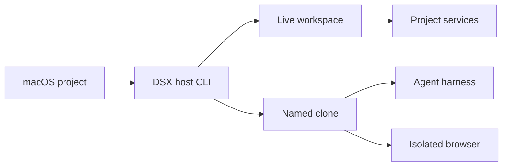

# Getting started with DSX

DSX creates isolated Linux development sandboxes on an Apple-silicon Mac. It uses Apple's `container` runtime to keep project source, agent credentials, services, and browser automation separate from the rest of the host.

Use DSX when you want to:

- open a disposable Linux shell for a project;
- run Codex, Claude Code, OpenCode, or OMP in an isolated named clone;
- start project processes and publish selected ports to `127.0.0.1`;
- test an application through a separate Playwright browser sandbox; or
- remove every resource DSX owns for a project without pruning unrelated Apple resources.



## Requirements

- An Apple-silicon Mac running macOS 26 or newer.
- Apple `container` CLI and API server version 1.2.2.
- Go 1.26.5 when building DSX from source.
- A Linux ARM64 project image pinned by SHA-256 digest.

DSX rejects untested Apple runtime versions before creating resources. Install Apple `container` from its [official releases](https://github.com/apple/container/releases), then start its system service:

```console
$ container system start
```

## Install DSX

DSX does not yet have a signed public installer. Build both required binaries from a source checkout:

```console
$ make build
$ sudo install -m 0755 bin/dsx bin/dsx-guest /usr/local/bin/
```

Keep `dsx` and `dsx-guest` in the same directory. The macOS CLI verifies and stages the adjacent Linux ARM64 guest helper when it creates a workspace.

## Verify the installation

Run the read-only host checks:

```console
$ dsx version
$ dsx doctor
$ dsx doctor --require-builder
```

`doctor` verifies the Mac architecture and OS, Apple CLI and API-server versions, system service, compatibility range, and builder health. It does not create a project sandbox.

A healthy installation reports compatible host and runtime capabilities. If the Apple service or builder is stopped, start it with the Apple-native commands shown by `doctor` and run the check again.

## Start your first project

Change to an existing Git project and run DSX without arguments:

```console
$ cd ~/Code/my-project
$ dsx
```

For an unconfigured project, DSX opens the setup wizard. It detects supported project files and shows the complete proposed configuration, including:

- the Linux image;
- setup commands and long-running processes;
- source and credential mounts;
- internet and private-network grants;
- published ports;
- CPU, memory, and clone limits; and
- the executable configuration hash.

Nothing is written and no Apple resource is created until the final confirmation. Confirming setup writes `.dsx/config.jsonc` in the project.

Run `dsx` again later to open the project launcher or dashboard. In automation or a non-interactive terminal, bare `dsx` prints help instead of prompting.

## Understand the two workspace modes

| Mode | Command | Source location | Best for |
|---|---|---|---|
| Live workspace | `dsx shell` | Selected host repositories mounted read/write | Interactive development and immediate host file changes |
| Named clone | `dsx run --name NAME` | Private guest-owned Git clone | Autonomous agents, concurrent tasks, and controlled result transfer |

A project may have one live workspace or multiple named clone sandboxes. Live and clone modes do not run together for the same project.

### Open a live shell

First inspect the exact live plan:

```console
$ dsx inspect
```

Copy the displayed `Executable hash`, then approve that exact plan:

```console
$ dsx shell --approve-config <inspected-hash>
```

The live workspace can modify or delete the mounted host project. Use it when you want changes to appear on the Mac immediately.

### Run an agent in a named clone

Inspect the same sandbox name and harness you intend to run:

```console
$ dsx inspect --mode clone --sandbox fix-test --agent codex
```

Copy that plan's executable hash and launch one non-empty prompt:

```console
$ dsx run \
    --name fix-test \
    --agent codex \
    --profile default \
    --approve-config <inspected-hash> \
    -- "fix the failing test"
```

The sandbox receives independent source, Git metadata, dependency state, services, ports, and writable authentication state. Ignored and untracked host files are excluded, and the tracked host working tree must be clean before clone creation.

The approval hash is specific to the complete projection. Changing the sandbox name, harness, browser flag, image, commands, mounts, credentials, network grants, or ports requires another inspection and approval.

## Review and recover agent changes

A named clone never merges directly into the host checkout.

```console
$ dsx git status fix-test
$ dsx git diff fix-test
$ dsx git fetch fix-test
```

- `status` reports the source and result commits, tracked-host fingerprint, and fetch state.
- `diff` renders a bounded, terminal-safe patch.
- `fetch` imports the result into a sandbox-specific host remote-tracking ref without merging it.

To apply the result as a guarded squashed working-tree change instead:

```console
$ dsx git apply fix-test
```

DSX checks the host repository fingerprint and ref state before applying. For a composite workspace, add `--repo MEMBER` to select one configured repository; omitting it operates on every member as one guarded operation.

## Authentication profiles

Configure an authentication profile in `.dsx/config.jsonc`, then log in explicitly:

```console
$ dsx inspect --agent codex
$ dsx login \
    --agent codex \
    --profile default \
    --root . \
    --approve-config <inspected-hash>
```

Supported harness names are `omp`, `codex`, `claude`, and `opencode`.

DSX never mounts the complete host home directory. Each running sandbox receives its own writable authentication copy. A profile with global persistence survives ordinary project cleanup; sandbox persistence remains scoped to that project and sandbox.

Normal `shell` and `run` commands do not start a login flow. Purging persisted authentication is always explicit:

```console
$ dsx clean --purge-auth --agent codex --profile default --force
```

## Publish an application port

Declare ports in `.dsx/config.jsonc`. This example asks DSX to choose a free host port and bind it only to loopback:

```jsonc
{
  "ports": [
    {
      "name": "web",
      "guest": 3000,
      "host": "dynamic",
      "bind": "127.0.0.1",
      "protocol": "tcp"
    }
  ]
}
```

After startup, inspect the final URL with:

```console
$ dsx status
$ dsx list
```

Non-loopback publication must be written explicitly in configuration and becomes part of the reviewed approval hash.

## Use the isolated browser

Browser access changes the executable plan. Include `--browser` in both inspection and execution:

```console
$ dsx inspect --mode clone --sandbox browser-test --agent codex --browser
$ dsx run \
    --name browser-test \
    --agent codex \
    --profile default \
    --browser \
    --approve-config <inspected-hash> \
    -- "verify the application in the browser"
```

The browser runs as a separate disposable resource on the sandbox's private network. It receives no project source, agent authentication, AWS credentials, host home mount, or host-published port. DSX injects an ephemeral Playwright MCP server into the selected harness configuration.

## Inspect running resources

```console
$ dsx list
$ dsx status
$ dsx logs web
```

- `list` shows DSX-owned sandboxes and their published ports.
- `status` shows live-workspace process health and URLs.
- `logs PROCESS` returns the bounded retained log for one configured live-workspace process; it is not a follow stream.

## Stop and clean up

Stop a live workspace or one named clone while retaining its persistent state:

```console
$ dsx stop
$ dsx stop --name fix-test
```

Before deleting a named clone, preserve useful results with `git fetch` or `git apply`. DSX refuses to delete unfetched work unless you explicitly accept the loss.

```console
$ dsx clean --name fix-test
$ dsx clean
```

- `clean --name` removes one named clone.
- `clean` removes all proven DSX-owned resources for the current project.
- Ordinary cleanup preserves global authentication.
- Ambiguous or unrelated Apple resources are reported and left untouched.

Only when data loss is intentional should you use both `--discard-unfetched` and the normal cleanup confirmation or `--force`:

```console
$ dsx clean --name fix-test --discard-unfetched --force
```

## Troubleshooting

### The approval hash is rejected

Run `inspect` again with the exact mode, sandbox, harness, and browser choice used by the mutating command. Copy the newly displayed hash. `--force` cannot bypass executable-plan approval.

### DSX reports an unsupported runtime

Run:

```console
$ dsx doctor --format json
$ container version --format json
```

Use the exact supported Apple CLI/API-server pair. DSX fails closed rather than guessing about untested runtime behavior.

### Cleanup refuses to remove a clone

Check and preserve the result first:

```console
$ dsx git status NAME
$ dsx git fetch NAME
$ dsx clean --name NAME
```

Use `--discard-unfetched` only when losing the sandbox result is intentional.

### A process is not ready

Inspect its retained output and current state:

```console
$ dsx status
$ dsx logs PROCESS
```

Required process or health-check failure marks the sandbox failed. DSX does not silently restart failed project processes.

### Docker instructions do not work

DSX uses Apple `container`, not Docker or Podman. It never places a Docker, Podman, or Apple runtime control socket inside an agent workspace.

## Next steps

- Read the [complete user and operator guide](./user-guide.md).
- Review the [product requirements](../PRD.md).
- Review the [implementation architecture](../adr/0001-dsx-implementation-architecture.md).
- For dedicated physical CI hosts, use the [runner operations guide](../runner-operations.md).
- See Apple's [`container` documentation](https://github.com/apple/container#readme).
