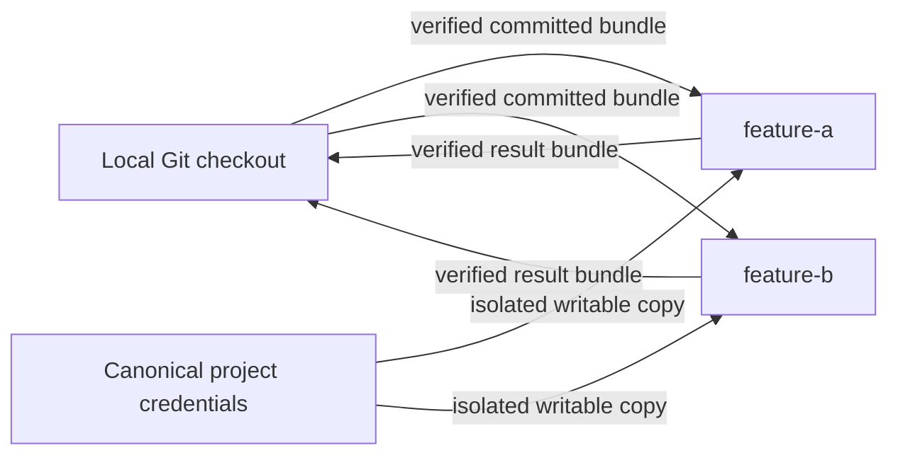

# Getting started with DSX

DSX creates named, isolated Linux workspaces on an Apple-silicon Mac. Every workspace is a peer backed by a guest-owned private Git clone. The local checkout is the source and integration point; it is not itself a DSX workspace.

Use DSX to:

- run several independent workspaces for one Git project;
- open OMP, Codex, Claude Code, or OpenCode in an existing workspace;
- transfer committed revisions without sharing host Git objects;
- publish selected application ports to loopback;
- opt into a disposable browser for one agent session;
- authorize selected workspaces to follow a temporary host AWS `default`; and
- remove only resources DSX can prove it owns.



## Requirements

- Apple silicon and macOS 26 or newer.
- Apple `container` CLI and API server in DSX's tested compatibility range.
- Git, with a branch checked out in the project.
- Go 1.26.5 only when building DSX from source.

Install and start Apple `container` from its [official releases](https://github.com/apple/container/releases):

```console
$ container system start
```

DSX is daemonless. Apple's own system services remain prerequisites; DSX never exposes their control socket inside a workspace.

## Install and verify DSX

Until a signed public installer is available, build both binaries from a source checkout:

```console
$ make build
$ sudo install -m 0755 bin/dsx bin/dsx-guest /usr/local/bin/
```

Keep `dsx` and the Linux ARM64 `dsx-guest` beside one another. The host binary verifies the adjacent helper before staging it read-only into a workspace.

Run the read-only checks:

```console
$ dsx version
$ dsx doctor
$ dsx doctor --require-builder
```

`doctor` checks the host architecture and OS, Apple CLI/API-server compatibility, system service, and—when requested—builder health. It creates no project resource.

## Configure a project

Start from a local Git checkout:

```console
$ cd ~/Code/my-project
$ dsx inspect
$ dsx init
```

`inspect` is read-only. It reports detected project facts, effective project defaults, provenance for each effective value, and the executable-configuration hash. `init` opens the setup flow.

The setup flow has three steps:

1. Choose **Ubuntu — Default settings** or **Ubuntu — Custom**. Default means Codex, 6 CPUs, 6 GiB, network allowed, no published ports, and no browser. Custom exposes the coding assistant, internet access, ports, CPU, and memory.
2. Review and approve one concise screen. DSX shows the effective environment and any non-default commands, mounts, credentials, network grants, ports, or volumes. It hides routine implementation digests and discovery noise while retaining the executable hash and every authority-bearing detail.
3. DSX verifies Apple Container, saves configuration and approval, prepares DSX Standard when needed, and opens the workspace dashboard.

Alternate OCI and project images remain supported through configuration and CLI workflows, but are intentionally absent from onboarding.

Guest ports entered in setup receive dynamic `127.0.0.1` host ports. Cancelling before final confirmation writes no configuration, approval, credential, or runtime resource.

Project setup also asks whether to allow selected workspaces to follow the host AWS `default`. This project-level choice authorizes only the capability: new workspaces still start with AWS access disabled, and enabling one workspace remains a separate action. The approval identifies the canonical host source, the reserved read-only guest destination, and warns that switching the host default changes every AWS-enabled running workspace without another DSX approval or workspace restart.

Setup writes one of these mutually exclusive files:

- `~/.dsx/projects/<project-name>-<project-id>/config.jsonc` for the normal project-local contract; or
- `.dsx/config.jsonc` when maintainers explicitly share the contract in the repository.

DSX fails if both exist; it never merges them. Effective-value precedence is:

1. CLI override.
2. The one active configuration.
3. DSX standard default.

A minimal configuration is:

```jsonc
{
  "$schema": "https://dsx.dev/schema/config-v1.json",
  "schemaVersion": 1,
  "workspace": { "root": "." },
  "image": { "standard": true },
  "agents": {
    "default": "codex",
    "allowed": ["omp", "codex", "claude", "opencode"]
  },
  "auth": {
    "imports": ["omp", "codex", "opencode"]
  },
  "resources": {
    "cpus": 6,
    "memory": "6GiB",
    "maxConcurrentWorkspaces": 3
  }
}
```

The schema is strict and validated offline. Unknown and obsolete fields fail visibly. `agents.default` must be present in `agents.allowed`. `auth.imports` declares only which portable host credential kinds setup may offer; it never imports anything by itself. Claude is intentionally absent because its host login is not portable.

To authorize the optional default-only AWS capability, add:

```jsonc
{
  "aws": {
    "mode": "host-default",
    "directory": "/Users/example/.aws"
  }
}
```

Omit `aws` or use `"mode": "none"` to authorize no host AWS access. No profile name is configurable in this increment.

## Create named workspaces

Ordinary creation requires a clean tracked local working tree. It records the checked-out branch and `HEAD`, excludes every untracked file whether ignored or not, transfers a restrictive verified bundle, and creates `dsx/<workspace-name>` in guest-owned storage.

```console
$ dsx workspace create feature-a
$ dsx workspace create feature-b --default-agent claude
$ dsx workspace create dirty-work --snapshot
$ dsx workspace list
```

`--snapshot` is an explicit alternative for reviewed local work. It creates an isolated synthetic commit whose single parent is the captured host `HEAD`, then uses the same bounded, verified bundle and guest-owned private clone as ordinary creation. The snapshot contains the final working-tree version of every tracked file—including tracked files that match ignore rules—and nonignored untracked files. Ignored untracked files stay on the host. Staged content is not a separate layer: if a tracked path has later unstaged edits, the final working-tree bytes win.

Unmerged paths and Git submodules are rejected. Snapshot capture also refuses other gitlinks, unsafe paths, unsupported file kinds, and bounded-input violations. It does not change the host branch, `HEAD`, index, working tree, durable refs, or object database. Temporary snapshot refs, indexes, object directories, and bundles are removed on success and failure.

Names contain 1–24 lowercase letters, digits, or hyphens, cannot begin or end with a hyphen, and identify peer workspaces. There is no implicit or privileged workspace.

Creation starts only `dsx-guest`. It does not ask for authentication, a task prompt, browser selection, or a workspace mode. It does not start an agent, browser, application, watcher, database, or background command.

In the TUI, press **c** on the dashboard. The create form contains only:

- workspace name;
- source branch and real parent revision;
- an optional workspace default selected from `agents.allowed`; and
- **Snapshot local changes**, which is off by default.

Ordinary submission remains unavailable from a dirty checkout. Selecting **Snapshot local changes** opens a separate review showing the workspace, real parent, included and excluded content, rejection rules, and host non-mutation guarantee. No creation intent is emitted until that review is confirmed. Dirty dashboard update stays disabled and points to the explicit CLI command.

Choose **Create and open** to keep a bounded creation-progress screen visible until the workspace is ready, then hand the terminal directly to its shell. Choose **Create in background** to show the same progress without attaching a shell. DSX does not expose an idle host prompt between creation and shell attachment.

## Operate a workspace

Every lifecycle action names its target:

```console
$ dsx workspace open feature-a
$ dsx workspace stop feature-a
$ dsx workspace start feature-a
$ dsx workspace restart feature-a
```

`open` starts the workspace if needed and opens its interactive shell. `start` starts only the workspace and guest control process. `stop` retains the private clone and persistent state.

`restart` preserves:

- commits, uncommitted files, and any in-progress rebase;
- dependencies and persistent service volumes;
- isolated authentication working copies; and
- configuration and ownership state.

It terminates and does not restore agents, development servers, watchers, manually started databases, background commands, application processes, or browsers. Only `dsx-guest` is restored. Restarting one workspace cannot affect its siblings.

With the managed DSX Standard image, `workspace open` enters login interactive Zsh as `dsx` (`UID 1000`, `GID 1000`) with home `/home/dsx`, image-owned Starship, and pinned offline plugins. DSX Standard uses Ubuntu 26.04 LTS ARM64. Direct shells and VS Code attachment may run `sudo -n COMMAND` without a password inside the workspace VM; DSX creates no root password or direct-root-login workflow. Elevation can control the VM and mounted workspace resources, but it grants no host runtime, host-home, or host-source authority. DSX does not read, copy, mount, or execute host shell dotfiles. Custom images must provide compatible account, shell, and toolchain expectations; passwordless sudo is a Standard-image guarantee.

The image-level baseline includes AWS CLI v2 2.36.22 (`aws`, `aws_completer`), uv 0.12.3 (`uv`, `uvx`), .NET 10 LTS SDK 10.0.400 with .NET/ASP.NET Core runtimes 10.0.11 (`dotnet`, `dnx`), and standalone Kotlin compiler 2.4.10 (`kotlin`, `kotlinc`) on the managed JDK. Installing `aws` grants no credentials: only an explicit per-workspace AWS grant exposes the host default profile, and disabled workspaces receive no AWS authority. uv and `dnx` may download dependencies only when invoked. Kotlin does not include Gradle, Maven, Kotlin/Native, or runtime dependency resolution.

For a running workspace, select it in the dashboard and press `v` for **Attach with VS Code (experimental)**. Install Dev Containers 0.467.0 or later, enable **Dev › Containers: Experimental Apple Container Support**, run **Dev Containers: Attach to Running Apple Container...**, choose the exact container name DSX prints, and open `/workspace`. Apple `container` 1.2.2 with Dev Containers 0.467.0+ is the verified combination. DSX neither starts stopped workspaces nor reads `.devcontainer`, and VS Code attachment does not replace explicit DSX loopback port publication.

Existing workspaces retain the image and user contract with which they were created. To adopt this Standard-image revision, first fetch/apply or otherwise preserve work, remove the old workspace with ownership-safe `dsx workspace remove NAME`, approve the changed Standard-image hash, and recreate it. DSX does not silently replace or recursively chown existing persistent resources.

## Run an agent in an existing workspace

Agent resolution is:

1. Explicit `--agent` override.
2. Workspace default.
3. Project `agents.default`.

Every resolved agent must appear in `agents.allowed`.

```console
$ dsx agent feature-a
$ dsx agent feature-a --agent codex
$ dsx agent feature-a --agent omp -- "implement the API"
```

No prompt opens an interactive agent. A prompt runs that task in the same persistent workspace. An invocation override does not change the workspace default, and ending the agent does not remove the workspace. Invoking an agent never creates an implicit workspace.

## Configure authentication

Authentication has its own lifecycle:

```console
$ dsx auth status
$ dsx auth import --agent omp
$ dsx auth import --agent codex
$ dsx auth import --agent opencode
$ dsx auth login --agent claude
$ dsx auth refresh --agent omp
$ dsx auth purge --agent omp
```

Each import presents the exact discovered artifacts for explicit approval. The allowlist is:

- OMP: one consistent snapshot taken while `agent.db` is closed, plus its optional WAL;
- Codex CLI: only the portable `auth.json`;
- OpenCode: only its approved provider-auth artifact; and
- Claude Code: no host import and no Keychain copy; use DSX login.

DSX never imports a complete harness directory or host home, never imports silently, and never translates OMP's Codex provider identity into Codex CLI credentials. Imported credentials become the canonical project store for that harness.

On first use of a harness in a workspace, DSX lazily creates an independent writable copy. Concurrent workspaces never share a writable credential store. Promotion back to the project store is serialized. Ordinary workspace removal preserves canonical project credentials; purge is a separate confirmed action and active copies block it.

## Enable AWS only where needed

Project `host-default` mode permits selected workspaces to use temporary host AWS credentials; it does not grant them automatically. Every new workspace starts with AWS access disabled. Leapp Desktop (or a compatible provider) must keep one complete temporary session active as the standard AWS `default` for enablement and credential rotation. DSX reads the approved standard-file directory; it never starts or controls the provider.

Review the dynamic identity warning carefully: enabling AWS gives the workspace and its agents whichever AWS account and role the host provider currently assigns to `default`. Switching the host default changes every AWS-enabled running workspace without another DSX approval or workspace restart. Named profiles are unavailable in this increment.

Manage one named workspace at a time:

```console
$ dsx aws status feature-a
$ dsx aws enable feature-a
$ dsx aws status feature-a
$ dsx aws disable feature-a
```

`status` reports the durable grant and only non-secret availability or failure state. It never prints credential values. **Enable AWS** and **Disable AWS** in the dashboard are the equivalent TUI actions for the selected workspace.

An enabled running workspace continuously follows stable replacements of the host `default`; complete config and credential generations appear atomically and no manual sync is required. Stopping the workspace stops its mirror helper while preserving the grant. Starting or restarting performs a fresh sync before a shell or agent can use AWS. Disabling records revocation before stopping the helper and removing that workspace's private mirror. Removing the workspace cleans up its exact AWS grant, helper, and mirror with the rest of its proven resources.

An AWS-disabled workspace has no AWS files, AWS environment, mirror helper, or access to the host source. Browser VMs never receive AWS state, including when their agent session belongs to an AWS-enabled workspace.

## Use a browser for one agent session

Browser selection belongs only to agent invocation:

```console
$ dsx agent feature-a --browser
$ dsx agent feature-a --agent codex --browser -- "verify the UI"
```

DSX creates a new disposable browser VM, attaches it only to `feature-a`'s private network, waits for Playwright MCP, and injects that endpoint into only the current agent session. The browser receives no source, harness credentials, AWS state, host home, runtime control, or host-published browser control port.

The browser is deleted on success, error, cancellation, or terminal closure. It is not shared, reused, persisted, created with the workspace, or restored by workspace restart.

## Update from the local checkout

For ordinary ingress, commit local changes on the same source branch recorded for the workspace, then run:

```console
$ dsx workspace update feature-a
```

DSX requires a clean local branch matching the recorded source branch. It transfers a verified bundle, creates a backup ref, and rebases `dsx/feature-a` onto the new committed revision.

To rebase onto explicitly reviewed final working-tree content instead, run:

```console
$ dsx workspace update feature-a --snapshot
```

Snapshot update uses the same inclusion, exclusion, parent, and host non-mutation rules as snapshot creation. It records the new synthetic source and its real host `HEAD`, then rebases workspace-only commits onto that synthetic commit. DSX never stashes work, merges unrelated branches, or attempts semantic conflict resolution.

If a conflict occurs, the workspace becomes **Needs resolution** and remains openable:

```console
$ dsx workspace open feature-a
$ git status
$ git rebase --continue
# or
$ git rebase --abort
```

After resolving or aborting, review state again from the dashboard or `dsx git status feature-a`.

## Review and integrate results

```console
$ dsx git status feature-a
$ dsx git diff feature-a
$ dsx git fetch feature-a
```

`fetch` imports committed workspace history through a verified bundle into `refs/remotes/dsx/feature-a`; it does not merge. Integrate normally:

```console
$ git merge refs/remotes/dsx/feature-a
```

Or apply a guarded squashed working-tree change:

```console
$ dsx git apply feature-a
```

For an ordinary committed source, the guarded apply contract is unchanged. For a snapshot source, `git status`, `git diff`, and `git fetch` work normally, but `git apply` requires a clean host whose `HEAD` tree exactly equals the recorded snapshot tree. First make the host contain the exact captured baseline and commit it:

```console
$ git add -A
$ git commit -m "record reviewed DSX snapshot baseline"
$ dsx git fetch feature-a
$ dsx git apply feature-a
```

The matching host commit may have a different commit ID from the synthetic source; tree equality is the boundary. If the captured baseline is no longer desired, update or re-snapshot instead. On success, apply stages only workspace-result changes relative to the captured snapshot. Any baseline mismatch refuses without host mutation.

For composite projects, add `--repo MEMBER` to target one configured repository.

## Remove workspaces safely

Fetch or apply useful work before removal:

```console
$ dsx git status feature-a
$ dsx git fetch feature-a
$ dsx workspace remove feature-a
```

DSX refuses to remove unfetched commits, uncommitted changes, unresolved rebase state, or uncertain result state unless you explicitly confirm permanent loss. `--force` may confirm that destructive choice, but it never bypasses ownership proof or configuration approval.

Explicit cleanup sets are available:

```console
$ dsx workspace remove --all
$ dsx workspace remove --legacy-resources
$ dsx workspace remove --all-projects
```

Legacy resources retain their old names and appear as **Legacy — cleanup only**. They can be inspected for ownership-safe cleanup but cannot be opened, started, restarted, updated, adopted, renamed, or used for an agent. The unfetched-work guard still applies.

New runtime names use:

```text
dsx-<project:16>-<workspace:24>-<role:9>-<path-hash:6>
```

They are sanitized, deterministic, and at most 62 bytes. Ownership labels and manifests—not readable names alone—authorize cleanup. Ambiguous or unrelated Apple resources are preserved and reported.

## Use the dashboard

Run bare `dsx` in a configured project. The dashboard shows the local checkout branch/commit and a deterministic list of peer workspaces with state, default and available agents, source revision, URLs, mutation status, unfetched warnings, and legacy cleanup-only records.

For the selected workspace:

- **Enter** opens it;
- **a** opens the agent form, containing only agent and browser-session choices;
- **u** updates from the local checkout;
- **s** starts or stops it;
- **r** restarts it;
- **g** reviews Git changes;
- **d** removes it;
- **c** creates another workspace.

The dashboard also exposes **Enable AWS** or **Disable AWS** for the selected workspace. These actions record intent and use the same workspace lifecycle path as the CLI.

Actions are state-aware. Update and restart are disabled during another lifecycle mutation. **Needs resolution** remains openable for Git conflict recovery. Without an interactive terminal, bare `dsx` prints help and changes nothing. `DSX_ACCESSIBLE=1` enables accessible form mode, and `NO_COLOR` is respected.

## Troubleshooting

### Configuration approval changed

Run `dsx inspect` again, review provenance and the executable plan, and use the exact displayed hash for non-interactive mutation. `--force` cannot bypass this approval.

### Creation reports local changes

Commit tracked changes before creating or updating. Ignored and untracked files are excluded from source bundles.

### Update reports a conflict

Open the named workspace and use Git's normal rebase continuation or abort commands. DSX deliberately leaves the valid rebase state for you.

### Removal reports unfetched work

Run `dsx git status WORKSPACE`, then fetch or apply every repository result. Confirm loss only when the work is intentionally disposable.

### AWS reports that the host default is unavailable

Start or renew one temporary `default` session in Leapp Desktop (or a compatible provider), then run `dsx aws status WORKSPACE`. DSX does not start the provider or retain stale credentials after a stable removal. If status reports a non-secret source or identity failure, restore the reviewed canonical standard-file directory before enabling or restarting.

### AWS identity changed unexpectedly

Run `dsx aws status WORKSPACE` and inspect the provider's active host `default`. This capability intentionally follows a dynamic identity: a host switch propagates continuously to every AWS-enabled running workspace. Disable AWS on workspaces that must not follow it. Named-profile selection and identity pinning are future work.

### Runtime is unsupported

Run `dsx doctor` and `container version --format json`. DSX fails closed for an untested or mismatched Apple CLI/API-server pair.

## Next steps

- Read the [complete user and operator guide](./user-guide.md).
- Review the [product requirements](../PRD.md).
- Review the [implementation architecture](../adr/0001-dsx-implementation-architecture.md).
- For dedicated physical CI hosts, use the [runner operations guide](../operations/runner-operations.md).
