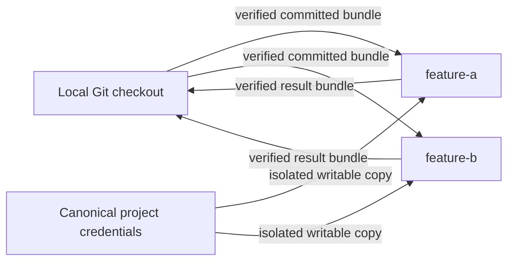

# Getting started with DSX

DSX creates named, isolated Linux workspaces on an Apple-silicon Mac. Every workspace is a peer backed by a guest-owned private Git clone. The local checkout is the source and integration point; it is not itself a DSX workspace.

Use DSX to:

- run several independent workspaces for one Git project;
- open OMP, Codex, Claude Code, or OpenCode in an existing workspace;
- transfer committed revisions without sharing host Git objects;
- publish selected application ports to loopback;
- opt into a disposable browser for one agent session; and
- remove only resources DSX can prove it owns.



## Requirements

- Apple silicon and macOS 26 or newer.
- Apple `container` CLI and API server in DSX's tested compatibility range.
- Git, with a branch checked out in the project.
- Go 1.26.5 only when building DSX from source.

Install and start Apple `container` from its [official releases](https://github.com/apple/container/releases):

```console
$ container system start
```

DSX is daemonless. Apple's own system services remain prerequisites; DSX never exposes their control socket inside a workspace.

## Install and verify DSX

Until a signed public installer is available, build both binaries from a source checkout:

```console
$ make build
$ sudo install -m 0755 bin/dsx bin/dsx-guest /usr/local/bin/
```

Keep `dsx` and the Linux ARM64 `dsx-guest` beside one another. The host binary verifies the adjacent helper before staging it read-only into a workspace.

Run the read-only checks:

```console
$ dsx version
$ dsx doctor
$ dsx doctor --require-builder
```

`doctor` checks the host architecture and OS, Apple CLI/API-server compatibility, system service, and—when requested—builder health. It creates no project resource.

## Configure a project

Start from a local Git checkout:

```console
$ cd ~/Code/my-project
$ dsx inspect
$ dsx init
```

`inspect` is read-only. It reports detected project facts, effective project defaults, provenance for each effective value, and the executable-configuration hash. `init` opens the setup flow.

The setup flow reviews:

- image source;
- repository layout;
- finite setup commands and configured processes;
- `agents.allowed` and `agents.default`;
- supported portable authentication imports;
- internet and private-network grants;
- published guest ports;
- CPU, memory, and workspace concurrency; and
- the executable-configuration hash.

New workspaces default to 4 CPUs and 6 GiB. Guest ports entered in setup receive dynamic `127.0.0.1` host ports. Cancelling before final confirmation writes no configuration, approval, credential, or runtime resource.

Setup writes one of these mutually exclusive files:

- `~/.dsx/projects/<project-name>-<project-id>/config.jsonc` for the normal project-local contract; or
- `.dsx/config.jsonc` when maintainers explicitly share the contract in the repository.

DSX fails if both exist; it never merges them. Effective-value precedence is:

1. CLI override.
2. The one active configuration.
3. DSX standard default.

A minimal configuration is:

```jsonc
{
  "$schema": "https://dsx.dev/schema/config-v1.json",
  "schemaVersion": 1,
  "workspace": { "root": "." },
  "image": { "standard": true },
  "agents": {
    "default": "codex",
    "allowed": ["omp", "codex", "claude", "opencode"]
  },
  "auth": {
    "imports": ["omp", "codex", "opencode"]
  },
  "resources": {
    "cpus": 4,
    "memory": "6GiB",
    "maxConcurrentWorkspaces": 3
  }
}
```

The schema is strict and validated offline. Unknown and obsolete fields fail visibly. `agents.default` must be present in `agents.allowed`. `auth.imports` declares only which portable host credential kinds setup may offer; it never imports anything by itself. Claude is intentionally absent because its host login is not portable.

## Create named workspaces

The tracked local working tree must be clean. Creation records the checked-out branch and commit, warns that ignored and untracked files are excluded, transfers a restrictive verified bundle, and creates `dsx/<workspace-name>` in guest-owned storage.

```console
$ dsx workspace create feature-a
$ dsx workspace create feature-b --default-agent claude
$ dsx workspace list
```

Names contain 1–24 lowercase letters, digits, or hyphens, cannot begin or end with a hyphen, and identify peer workspaces. There is no implicit or privileged workspace.

Creation starts only `dsx-guest`. It does not ask for authentication, a task prompt, browser selection, or a workspace mode. It does not start an agent, browser, application, watcher, database, or background command.

In the TUI, press **c** on the dashboard. The create form contains only:

- workspace name;
- committed source branch and revision; and
- an optional workspace default selected from `agents.allowed`.

Choose **Create and open** to enter the shell after creation, or **Create in background** to return to the dashboard.

## Operate a workspace

Every lifecycle action names its target:

```console
$ dsx workspace open feature-a
$ dsx workspace stop feature-a
$ dsx workspace start feature-a
$ dsx workspace restart feature-a
```

`open` starts the workspace if needed and opens its interactive shell. `start` starts only the workspace and guest control process. `stop` retains the private clone and persistent state.

`restart` preserves:

- commits, uncommitted files, and any in-progress rebase;
- dependencies and persistent service volumes;
- isolated authentication working copies; and
- configuration and ownership state.

It terminates and does not restore agents, development servers, watchers, manually started databases, background commands, application processes, or browsers. Only `dsx-guest` is restored. Restarting one workspace cannot affect its siblings.

With the managed DSX Standard image, `workspace open` enters login interactive Zsh with the image-owned Starship and pinned offline plugins. DSX does not read, copy, mount, or execute host shell dotfiles. Custom images must provide their own shell and toolchain expectations.

## Run an agent in an existing workspace

Agent resolution is:

1. Explicit `--agent` override.
2. Workspace default.
3. Project `agents.default`.

Every resolved agent must appear in `agents.allowed`.

```console
$ dsx agent feature-a
$ dsx agent feature-a --agent codex
$ dsx agent feature-a --agent omp -- "implement the API"
```

No prompt opens an interactive agent. A prompt runs that task in the same persistent workspace. An invocation override does not change the workspace default, and ending the agent does not remove the workspace. Invoking an agent never creates an implicit workspace.

## Configure authentication

Authentication has its own lifecycle:

```console
$ dsx auth status
$ dsx auth import --agent omp
$ dsx auth import --agent codex
$ dsx auth import --agent opencode
$ dsx auth login --agent claude
$ dsx auth refresh --agent omp
$ dsx auth purge --agent omp
```

Each import presents the exact discovered artifacts for explicit approval. The allowlist is:

- OMP: one consistent snapshot taken while `agent.db` is closed, plus its optional WAL;
- Codex CLI: only the portable `auth.json`;
- OpenCode: only its approved provider-auth artifact; and
- Claude Code: no host import and no Keychain copy; use DSX login.

DSX never imports a complete harness directory or host home, never imports silently, and never translates OMP's Codex provider identity into Codex CLI credentials. Imported credentials become the canonical project store for that harness.

On first use of a harness in a workspace, DSX lazily creates an independent writable copy. Concurrent workspaces never share a writable credential store. Promotion back to the project store is serialized. Ordinary workspace removal preserves canonical project credentials; purge is a separate confirmed action and active copies block it.

## Use a browser for one agent session

Browser selection belongs only to agent invocation:

```console
$ dsx agent feature-a --browser
$ dsx agent feature-a --agent codex --browser -- "verify the UI"
```

DSX creates a new disposable browser VM, attaches it only to `feature-a`'s private network, waits for Playwright MCP, and injects that endpoint into only the current agent session. The browser receives no source, harness credentials, AWS state, host home, runtime control, or host-published browser control port.

The browser is deleted on success, error, cancellation, or terminal closure. It is not shared, reused, persisted, created with the workspace, or restored by workspace restart.

## Update from the local checkout

Commit local changes on the same source branch recorded for the workspace, then run:

```console
$ dsx workspace update feature-a
```

DSX requires a clean, committed local branch matching the recorded source branch. It transfers a verified bundle, creates a backup ref, and rebases `dsx/feature-a` onto the new local revision. It never stashes work, invents commits, or attempts semantic conflict resolution.

If a conflict occurs, the workspace becomes **Needs resolution** and remains openable:

```console
$ dsx workspace open feature-a
$ git status
$ git rebase --continue
# or
$ git rebase --abort
```

After resolving or aborting, review state again from the dashboard or `dsx git status feature-a`.

## Review and integrate results

```console
$ dsx git status feature-a
$ dsx git diff feature-a
$ dsx git fetch feature-a
```

`fetch` imports committed workspace history through a verified bundle into `refs/remotes/dsx/feature-a`; it does not merge. Integrate normally:

```console
$ git merge refs/remotes/dsx/feature-a
```

Or apply a guarded squashed working-tree change:

```console
$ dsx git apply feature-a
```

For composite projects, add `--repo MEMBER` to target one configured repository.

## Remove workspaces safely

Fetch or apply useful work before removal:

```console
$ dsx git status feature-a
$ dsx git fetch feature-a
$ dsx workspace remove feature-a
```

DSX refuses to remove unfetched commits, uncommitted changes, unresolved rebase state, or uncertain result state unless you explicitly confirm permanent loss. `--force` may confirm that destructive choice, but it never bypasses ownership proof or configuration approval.

Explicit cleanup sets are available:

```console
$ dsx workspace remove --all
$ dsx workspace remove --legacy-resources
$ dsx workspace remove --all-projects
```

Legacy resources retain their old names and appear as **Legacy — cleanup only**. They can be inspected for ownership-safe cleanup but cannot be opened, started, restarted, updated, adopted, renamed, or used for an agent. The unfetched-work guard still applies.

New runtime names use:

```text
dsx-<project:16>-<workspace:24>-<role:9>-<path-hash:6>
```

They are sanitized, deterministic, and at most 62 bytes. Ownership labels and manifests—not readable names alone—authorize cleanup. Ambiguous or unrelated Apple resources are preserved and reported.

## Use the dashboard

Run bare `dsx` in a configured project. The dashboard shows the local checkout branch/commit and a deterministic list of peer workspaces with state, default and available agents, source revision, URLs, mutation status, unfetched warnings, and legacy cleanup-only records.

For the selected workspace:

- **Enter** opens it;
- **a** opens the agent form, containing only agent and browser-session choices;
- **u** updates from the local checkout;
- **s** starts or stops it;
- **r** restarts it;
- **g** reviews Git changes;
- **d** removes it; and
- **c** creates another workspace.

Actions are state-aware. Update and restart are disabled during another lifecycle mutation. **Needs resolution** remains openable for Git conflict recovery. Without an interactive terminal, bare `dsx` prints help and changes nothing. `DSX_ACCESSIBLE=1` enables accessible form mode, and `NO_COLOR` is respected.

## Troubleshooting

### Configuration approval changed

Run `dsx inspect` again, review provenance and the executable plan, and use the exact displayed hash for non-interactive mutation. `--force` cannot bypass this approval.

### Creation reports local changes

Commit tracked changes before creating or updating. Ignored and untracked files are excluded from source bundles.

### Update reports a conflict

Open the named workspace and use Git's normal rebase continuation or abort commands. DSX deliberately leaves the valid rebase state for you.

### Removal reports unfetched work

Run `dsx git status WORKSPACE`, then fetch or apply every repository result. Confirm loss only when the work is intentionally disposable.

### Runtime is unsupported

Run `dsx doctor` and `container version --format json`. DSX fails closed for an untested or mismatched Apple CLI/API-server pair.

## Next steps

- Read the [complete user and operator guide](./user-guide.md).
- Review the [product requirements](../PRD.md).
- Review the [implementation architecture](../adr/0001-dsx-implementation-architecture.md).
- For dedicated physical CI hosts, use the [runner operations guide](../runner-operations.md).
