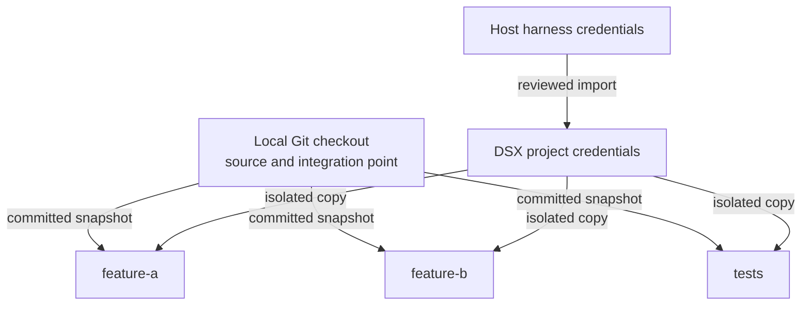

# DSX Multi-Workspace Plan

## Status

This document records the approved product direction for the DSX multi-workspace redesign. It is a change plan, not a description of current behavior. Implementation begins by updating `docs/PRD.md` and `docs/adr/0001-dsx-implementation-architecture.md`, which remain authoritative until that contract change is made.

## 1. Product model

DSX has one workspace type: a named, isolated Apple microVM containing a private Git clone.



Decisions:

- No special `main` workspace.
- No direct host-mounted workspace.
- The local checkout is not a DSX workspace.
- All workspaces are named peers.
- Multiple workspaces may run concurrently.
- Workspace lifecycle and agent lifecycle are separate.
- DSX requires Git and transfers committed revisions.
- No host source or host home directory is mounted into a workspace.

## 2. Project onboarding

Onboarding configures reusable project defaults:

- Workspace image.
- Allowed agents.
- Default agent.
- Internet policy.
- Published ports.
- CPU and memory.
- Setup definition.
- Supported host authentication imports.

### Authentication import

DSX detects portable host credentials and asks for explicit approval:

```text
Agent authentication

OMP
  Codex Team                 Available to import

Codex CLI
  Existing host login        Available to import

Claude Code
  Host login not portable    DSX login required

OpenCode
  Existing host login        Available to import

[Import supported authentication]
```

Rules:

- OMP: import a consistent closed `agent.db` snapshot and optional WAL.
- Codex: import only its approved portable `auth.json`.
- Claude: never copy macOS Keychain state; require a DSX login.
- OpenCode: import only its approved provider-auth artifact.
- Never import complete harness directories.
- Never import credentials silently.

Imported credentials become canonical project credentials, separated by harness.

## 3. Workspace creation

### CLI

```console
dsx workspace create feature-a
dsx workspace create feature-b --default-agent codex
```

### TUI form

```text
Create workspace

Name
  feature-a

Starting point
  feat/branch-1 @ abc123

Default agent
  OMP — inherited from project

Container
  dsx-tracking-chrome-feature-a-workspace-a81f2c

[Create and open]  [Create in background]
```

The form has:

- A validated workspace name.
- The committed source branch and revision.
- An agent selector populated from `agents.allowed`.
- The project default agent preselected.

The form does not have:

- Authentication selection.
- Prompt.
- Browser selection.
- Workspace-mode selection.

### Creation process

1. Inspect the local Git checkout.
2. Require a clean tracked working tree.
3. Warn that ignored and untracked files are excluded.
4. Record the checked-out branch and commit.
5. Create and verify a restrictive Git bundle.
6. Create the workspace VM and private volumes.
7. Clone into guest-owned storage without shared Git objects.
8. Create and check out `dsx/<workspace-name>`.
9. Start only the DSX guest control process.
10. Optionally open a shell.

## 4. Workspace lifecycle

```console
dsx workspace create NAME
dsx workspace list
dsx workspace open NAME
dsx workspace start NAME
dsx workspace stop NAME
dsx workspace restart NAME
dsx workspace update NAME
dsx workspace remove NAME
```

### Restart

```console
dsx workspace restart feature-a
```

Restart preserves:

- Git clone, commits, and uncommitted files.
- Dependencies and persistent volumes.
- Authentication working copies.
- Workspace configuration and ownership.

Restart terminates and does not restore:

- Agent sessions.
- `pnpm dev`.
- Watchers.
- Manually started databases.
- Background commands.
- Project application processes.

Only the DSX guest control process starts afterward. Restarting one workspace cannot affect siblings.

## 5. Updating a workspace

```console
dsx workspace update feature-a
```

This means **Update from local checkout**.

Process:

1. Require committed local changes.
2. Verify the local checkout remains on the workspace's recorded source branch.
3. Transfer the latest revision through a verified Git bundle.
4. Create a workspace backup ref.
5. Rebase `dsx/feature-a` onto the new local revision.
6. Report conflicts without attempting semantic resolution.

```text
Before:

Local:       C1 ── C2
Workspace:   C1 ── A1 ── A2

After:

Local:       C1 ── C2
Workspace:        └── A1′ ── A2′
```

On conflict:

```text
feature-a    Needs resolution
```

The user opens the workspace and runs:

```console
git rebase --continue
# or
git rebase --abort
```

DSX does not silently stash files or invent commits.

## 6. Agent lifecycle

```console
dsx agent feature-a
dsx agent feature-a --agent codex
dsx agent feature-a --agent omp -- "implement the API"
```

Agent resolution:

```text
Explicit --agent
      ↓
Workspace default
      ↓
Project default
```

Behavior:

- No prompt: open an interactive agent session.
- Prompt supplied: run that task inside the existing workspace.
- Repeated sessions use the same persistent workspace.
- An invocation override does not change the workspace default.
- Agents must be selected from the approved list.

The old "create a clone and immediately run one prompt" model is removed.

## 7. Workspace authentication

Authentication is not a workspace-creation decision.

When an agent first starts:

1. Resolve the canonical project credentials for that harness.
2. Create an independent writable workspace copy.
3. Inject only that harness's credentials.
4. Run the agent against the isolated copy.
5. Serialize any credential promotion back to the project store.

If authentication is missing:

```text
OMP authentication is not configured.

[i] Import supported host credentials
[l] Sign in
[Esc] Cancel
```

Commands:

```console
dsx auth status
dsx auth import --agent omp
dsx auth import --agent codex
dsx auth login --agent claude
dsx auth refresh --agent omp
dsx auth purge --agent omp
```

OMP's Codex provider identity remains inside OMP's credentials. It is not translated into the separate Codex CLI's credential format.

## 8. Git result integration

```console
dsx git status feature-a
dsx git diff feature-a
dsx git fetch feature-a
dsx git apply feature-a
```

Fetch imports the workspace branch into:

```text
refs/remotes/dsx/feature-a
```

Merge normally:

```console
dsx git fetch feature-a
git merge refs/remotes/dsx/feature-a
```

Recommended parallel workflow:

1. Create `feature-a` and `feature-b`.
2. Let both agents work independently.
3. Commit new local changes.
4. Update both workspaces.
5. Fetch and merge `feature-a`.
6. Update `feature-b` again from the merged local checkout.
7. Fetch and merge `feature-b`.

Cleanup refuses to destroy unfetched work unless loss is explicitly confirmed.

## 9. Optional isolated browser

Browser support is opt-in per agent invocation:

```console
dsx agent feature-a --browser
```

TUI agent form:

```text
Open agent

Agent
  OMP

[ ] Enable isolated browser

[Open agent]
```

When enabled, DSX:

1. Creates a disposable browser VM.
2. Connects it only to the selected workspace network.
3. Waits for Playwright MCP readiness.
4. Injects Playwright MCP into that agent session.
5. Gives the browser no source, credentials, AWS, or host-home mounts.
6. Publishes no browser control port to the host.
7. Deletes the browser when the agent session ends or is cancelled.

The browser is not:

- Started during workspace creation.
- Shared between workspaces.
- Reused between agent sessions.
- Restored by workspace restart.

## 10. Container naming

```text
dsx-<project:16>-<workspace:24>-<role:9>-<hash:6>
```

Examples:

```text
dsx-tracking-chrome-feature-a-workspace-a81f2c
dsx-tracking-chrome-feature-b-workspace-a81f2c
dsx-tracking-chrome-feature-a-browser-a81f2c
```

Rules:

- Project folder component: sanitized, maximum 16 characters.
- Workspace component: lowercase letters, digits, and hyphens, maximum 24 characters.
- Role: maximum 9 characters.
- Hash: six characters derived from the canonical project path.
- Complete container name: at most 62 bytes.
- Ownership labels remain authoritative.
- Existing resources retain their existing names.

## 11. TUI dashboard

```text
DSX PROJECT — tracking-chrome-extension

Local checkout
  feat/branch-1 @ abc123
  Clean

Workspaces

> feature-a    Running             OMP · Codex
  feature-b    Stopped             Codex
  tests        Needs resolution    OMP · Codex

[c] Create workspace
[Enter] Open
[a] Open agent
[u] Update from local checkout
[s] Start/stop
[r] Restart
[g] Review Git changes
[d] Remove
[q] Quit
```

Actions are state-aware. Restart and update are unavailable while another lifecycle mutation is active.

## 12. Command cutover

Remove:

- Live/clone workspace modes.
- Special sandbox name `main`.
- Direct host source mounts.
- `dsx shell`.
- One-shot `dsx run --name`.
- Unnamed start/stop behavior.

Replace with:

- `dsx workspace ...`.
- `dsx agent WORKSPACE ...`.
- `dsx auth ...`.
- Existing named `dsx git ...` operations.

DSX is unreleased, so this is a clean cutover without deprecated aliases.

## 13. Delivery sequence

1. Update PRD, ADR, schema, and manuals.
2. Replace live/clone domain modes with one named-workspace model.
3. Implement workspace create/open/start/stop/restart/update/remove.
4. Implement Git source updates, rebase conflict state, fetch, and apply.
5. Add reviewed host-auth import and project credential stores.
6. Add workspace-targeted agent invocation.
7. Retain optional per-session browser isolation.
8. Introduce readable bounded resource names.
9. Replace the TUI dashboard and creation forms.
10. Safely recognize and clean existing owned resources.
11. Verify the complete workflow on the real Apple runtime.

## Acceptance criteria

- Three named workspaces run concurrently with independent files and processes.
- No workspace receives host source or host-home mounts.
- Workspace creation requires neither authentication, prompt, nor browser selection.
- Supported host credentials are imported explicitly and copied safely per workspace and agent.
- Workspace update rebases onto the latest committed local revision.
- Restart preserves files but relaunches no agent or project process.
- A browser VM exists only for an explicitly browser-enabled agent session.
- Workspace results can be fetched and merged independently.
- Runtime names are readable, unique, and at most 63 bytes.
- Cleanup protects unfetched work and never deletes unrelated resources.
